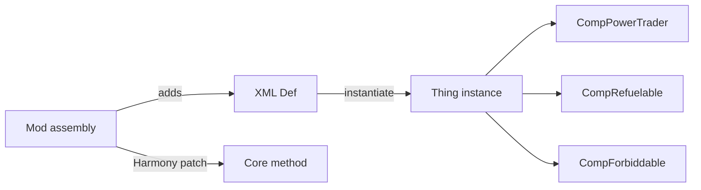
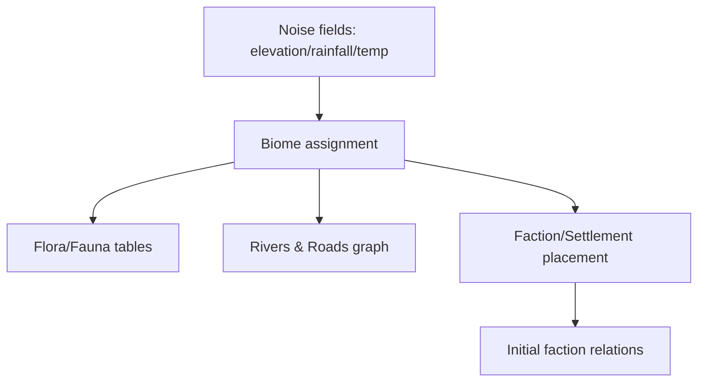
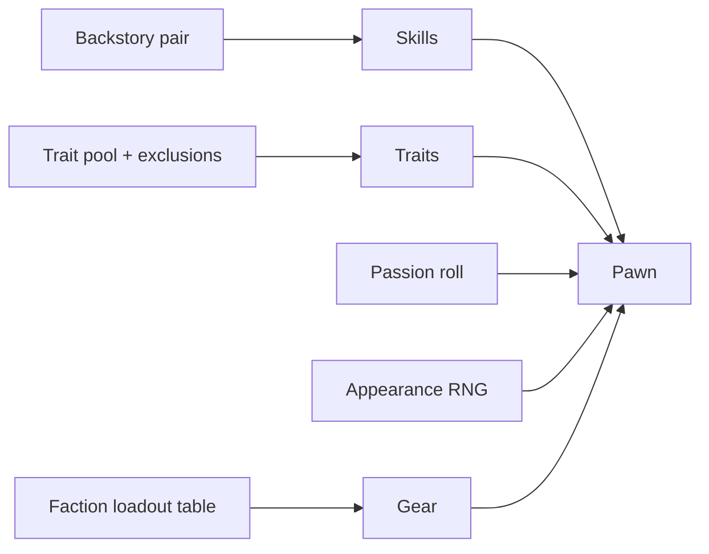
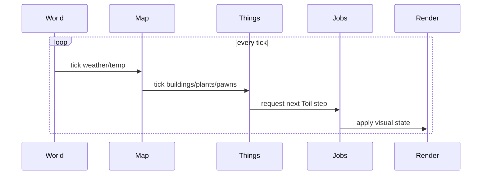
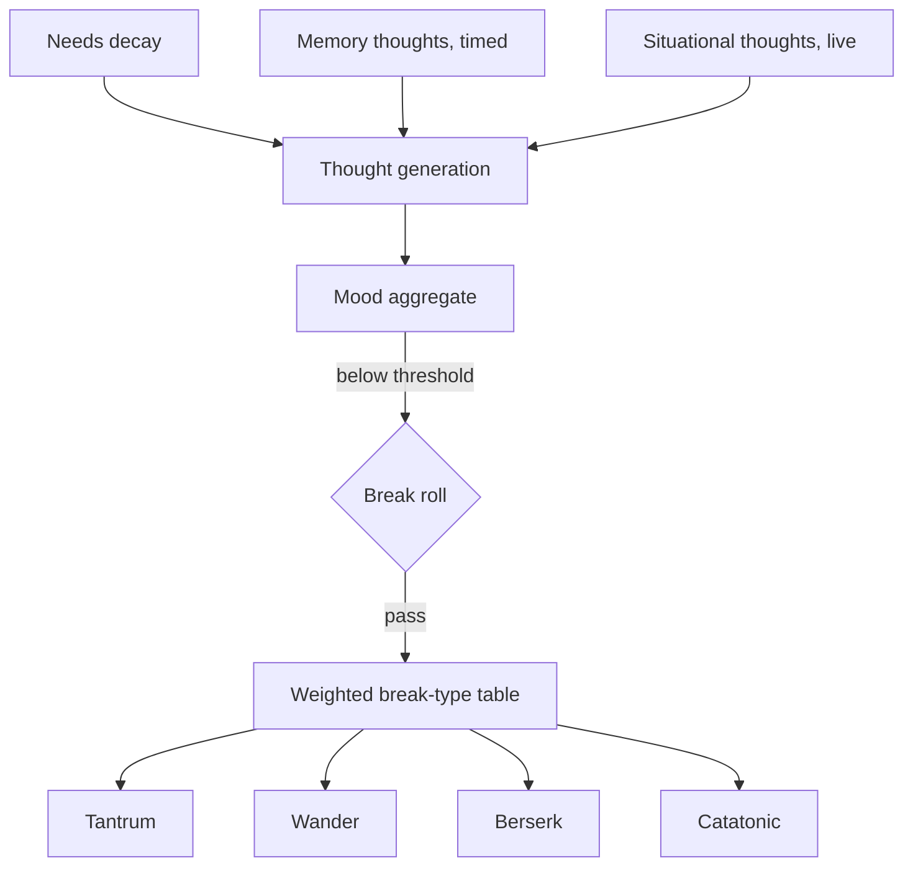
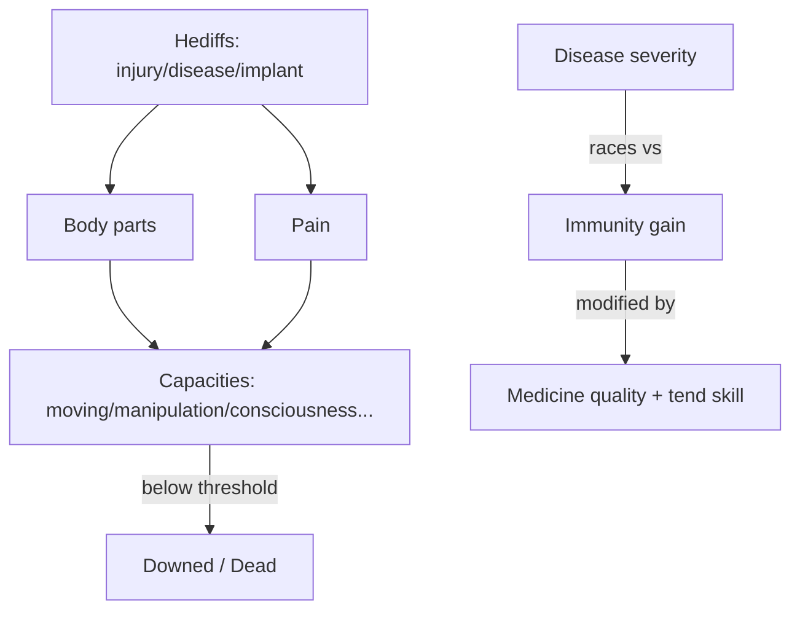
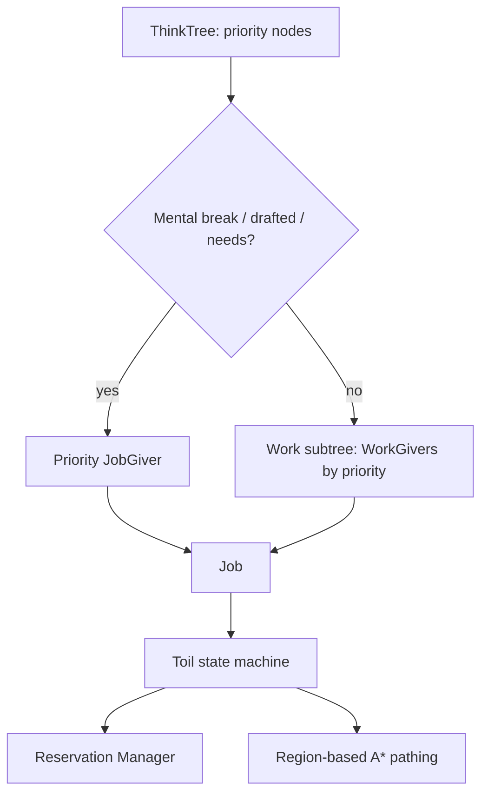
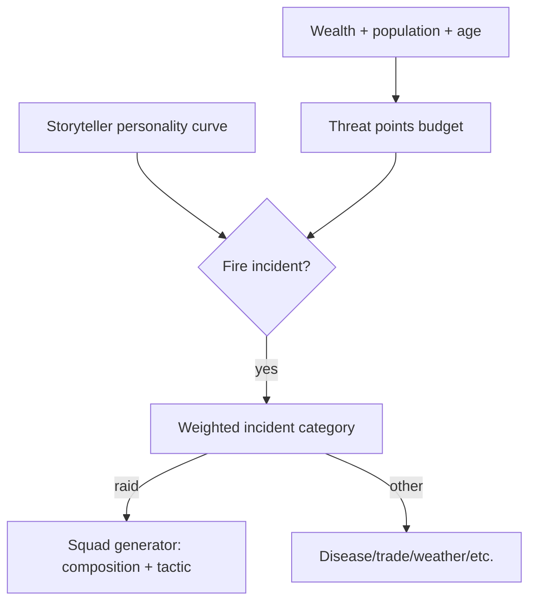
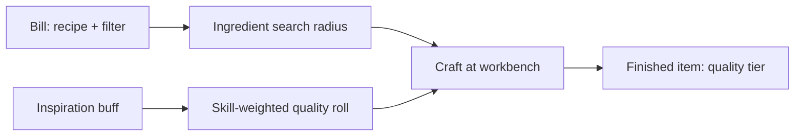
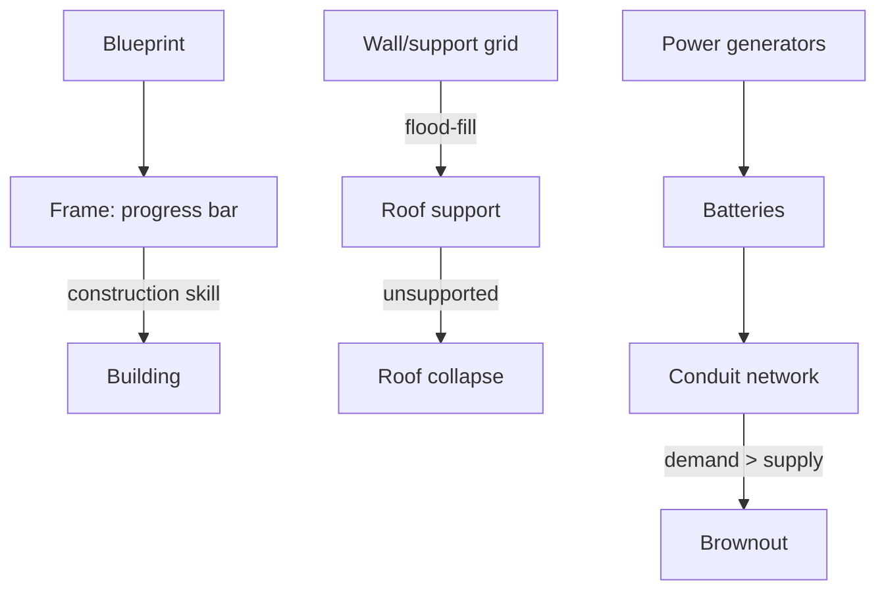

# RimWorld Mechanics Research

Terse reference on RimWorld's mechanics, loops, generation, and architecture.
Base game + DLC (Royalty, Ideology, Biotech, Anomaly). Facts, not prose.

## 1. Data & Modding Architecture

- Engine: Unity/C#, thin custom wrapper ("Verse").
- Data-driven via XML **Defs**: `ThingDef`, `PawnKindDef`, `RecipeDef`, `HediffDef`,
  `IncidentDef`, `TraitDef`, etc. Content is decoupled from code.
- **Comp** pattern: composition over inheritance. `ThingWithComps` holds a list of
  `CompProperties` (e.g. `CompPowerTrader`, `CompRefuelable`, `CompForbiddable`).
- Mods = extra Defs + assemblies. **Harmony** patches game methods at runtime,
  no source access needed.
- Load order Core → DLC → mods; later Defs can `<Inherit>`/override earlier ones.
- Save = XML object graph via `Scribe` (reflection-based serializer).
- RNG seeded per map / per generation call → reproducible given same seed.

## 2. World Generation

- World = grid of **Tiles** on a hex-sphere-like projection (coverage % configurable).
- Per-tile noise (Perlin/Worley-like) → elevation, rainfall, temperature, swampiness
  → derives **Biome** (16+: Tundra, Desert, Boreal Forest, Tropical Rainforest...).
- Biome drives flora/fauna tables, disease frequency, seasonal temperature curve.
- Rivers/roads = graph edges between tiles; affect travel speed, trade, raid paths.
- Factions seeded onto tiles by spawn rules (count, min distance, biome affinity);
  each gets tech level, relations, (Ideology) an ideoligion.
- Settlements/sites tagged by type (faction base, ancient danger, quest site).

## 3. Local Map Generation

- Selected tile → local map: terrain layer resolved from tile biome + hilliness,
  elevation → mountains/caves, water bodies, roads carried in.
- Scatterers place resource deposits, ruins, ancient structures; plant density
  from biome curve.
- Mountain maps get cave systems: insect hives, ancient labs, minable rock types.

## 4. Pawn Generation

- **Backstory** pair (childhood + adulthood) → skill offsets, disabled work
  types, forced traits.
- **Traits** rolled from a pool with exclusion groups (e.g. Pyromaniac excludes
  Pyrophobia), some with weighted degrees.
- Skills = base + backstory offset + randomized **passion** (none/interested/burning).
- Appearance (body type, head, hair, skin tone, age scaling) — cosmetic RNG.
- Gear/apparel from faction tech level + `PawnKindDef` loadout tables.
- Names from culture-tagged name banks.
- (Biotech) genes rolled per xenotype template; inherited via pregnancy genetics.

## 5. Simulation Core / Game Loop

- Real-time-with-pause: fixed tick (60 ticks = 1 game second), advanced at
  speed multiplier (paused/1x/2x/3x).
- Tick order: World tick → Map tick (weather, temperature diffusion) →
  Thing ticks (buildings, plants, pawns) → bucketed rare/long ticks
  (perf: every 250 / 2000 ticks) → Job `Toil` execution → render.
- Deterministic given fixed seed + identical inputs.
- Autosave interval; `Scribe` reconstructs entire object graph on load.

## 6. Needs & Mood

- Needs: Food, Rest, Joy/Recreation, Mood (derived), Beauty, Comfort, Room,
  Outdoors, Bladder, Social, Authority/Suppression (Ideology roles).
- Each decays on a curve (rate scaled by trait/hediff); crosses thresholds
  (e.g. Hungry <30%, Starving <10%) → behavior priority + thought triggers.
- Mood = weighted sum of active **Thoughts**: memory thoughts (fixed decay,
  e.g. "Ate without table", 1 day) + situational thoughts (recomputed live,
  e.g. "Ugly room").
- Mood crossing break-risk bands (minor ~35%, major ~20%, extreme ~5%) rolls
  a chance each check interval to trigger a **Mental Break**.
- Break type chosen from a weighted table filtered by traits (Tantrum, Binge,
  Wander off, Berserk, Murderous rage, Catatonic, Give-up-exit).

## 7. Health System

- **Body** = hierarchical part tree; each part has a size weight for hit-chance
  and coverage.
- **Hediffs** attach to parts or whole body: injury, disease (staged
  progression), addiction, implant/prosthetic, chronic condition.
- Part **capacities** (Moving, Manipulation, Sight, Consciousness, Talking,
  Breathing, BloodPumping, BloodFiltration) = weighted efficiency of
  contributing parts/hediffs. Below threshold → downed/dead.
- Pain aggregate from injuries → consciousness penalty → work-speed/mood hit.
- Immunity: disease severity vs. immunity-gain race, modified by medicine
  quality, tend skill, rest.
- Surgery: bill-based; skill roll → success / fail / catastrophic fail;
  installs prosthetics/organs.

## 8. Skills & Work

- Skill level 0–20; XP curve steepens per level; passion multiplies XP gain.
- No-use decay: XP slowly drains past a level threshold if unused ("rusting").
- Work tab: priority grid (0 disabled, 1 highest .. 4) per work type per pawn.
- **WorkGiver** objects scan for available jobs per work type, ordered by
  priority then a distance/urgency score, feeding the pawn's think tree.

## 9. AI: Think Tree / Job System

- **ThinkTree**: priority tree of `ThinkNode`s (conditionals + JobGivers),
  evaluated top-down whenever a pawn needs a new job.
- Mental-break / drafted / self-tend / basic-needs subtrees outrank the
  normal work subtree.
- Selected **Job** runs as a **Toil** state machine (sequential steps: goto,
  wait, do-effect, end/fail conditions) driven by a `JobDriver`.
- **Reservation Manager**: pawns reserve Things/cells before acting, avoiding
  collisions between colonists.
- **Pathfinding**: map is flood-filled into `Region`/`RegionLink` graphs for
  fast reachability, plus per-cell path-cost grid (terrain, doors, snow) for A*.
- Animal AI: simplified think tree (wander/graze/flee/attack); taming/training
  via handling-skill checks; tricks gated by obedience.

## 10. Storyteller / Threat Director

- **Storyteller** personality (Cassandra = rising tension, Phoebe = chill/rare,
  Randy = random) picks incidents on a check interval.
- **Threat/wealth scaling**: colony wealth (buildings + items + pawns) +
  population + game age → threat-points budget for raids/incidents.
- Incident categories weighted (raid, disease, wanderer join, cargo pod,
  solar flare, trade ship, mental-break trigger), filtered by fire conditions
  (cooldown, map eligibility).
- Raid point budget spent by a squad generator: composition (melee/ranged
  mix), tactic (siege / breach / drop-pod / sappers) chosen from the set the
  points and faction tech allow.
- Adaptive: bigger/older colonies draw harder raids.

## 11. Combat

- **Verb** system: ranged (hit chance = base weapon accuracy × range-band
  multiplier × cover reduction × target size × shooter skill/hediff mods) and
  melee (chance-to-hit vs. dodge, damage per maneuver).
- Damage types (Sharp/Blunt/Heat/Electric/...) vs. per-type armor rating;
  penetration roll vs. deflect.
- Cover: partial-cover cells reduce hit chance via line-of-fire sampling.
- Downed vs. dead thresholds come from the health system; capture/execute/
  recruit-prisoner loop follows.
- Structures: turrets (auto-target scan), traps (trigger on step), explosions
  (radius falloff damage).

## 12. Crafting & Production

- **Bill** queue per workbench: recipe + ingredient filter + repeat mode
  (do X / until Y / forever).
- Ingredient search radius scans stockpiles/haul-accessible items.
- **Quality** roll on crafted/built items: skill-weighted distribution
  (Awful → Legendary), boosted by temporary **Inspiration** buffs.
- Cooking: meal quality tiers, raw-food mood penalty, food-poisoning chance
  (skill + hygiene modifiers).
- Animal husbandry: taming success = wildness vs. handling-skill roll;
  training unlocks gated by obedience + animal intelligence tier; produce
  cycles (milk/eggs/wool) on timers; butchering yields meat/leather.

## 13. Research & Tech

- **Research Projects** form a prerequisite DAG; progress = accumulated
  points/tick (rate = base × researcher skill × bench quality).
- Unlocks recipes/buildings/apparel; tech-level gates (Neolithic → Spacer)
  constrain which Defs a faction/scenario can use.

## 14. Economy, Trade & Factions

- Currency: Silver (abstracted barter unit).
- Trade: orbital beacon + comms console (ship trade), visiting caravans,
  player caravans travel the world-tile graph with time/supply cost.
- Price = base value × market fluctuation × faction-relation modifier ×
  trader stock category.
- Faction **goodwill** adjusted by raids/gifts/quests/ideoligion alignment;
  crossing thresholds flips hostile/neutral/ally, gating trade & raid sourcing.

## 15. Colony Building & Environment

- **Zones**: stockpile (item filter + priority), growing (crop def +
  fertility need), home area (restricts cleaning/roof-auto/wardrobe).
- Construction: Blueprint (ghost) → Frame (progress bar, work speed =
  construction skill) → completed Building; materials drawn from nearby stock.
- Structural integrity: roof-support flood-fill distance from wall;
  unsupported roof collapses (damage + rubble).
- **Power grid**: generators → batteries → conduits as a network graph;
  consumption vs. generation; brownout cuts non-priority buildings first.
- **Temperature**: per-room heat-diffusion sim (heaters/coolers/vents),
  modulated by biome + season; extremes damage pawns/items/crops.
- Plant growth: growth% per tick from fertility × light × temperature-in-range;
  yield scales with growth% and harvesting skill.

## 16. Social, Ideoligion & DLC Systems

- Relationship **opinion** score = sum of modifiers (traits, shared history,
  interactions, ideoligion alignment, family) → romance/rivalry thresholds,
  marriage/breakup logic.
- Interactions: periodic social-fight/chitchat/insult rolls between pawns
  sharing a room, each nudging opinion.
- (Ideology) **Ideoligion** = memes + precepts (approved/disapproved actions
  feed mood thoughts), rituals (scripted group activity, quality outcome),
  roles (leader bonuses).
- (Biotech) genes = modular trait/stat packages, inherited via pregnancy
  genetics; mechanitor commands mechs via a bandwidth resource.
- (Royalty) psycasts = neural-heat-gated ability system; permits/honor
  earned via faction quests.
- (Anomaly) contained-entity subsystem: containment strength vs. breakout
  roll; study points unlock horror tech.

## 17. Quests & Scenario

- Scenario = start-of-game modifier set (starting pawns/items/map
  conditions/enabled rules).
- Quests: instantiated from `QuestScriptDef` node graphs (trigger → reward/
  threat branches), delivered via comms/letter, timed accept/expire.
