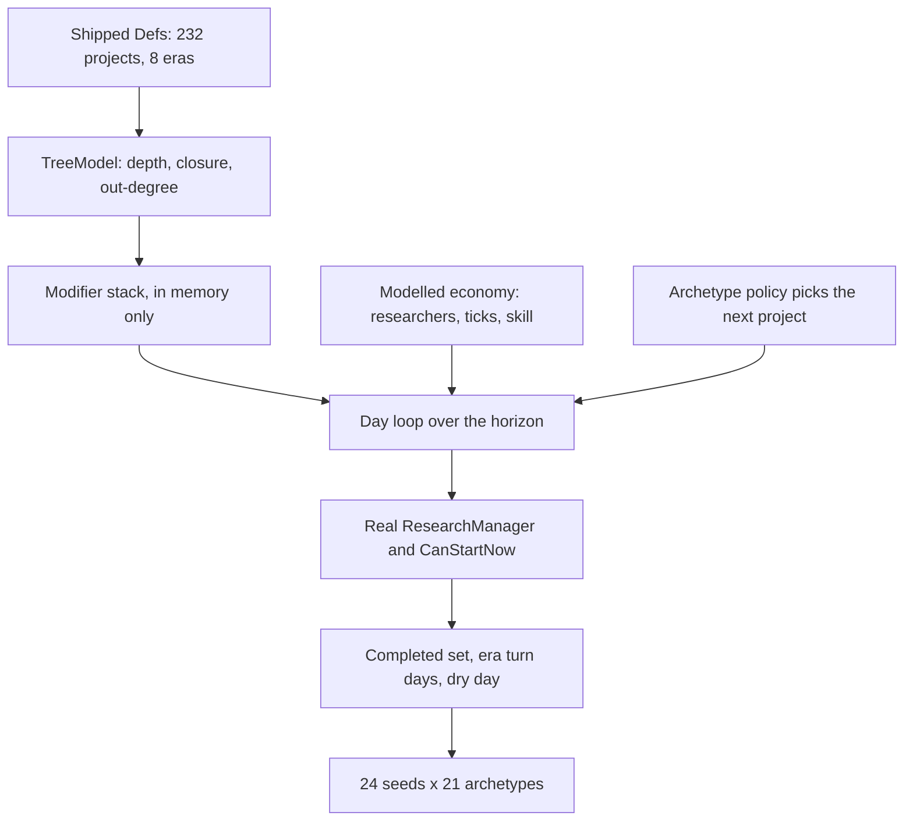

# Tech-tree reachability

SimWorld ships 232 research projects across 8 eras and 14 tracks and has never
measured what a played game reaches. This is that measurement, and it does not say
what it was expected to say.

The prompting worry came from `docs/research/epoch-inspiration.md` §3: the same
author's other game authored 78 tech rows, reaches about 10 in six years of play, and
concluded that "authoring is ahead of reachability, and reachability is a ladder
problem". SimWorld has three times that authored surface. The default hypothesis was
that most of the tree is dead content.

It is not. **At the baseline, every one of the 232 projects is reached by some
archetype on some seed, an engaged archetype finishes 98.4% of the tree, and the tree
is exhausted for good on day 3,074 — year 51.** The problems the harness found are
different ones, and most of them are wiring rather than content.

- The harness lives in `tools/research/`; its README covers running and extending it.
- Nothing in `src/SimWorld.Core/Data` was changed. Every candidate fix below is a
  switchable in-memory modifier, measured, never written to disk.

## 1. Method

### 1.1 What is real and what is modelled

The harness loads the shipped content through `CoreContent`, drives a real
`ResearchManager`, and asks the shipped runtime the two questions that matter:
`ResearchProjectDef.CanStartNow` decides what may be started, and
`ResearchProjectDef.CostFactor` prices it against
`ResearchManager.ResearcherTechLevel`. Starting eras replicate what
`ScenPart_StartingEra` does at game start. Researcher skill runs on a real
`SkillRecord`, so the XP curve, the passion factor, the daily learning saturation and
the level-10-and-up decay table are the shipped ones.

The research _economy_ is modelled, because SimWorld does not ship one. There is no
`ResearchSpeed` StatDef in `Data/Core/Defs/StatDefs`, no research `WorkGiver`, no
research building, and no work-scheduling loop — the `Research` `WorkTypeDef` exists
and nothing drives it. So the harness supplies one:

```text
points/day = researchers x WorkTicksPerDay x ResearchPointsPerWorkTick x speed(skill)
speed(skill) = SkillSpeedBase + SkillSpeedPerLevel x IntellectualLevel
```



### 1.2 Every assumption

Anything the shipped code or RimWorld could not settle is listed here. The
sensitivity column is measured, not guessed — see §4.

| Assumption | Value | Where it comes from | Sensitivity |
| --- | --- | --- | --- |
| Playthrough horizon | 50 in-game years (3,000 days) | Nothing in the repo states one. Epoch's reachability panel ran 45 years; the era ladder spans neolithic to archotech, so a civilization arc, not a RimWorld colony arc | **Dominant.** 10y gives 52% completed and 11 unreachable projects; 100y gives 100% and a dry game |
| Researcher-equivalents | 2, constant | The RimWorld colony convention the 1:1 port inherits. SimWorld has no civilization-scale research rollup yet | **Dominant.** 1 gives 75%; 4 gives 100% and dry at year 26 |
| Research work-ticks per day | 15,000 of the 60,000-tick day | Roughly six waking hours on one work type after sleep, meals and recreation. Not sourced — RimWorld has no such constant, it falls out of the schedule | High, and it multiplies with researcher count |
| `speed(skill)` shape | `0.08 + 0.115 x level`, so level 8 works at 1.0x | RimWorld's `SkillNeed_BaseBonus` shape for work-speed stats. **Not sourced from SimWorld content** — flagged in the harness source | High. A fixed skill 4 gives 59% and 30 dead projects; a fixed 20 gives 100% |
| Research XP per work tick | 0.1 | RimWorld's `JobDriver_Research`. **Not sourced from SimWorld content** | Moderate; equilibrium skill lands at 18.3-18.5 across the panel |
| Researcher passion | Minor (learn factor 1.0) | `SkillRecord.LearnRateFactor` ships None 0.35 / Minor 1.0 / Major 1.5 | Moderate, via equilibrium skill |
| Attention | Research happens on 85% of days | A player who is not always minding the queue | Moderate. 0.4 gives 70% and 7 dead; 1.0 gives 100% and dry at year 44 |
| Choice jitter | 15% multiplicative noise on a policy's preference key | A scripted player is not a perfect optimizer; also what makes seeds separate | Low |
| Starting era | Sticks and stones | The `TribalStart` scenario. The **default** scenario is `Landfall`, which starts Industrial | High, and it is measured separately in §3.3 |

Two consequences of the modelled economy worth stating plainly. First, "researcher-
equivalents" is a civilization-scale abstraction with no counterpart in the code yet;
2 is a colony number, and a civilization would plausibly have far more, which makes
the baseline the _conservative_ end of the range. Second, because throughput is a
product of four modelled numbers, the honest sensitivity statement is the aggregate
one: the baseline delivers about 1.35 million research points over 50 years against
an effective tree cost of 1.373 million. Those two numbers were never tuned against
each other, and their near-equality is why the baseline lands at 98% rather than 60%
or 100%.

### 1.3 The archetype panel

Following Epoch's method — a fixed named seed panel driven by scripted archetypes,
not a single playtest — the harness runs **21 archetypes across 24 fixed seeds**, 504
runs per configuration.

- `cheapest` — always takes the cheapest thing on the shelf.
- `breadth` — generalist; always feeds the track it has served least.
- `era-rush` — clears the era ladder rung by rung, taking only what the lowest
  incomplete era still needs.
- `spire` — races the deepest unfinished node in the DAG.
- `unlockers` — buys structural leverage: cheap nodes many others wait on.
- `random` — clicks without reading.
- `idle` — the negligent control: researching on 20% of days, and abandoning its
  target 15% of days when it does.
- `track:<T>` — fourteen specialists, one per track, each beelining its own track and
  paying whatever off-track prerequisites that track needs.

Every aggregate below is the **engaged arm**: the `idle` control is excluded, per
Epoch's engaged-arm framing. Both figures are printed by the harness.

Divergence is measured two ways, because they disagree and the disagreement is the
finding:

- **Policy overlap** — mean pairwise Jaccard similarity between two archetypes'
  completed sets on the same seed. 1.000 means every playstyle ended in exactly the
  same place.
- **Era-turn spread** — mean days between the first and last engaged archetype
  turning the same era on the same seed. This is Epoch's signal: a ladder where every
  playstyle turns the era within days of every other is not offering a choice.

## 2. The shipped tree

Static shape, from `ReachHarness tree`:

| Era | Projects | Cost sum | Mean | Depth range | Dead-end leaves | Cheapest closure |
| --- | --- | --- | --- | --- | --- | --- |
| SticksAndStones | 20 | 3,430 | 172 | 0-3 | 7 | 100 |
| Agrarian | 25 | 10,360 | 414 | 1-4 | 7 | 350 |
| Bronze | 27 | 18,670 | 691 | 2-8 | 4 | 850 |
| Classical | 30 | 33,560 | 1,119 | 3-9 | 10 | 1,520 |
| Medieval | 33 | 58,830 | 1,783 | 3-11 | 10 | 1,920 |
| Industrial | 36 | 113,400 | 3,150 | 4-12 | 8 | 3,300 |
| Information | 36 | 148,950 | 4,138 | 9-17 | 8 | 12,850 |
| Exotic | 25 | 169,560 | 6,782 | 11-21 | 13 | 26,400 |

Total 556,760 raw points; 1,373,015 after `CostFactor` at a researcher tech level
pinned to Neolithic, which is what the sticks-and-stones start leaves it at forever
(§5.4). The deepest chain is 22 nodes: `StoneTools` through `Agriculture`, `Copper`,
`Bronze`, `Wheel`, `Masonry`, `Iron`, `Steel`, `CokeSmelting`, `SteamEngine`,
`Thermodynamics`, `Electricity`, `Telegraphy`, `Telecommunications`, `TheInternet`,
`ArtificialIntelligence`, `NeuralInterfaces`, `NeuralLace`, `MindUploading`,
`TranscendentIntelligence`, `PostSingularityCivilization`, `OpenEndedFrontier`.

Two structural facts matter more than the totals.

**Depth is not a wall.** The "cheapest closure" column is the total raw cost of the
whole prerequisite closure of the cheapest project in each era. Reaching _some_
Exotic-era project (`Genomics`) costs 26,400 raw points across 22 projects — 56,380
after the shipped cost factor at a pinned Neolithic tech level, about 150 in-game days
at baseline throughput. Even the far end of the 22-node chain, `OpenEndedFrontier`,
needs 51 projects and 372,005 effective points, around 13 in-game years. The tree is
deep, but it is narrow at the bottom: a beeline touches the last era inside the first
three in-game years of a fifty-year game.

**Nothing is gated on era.** `ResearchProjectDef.CanStartNow` checks prerequisites
only. `EraDef` carries `order` and `techLevel` and computes `IsComplete`, but no code
path uses an era to decide what may be researched. An Exotic project is legal on day
one if its chain allows.

**Nothing is gated on research either.** `ResearchProjectDef.UnlockedDefs` scans every
loaded Def for `IResearchUnlockable`. The harness reports the answer: **0 of 232
projects unlock any Def.** No shipped recipe, thing or building names a research
prerequisite; `RecipeDef.AvailableNow` is hardcoded `true` with a comment saying
research gating joins later.

## 3. Baseline numbers

50 years, sticks-and-stones start, 2 researchers at Intellectual 8 growing, 15,000
work-ticks a day, attention 0.85, 21 archetypes x 24 seeds = 504 runs.

### 3.1 As shipped

| Metric | Value |
| --- | --- |
| Mean completed, engaged arm | **98.4%** — 228.4 of 232 |
| Mean completed, all archetypes | 96.6% |
| Never reached by any archetype on any seed | **0 of 232** |
| Policy overlap, engaged | **0.977** |
| Engaged runs that ran out of research | 0% at 50 years; 100% by day 3,076 (year 51.3) |
| Highest era turned, engaged mean | 5.63 of 7 |

Per archetype, every engaged policy lands between 230.0 and 230.6 of 232 — except
`spire`, at 191.1, which is the only archetype that meaningfully diverges. The `idle`
control still reaches 139.0 (59.9%).

Era turns:

| Era | Reached | Median day | Median year | Archetype spread (days) |
| --- | --- | --- | --- | --- |
| SticksAndStones | 95% | 366 | 6.1 | 1,442 |
| Agrarian | 95% | 401 | 6.7 | 1,423 |
| Bronze | 95% | 479 | 8.0 | 1,409 |
| Classical | 93% | 571 | 9.5 | 1,408 |
| Medieval | 90% | 716 | 11.9 | 1,573 |
| Industrial | 90% | 1,100 | 18.3 | 1,408 |
| Information | 89% | 1,838 | 30.6 | 1,164 |
| Exotic | **0%** | never | — | — |

"Reached" is over all 21 archetypes; "spread" is the engaged arm only.

Read that table twice. The first era turns at year 6, and 5% of runs — the
frontier-racing `spire` archetype — never turn it at all. The last era never turns in
any run, in a panel where the typical engaged archetype finished 99.3% of the tree.

### 3.2 With the researcher tech level tracking the era

`ScenPart_StartingEra` sets `ResearchManager.ResearcherTechLevel` once and nothing
ever advances it. From a sticks start it stays Neolithic for the whole game, so every
Medieval-era project costs 1.5x, Industrial 2x, Information 2.5x and Exotic 3.5x,
forever. That is an unfinished wire, not a design decision, so the fair baseline is
measured both ways.

| Metric | As shipped | Tech level tracks era |
| --- | --- | --- |
| Completed, engaged | 98.4% | 99.1% |
| Policy overlap, engaged | 0.977 | 0.982 |
| Exotic era reached | 0% | **90%**, median year 34.8 |
| Ran dry | 0% | **95%**, median year 34.8 |

### 3.3 The shipped scenarios

`Landfall` is the default scenario and starts in the Industrial era, which means
`ScenPart_StartingEra` finishes **135 of 232 projects before the player does
anything**.

| Scenario | Start era | Granted free | Completed, engaged | Overlap | Ran dry |
| --- | --- | --- | --- | --- | --- |
| `TribalStart` | SticksAndStones | 0 | 98.4% | 0.977 | 0% |
| `AgrarianVillage` | Agrarian | 20 | 98.7% | 0.982 | 0% |
| `Landfall` (default) | Industrial | **135** | **100.0%** | **1.000** | 100%, year 28.7 |

On the default scenario every engaged archetype finishes every remaining project,
ends with an identical completed set, and turns the final era within a **43-day**
spread of every other archetype. That is Epoch's exact failure signature — "every
playstyle turned the era within two days of every other" — reproduced on SimWorld's
default start.

## 4. Sensitivity

Seven-archetype core panel (the fourteen track specialists are dropped for run time),
24 seeds. "Dead" is projects no archetype reached on any seed.

| Configuration | Completed | Highest era | Dead | Overlap | Ran dry (day) |
| --- | --- | --- | --- | --- | --- |
| 1 researcher | 74.9% | 3.23 | 0 | 0.684 | — |
| 2 researchers (baseline) | 96.4% | 4.78 | 0 | 0.932 | — |
| 4 researchers | 100.0% | 7.00 | 0 | 1.000 | 1,558 |
| 8 researchers | 100.0% | 7.00 | 0 | 1.000 | 800 |
| 16 researchers | 100.0% | 7.00 | 0 | 1.000 | 421 |
| Horizon 10y | 53.7% | 2.13 | 38 | 0.611 | — |
| Horizon 25y | 74.4% | 3.24 | 1 | 0.679 | — |
| Horizon 50y | 96.4% | 4.78 | 0 | 0.932 | — |
| Horizon 100y | 100.0% | 7.00 | 0 | 1.000 | 3,074 |
| Horizon 500y | 100.0% | 7.00 | 0 | 1.000 | 3,074 |
| Researcher base +3%/y | 100.0% | 7.00 | 0 | 1.000 | 1,871 |
| Researcher base +6%/y | 100.0% | 7.00 | 0 | 1.000 | 1,424 |
| Attention 0.40 | 70.3% | 3.10 | 7 | 0.663 | — |
| Attention 1.00 | 100.0% | 7.00 | 0 | 1.000 | 2,614 |
| Fixed skill 4 | 59.1% | 2.42 | 30 | 0.617 | — |
| Fixed skill 8 | 73.1% | 3.17 | 3 | 0.670 | — |
| Fixed skill 20 | 100.0% | 7.00 | 0 | 1.000 | 2,740 |

Three things fall out of this table.

**The tree holds about fifty years of a two-researcher civilization, and not one day
more.** Horizons of 100, 200 and 500 years all report the same first-dry day, 3,074.
Past that the civilization researches nothing, forever. Run to a 100-year horizon on
the full 21-archetype panel, every engaged archetype finishes all 232 projects, goes
dry at a median day 3,076, ends with an identical completed set (overlap 1.000), and
then generates **1.32 million research points with nothing to spend them on** — as
many points as the entire tree cost to buy in the first place.

**Every plausible move makes the game drier, not richer.** Four researchers instead of
two, or a researcher base growing at 3% a year — a mild assumption for a game about
civilizations — exhausts the tree by year 26 to 31.

**Dead content only appears when the game is short or the researchers are bad.** At a
10-year horizon 38 projects are unreachable on the core panel and 11 on the full
21-archetype panel. On that wider panel they are exactly the ones you would expect: 9
of the 25 Exotic projects and 2 of the 36 Information projects, and 9 of the 11
projects on the `FrontierExotic` track are among them. Note that "dead" is
panel-width dependent — a wider archetype panel finds fewer dead projects, because a
specialist reaches things a generalist never does. Any dead-content number is a property of the panel as much as of the tree.

## 5. Diagnosis

### 5.1 Reachability is not the problem

The prompting hypotheses were cost bands too steep, prerequisite depth, era gating
ending the game early, too many parallel tracks, and projects with no unlock
consequence. Measured, four of the five are not binding:

- **Cost bands.** Freezing the era escalation from Industrial onward (`costfreeze4`,
  Epoch's capped-quadratic-then-flat finding) takes the tree from 98.4% to 100%
  completed and moves the dry day _forward_ to year 24. The escalation is not the
  problem; it is the only thing slowing the tree down.
- **Prerequisite depth.** Capping depth at 10 by rebasing (`flatten10`) moves
  completion from 98.4% to 98.3% and overlap from 0.977 to 0.971. No archetype is
  stuck behind depth: the cheapest route into the last era is 22 projects long and
  costs 150 in-game days.
- **Era gating ending the game.** Eras do not gate anything. `CanStartNow` never asks.
- **Parallel tracks.** One two-researcher civilization covers all fourteen tracks and
  finishes 99.3% of them.

### 5.2 There is no opportunity cost

Engaged policy overlap is 0.977 at the baseline and 1.000 on the default scenario. A
Warfare specialist and a Medicine specialist finish the same 230 of 232 projects. The
choice of what to research is not a choice about _what you get_; at best it is a
choice about what order you get it in.

The one archetype that genuinely diverges, `spire`, does so by racing the frontier and
leaving dead-end leaves unbought: 191.1 of 232, and — because era completion demands
100% — it never turns even the first era in fifty years.

Era-turn spread tells the other half. At the baseline the spread is about 1,400 days,
so archetypes do diverge sharply in _when_ they turn an era even though they converge
on _what_ they end up with. That divergence is currently invisible to the game,
because of §5.3.

### 5.3 Nothing is at stake

**0 of 232 projects unlock any Def.** No recipe, thing or building in
`Data/Core/Defs` names a research prerequisite, and `IResearchUnlockable` has no
implementors in content. Finishing `Steel` and finishing `BodyAdornment` have exactly
the same mechanical consequence: none.

This makes every divergence number in this report an upper bound on a _shape_, not a
measure of meaningful choice. The archetypes are proxies for preferences the game does
not yet reward. Until research gates something, "reachability" cannot be a question
about value, only about arithmetic.

### 5.4 The era ladder is a completion audit, not a ladder

`EraDef.IsComplete` is true when **every** project tagged to that era is finished, and
`ResearchManager.CurrentEra` walks unbroken from era 0. Three measured consequences:

- A civilization that has finished 99.3% of the tech tree has not reached the Exotic
  era, in any of 480 engaged runs at the baseline. It is short one or two dead-end
  leaves.
- An archetype that races the technological frontier (`spire`) never reaches era 0.
- 5% of baseline runs never turn the first era at all.

An era ladder in which the frontier-racing player is ranked below the completionist,
and in which reaching the last age requires buying every piece of flavour content in
every earlier one, is not measuring what the spec says it measures ("an `EraDef`
ladder over the research DAG carries a civilization from neolithic to archotech").

### 5.5 The researcher tech level is a stale wire carrying a 2.5x tax

`ScenPart_StartingEra` sets `ResearcherTechLevel` once; nothing advances it. From a
sticks start the tree's effective price is 1,373,015 points instead of 556,760. That
tax is currently load-bearing for pacing _by accident_: fixing the wire (§3.2) moves
the Exotic era from unreachable to year 34.8 and makes 95% of engaged runs go dry.

### 5.6 The default scenario gives away 58% of the tree

`Landfall` is `isScenarioDefault` and starts Industrial, so 135 of 232 projects are
finished by `ScenPart_StartingEra` before the first tick. The remaining 97 are bought
out identically by every engaged archetype by year 28.7.

## 6. Candidate fixes, measured

Each is a switchable modifier; none touches the shipped content. All at the baseline
configuration, 21 archetypes x 24 seeds.

| Candidate | Active | Completed | Highest era | Dead | Overlap | Ran dry (day) |
| --- | --- | --- | --- | --- | --- | --- |
| Baseline (`none`) | 232 | 98.4% | 5.63 | 0 | 0.977 | — |
| Wire the tech level to the era (`techtrack`) | 232 | 99.1% | 6.60 | 0 | 0.982 | 95%, 2,085 |
| Cut authored surface (`trim12`) | **112** | 100.0% | 7.00 | 0 | **1.000** | 100%, 1,432 |
| Raise throughput 4x (`throughput4`) | 232 | 100.0% | 7.00 | 0 | **1.000** | 100%, 801 |
| Flatten prerequisites to depth 10 (`flatten10`) | 232 | 98.3% | 5.51 | 0 | 0.971 | — |
| Freeze cost escalation (`costfreeze4`) | 232 | 100.0% | 7.00 | 0 | **1.000** | 100%, 1,423 |
| Eras turn on their spine (`spine`) | 232 | 98.5% | **6.18** | 0 | 0.976 | — |
| Eras turn at 60% (`era60`) | 232 | 98.5% | **6.60** | 0 | 0.977 | — |
| Eras gate availability (`eragate`) | 232 | 99.3% | 6.00 | 0 | **0.994** | — |
| `eragate,spine` | 232 | 99.3% | 6.53 | 0 | **0.994** | — |
| `eragate,era60` | 232 | 99.3% | **7.00** | 0 | 0.993 | — |
| Double every cost (`costscale2`) | 232 | 80.0% | 4.27 | 0 | **0.827** | — |
| Triple every cost (`costscale3`) | 232 | 68.9% | 3.46 | 0 | **0.755** | — |
| Quintuple every cost (`costscale5`) | 232 | 54.1% | 2.28 | **8** | **0.630** | — |
| `costscale3,eragate,spine` | 232 | 74.3% | 5.00 | **30** | 0.928 | — |
| `techtrack,throughput4` | 232 | 100.0% | 7.00 | 0 | **1.000** | 100%, 555 |

Reading the table against the five proposals the investigation set out with, plus
one the measurement itself suggested:

**Reduce authored surface — rejected, with evidence.** `trim12` asks for at most 12
projects per era (96 in total) and, swept to a fixed point, gets to 112 — it will only
ever cut a project nothing else depends on, so 120 of the 232 are removable dead ends
once cutting cascades (the tree has 67 leaves to start with; each cut exposes more)
and the other 112 are load-bearing structure for the chains above them. On the trimmed
tree completion goes to 100%, overlap to 1.000, and the game runs dry at year 24
instead of never. Every measured symptom gets worse. The tree is not too big.

**Raise throughput — rejected, with evidence.** `throughput4` produces the same
outcome, faster: dry at year 13, overlap 1.000. Throughput was already comfortably
sufficient; more of it only shortens the game.

**Restructure prerequisites — rejected, no measurable effect.** `flatten10` moves
every headline number by less than one point in either direction. Depth is not a
constraint anyone is hitting.

**Make eras open laterally — accepted, but only as a readout fix.** `spine` and
`era60` raise the mean highest era from 5.63 to 6.18 and 6.60, fix the absurdity of a
frontier-racer never turning era 0, and change nothing else: completion, overlap and
dead content are all within noise. Cheap, correct, and does not solve §5.2.

**Epoch's charter idea — the closest measurable analogue is mixed.** The charter
proposal is "era advancement gated on what the player did, not on a research
checklist"; the world-state half of it cannot be measured until the world sim exists,
so the harness measured its mechanical half — an era ladder that actually gates
content (`eragate`), with the checklist relaxed (`spine`, `era60`). It works as a
ladder: `eragate,era60` reaches era 7.00, and the era turns become an ordered
sequence with an 8-to-121-day archetype spread in the early eras instead of 1,400.
But that is the point of concern, not of celebration: engaged overlap rises to 0.994,
the highest of any configuration except the outright degenerate ones. Forcing every
archetype up the same ladder makes the progression legible and the playstyles
identical. And when combined with scarcity (`costscale3,eragate,spine`) it produces
**30 genuinely dead projects** and parks every archetype at era 5 — Epoch's own
failure, manufactured.

**The one lever that produces divergence is scarcity.** Doubling every cost lands a
50-year game at 80% completion with overlap 0.827 and no dead content. Tripling it
lands at 69% with overlap 0.755, still no dead content, but strands the top two eras.
Quintupling it produces 8 dead projects. Scarcity is the only knob in the panel that
buys meaningful choice, and it buys it at a measurable, tunable price.

## 7. Recommendation

**Do not resize the tech tree. Change three things around it, in this order, and one
cheap extra.**

### 7.1 Attach consequences to research before touching anything else

0 of 232 projects gate any Def. Until `researchPrerequisites` appears on recipes,
buildings and things, no archetype has any reason to prefer one project over another
except price, and every reachability, divergence and pacing number in this report is a
statement about arithmetic rather than about play. This is the highest-leverage change
available and it is content wiring, not redesign: `IResearchUnlockable` and
`ResearchProjectDef.UnlockedDefs` already exist and are already tested; nothing
implements the interface.

It also changes what the measurement _means_, which is why it comes first: once
projects unlock things, a track specialist has a reason to skip the other thirteen
tracks, and the divergence numbers in §6 stop being an upper bound on shape and start
being a measure of choice. Re-run the panel after this lands; several conclusions here
should be expected to move.

### 7.2 Fix the era ladder's two defects

- Advance `ResearcherTechLevel` with the era. Right now it is set once by
  `ScenPart_StartingEra` and never again, which taxes the whole tree 2.5x from a
  tribal start. That tax is currently doing pacing work by accident; removing it
  without §7.3 moves the dry day to year 35.
- Stop requiring 100% of an era's projects to turn it. `spine` (turn on the projects
  something else depends on) is the better of the two measured variants because it is
  a structural rule rather than a tuned percentage, and it raises the mean highest era
  from 5.63 to 6.18 at no measured cost. Dead-end flavour content should be optional
  flavour, not a bar in front of the next age.

Do **not** make eras gate availability. Measured: overlap 0.977 → 0.994, and with any
scarcity it creates real dead content.

### 7.3 Choose a horizon, then price the tree to it — do not resize it

The tree holds about fifty years of a two-researcher civilization and is exhausted at
day 3,074 regardless of how long the game runs. Nothing in the repo states an intended
playthrough length; that decision is a prerequisite for any further tuning, and it
belongs in `docs/status.json`'s decisions the way the other pinned choices do.

Once it exists, the lever is price, not row count. Measured shape of the price lever
at a 50-year horizon: 1x gives 98% completion and overlap 0.977; 2x gives 80% and
0.827; 3x gives 69% and 0.755; 5x gives 54%, 0.630 and 8 dead projects. Somewhere
between 2x and 3x is a 50-year game where a civilization visibly cannot have
everything, no content is unreachable, and playstyles end in visibly different places.
That is a per-era cost-band edit in `tools/content/gen_techtree.py`, not a rewrite —
and it should be made only after §7.1, because consequences change what scarcity is
scarce _of_.

### 7.4 Also worth fixing, cheaply

`Landfall` is the default scenario and grants 135 of 232 projects at game start.
Whatever the intended pacing is, the default start should probably not be the one that
hands over 58% of the authored tree before the player acts.

## 8. The counter-case

Everything above rests on the horizon and the throughput. Here is precisely what would
have to be true for the recommendation to be wrong.

**If a SimWorld playthrough is 5 to 10 in-game years, the diagnosis inverts.** At a
10-year horizon an engaged archetype completes 52.1%, 11 projects are unreachable by
any of the 21 archetypes on any of the 24 seeds — 9 Exotic and 2 Information, taking
9 of the 11 `FrontierExotic` projects with them — and the top three eras never turn.
That is Epoch's finding, and the right response would be the opposite of §7.3: the
tree would be roughly twice as large as the horizon can carry, and trimming or
cheapening it would be correct. A RimWorld colony game runs 2 to 10 in-game years, and SimWorld is a 1:1
port of RimWorld's systems, so this is not a remote possibility — it is the reading
that follows if the game turns out to be played at RimWorld's timescale rather than a
civilization's.

**If real research throughput is below about 40% of the modelled figure, likewise.**
The `attention 0.40` row is a proxy for exactly this: 70.3% completed, 7 dead
projects, overlap 0.663. If the god layer never lets a player dedicate the equivalent
of two full-time researchers, or if research work turns out to be 5,000 ticks a day
rather than 15,000, the tree becomes appropriately sized rather than too cheap.

**If the `speed(skill)` constants are wrong.** `0.08 + 0.115 x level` is RimWorld's
shape for work-speed stats and is not sourced from SimWorld content, which ships no
`ResearchSpeed` StatDef at all. The panel's researchers settle at Intellectual 18.3 to
18.5, so they spend most of the game at about 2.2x. If the real curve tops out nearer
1.0x, the fixed-skill-8 row applies instead: 73.1% completed and 3 dead projects.

**If the archetype panel is not a spanning set of real play.** All 21 archetypes are
optimizers of one kind or another over a tree in which cost is the only signal,
because it is the only signal that exists (§5.3). A real player responds to what
research unlocks. The dead-content count is also panel-width dependent — 38 on the
7-archetype panel at 10 years, 11 on the 21-archetype panel — so any specific dead
number should be read as "dead to this panel", not "dead".

**What would settle it.** The horizon question is a design decision, not a
measurement; someone has to make it. The throughput question is answerable once the
work loop, a research building and a `ResearchSpeed` StatDef exist — at which point
this harness should be re-pointed at the real economy instead of the modelled one, and
every number here re-derived.

## 9. What this could not determine

- **The intended playthrough length.** Nothing in the repo states one. This is the
  single largest source of uncertainty in the report.
- **Real research throughput.** SimWorld ships no `ResearchSpeed` StatDef, no research
  `WorkGiver` or `JobDriver`, and no research building. The economy in §1.1 is a
  model, not a measurement of the port.
- **Whether playstyles would diverge if research unlocked things.** Cannot be measured
  until §7.1 lands. Every divergence figure here is conditional on a tree where all
  232 projects are mechanically identical.
- **Whether research scales with civilization size.** The god layer, the building
  module and any civilization-scale rollup are unbuilt, so "researcher-equivalents"
  is an abstraction with no counterpart in code.
- **Anything about the world state Epoch's charters read** — population, stockpiles,
  buildings raised, raids survived. The charter proposal's mechanical half was
  measured; its world-state half needs the world sim.

## 10. Era shape, after the horizon decision

§9 named the intended playthrough length as "the single largest source of
uncertainty in the report". That uncertainty is now resolved by decision rather
than by measurement: **there is no fixed horizon** — the director paces time, a
century in which nothing happened costs nothing to pass, and years are not the
currency. The tracker item this report served (`research.horizon`) asked whether
a 50-year civilization can have everything. That question is about a unit that
no longer applies.

What survives the reframing is per era: **by the time a civilization leaves an
era behind, how much of that era had it seen, and did two civilizations see the
same things?** The harness gained an `eras` command that answers exactly that.

### 10.1 A stale rule, and a tautology

The first run reported 100% seen and 1.00 overlap in every era at every
throughput. That was not a finding — it was the harness measuring a rule the
game had stopped using.

`EraRule.Full` was the shipped rule and was documented as such. Then
`EraDef.IsComplete` moved to the **spine** rule (§6, §7.2) and this harness was
not updated. Under `Full`, an era turns exactly when 100% of it is finished, so
"how much had they seen when it turned" is 100% by construction, and every
archetype's set is identical.

The fix is structural rather than a correction: `EraRule.Shipped` now delegates
to the real `EraDef`, so the harness cannot drift from the game again. Every
number below is measured against it.

### 10.2 What the shipped tree actually does

Panel: the full archetype set, tech level tracking the era, five seeds.

| throughput | seen% (range across eras) | overlap |
| --- | --- | --- |
| x0.5 | 88–98% | 0.89–1.00 |
| x1 | 88–98% | 0.86–0.96 |
| x2 | 87–98% | 0.86–0.97 |
| x4 | 87–98% | 0.86–0.97 |

A civilization sees **essentially all of an era before leaving it**, and two
different archetypes finish nearly the same set. Throughput barely moves either
number: researching four times faster changes seen% by about one point. The
shape of an era does not depend on how fast you research it.

### 10.3 The candidate fix, and why it stops working

If optional content is cheap enough to sweep up while working the spine that
actually gates the age, then price it. `leafcost<N>` multiplies the cost of
every project nothing else depends on, leaving the spine alone.

| leaf cost | seen% (range) | overlap | eras reached |
| --- | --- | --- | --- |
| shipped | 87–98% | 0.86–0.97 | 95% |
| x2 | 53–87% | 0.86–0.96 | 89–95% |
| x4 | 50–87% | 0.86–0.97 | 80–95% |
| x8 | 50–87% | 0.91–0.97 | 75–90% |

It works once and then saturates. x2 buys real choice; x4 and x8 buy almost
nothing more, while steadily making later eras less reachable. **Overlap never
moves at all** — at any price, archetypes finish nearly the same set.

### 10.4 Why: the spine is the floor

Reporting spine share beside seen% makes the reason exact. At leaf cost x4:

| era | spine% | seen% |
| --- | --- | --- |
| SticksAndStones | 65% | 69% |
| Agrarian | 72% | 76% |
| Bronze | 85% | 87% |
| Classical | 67% | 71% |
| Medieval | 70% | 74% |
| Industrial | 78% | 81% |
| Information | 78% | 79% |
| Exotic | 48% | 50% |

**seen% lands within two to four points of spine% in every era.** Every
civilization must finish the spine to leave the era at all, so the leaves are
the only room for divergence, and pricing can push seen% down to the spine and
no further. The shipped tree is 48–85% spine, median about 72%.

That is a structural ceiling, not a tuning problem:

- Cost tuning moves seen% between "spine plus everything" (the shipped 87–98%)
  and "spine only" (~spine%). That is the entire available range.
- Overlap cannot fall much below ~0.85 whatever the price, because the shared
  spine is most of what anyone finishes.

### 10.5 Conclusion

**Do not re-price the tree.** The premise behind `research.horizon` — that cost
tuning produces playstyle divergence — is not supported. Cost changes how _much_
a civilization does within an era; it does not change _what_, because the part
that differs is a minority of the era by construction.

The lever is **tree shape**: fewer dependencies and more leaves per era raises
the ceiling that pricing then works within. And unlike when this report was
first written, that is now worth authoring for — research has real consequences
(`ThingDef` and `RecipeDef` gate on it, §7.1's condition, since landed), so
leaves can be written so a farming civilization and a war-making one genuinely
want different ones. Divergence has to be authored into what projects _do_
before any amount of pricing can express it.

If the shipped tree is left exactly as it is, the honest description is: eras
are a paced ladder every civilization walks the same way, and the variety comes
from elsewhere in the simulation. That is a legitimate design — it is just not
the one `research.horizon` assumed.

## 11. Authoring the divergence (`research.divergence`)

§10.5's conclusion is the brief this section executes: tree shape, not price,
is the lever, and it is now worth pulling because research gates real content.
Nothing in `src/SimWorld.Core/Research` changed — only
`tools/content/gen_techtree.py` and the `ResearchProjectDef` XML it generates.

### 11.1 What was authored

**De-linearize 68 of the tree's prerequisite edges.** §10.4 showed why spine
share is the ceiling on divergence: a project only becomes optional once
nothing else needs it, and a long single-file chain (A→B→C→D, each the sole
prerequisite of the next) makes every link but the last mandatory. The fix is
mechanical: for every project with exactly one dependent, either drop it from
that dependent's prerequisite list (if the dependent has others) or splice the
dependent onto the source's own prerequisites (if it does not), turning the
source into a leaf. Applied once, in a single deterministic pass over the
original topology (era order, then `defName`) so a downstream project loses at
most one incoming edge — an earlier iterative version let two independent
single-source edges compound onto the same node and once silently rerouted
`TradeRoutes` past two intermediate techs at once, which was surgery, not
authoring, and was rejected in favor of the single-pass version measured here.

Two things were protected from this pass:

- **The 22-node deep chain** (`StoneTools` through `OpenEndedFrontier`, the one
  `TechTreeTests.The_longest_prerequisite_chain_is_at_least_20_deep` pins) —
  every node on it was excluded as an edge *source*, and the pass was verified
  afterward to leave every one of its 22 depths unchanged. Two of its interior
  nodes (`SteamEngine`, `MindUploading`) still lost an *unrelated* second
  prerequisite as edge *targets* (`CoalMining`, `ArchotechSeeds` respectively);
  that is safe because depth is a max over prerequisites and the chain's own
  branch was never the one removed, confirmed by the same before/after check.
- **`Fire` and `Foraging`**, the two SticksAndStones roots whose sole
  dependents (`Cooking`, `HerbalRemedies`) would otherwise have been spliced
  onto an empty prerequisite list. Nothing in the validator forbids a second
  generation of first-era roots, but a tech tree where "cooking" needs nothing
  at all reads as an artifact of the algorithm rather than an authored choice,
  so these two edges were left as spine by hand. (`AncestorVeneration` and
  `GiftExchange` looked like the same case on a first pass — they are not:
  both already require `Language`, so their skip-transformations are ordinary.)

**13 new leaf projects, one per track/era cell that the restructuring left with
none.** Cutting edges lowers spine share but does not, by itself, give a track
specialist anything of their own to spend time on: `TrackPolicy` prioritizes
every unfinished project in its track, spine or leaf, over everything else, so
a cell with zero leaves gives that archetype no room to diverge from a
generalist in that era. `Counting`, `BoneSetting`, `Threshing`, `Pictographs`,
`TributeSystems`, `SacredSites`, `Causeways`, `Cartography`, `Haymaking`,
`Journalism`, `Suburbs`, `VideoGames` and `ComputerGraphics` each fill exactly
one such cell (era, track pair where every existing project was spine),
prerequisite on an existing project in the same cell or its immediate ancestor,
never gate anything themselves, and cost inside their era's existing band via
the same depth-based `assign_costs` every other project uses — no new pricing
mechanism.

**Not attempted: mutually-exclusive lines.** The brief named this as a
divergence type; `ResearchProjectDef` has no exclusion-tag mechanism (no
RimWorld-style `ExclusionTags`, no OR-prerequisites), and adding one is a
`src/SimWorld.Core/Research` change explicitly out of scope this round (it
collides with `EndlessResearch`, landing separately — see the brief). The
restructuring above is exclusively AND-DAG surgery: fewer mandatory edges and
more parallel leaves, not branches that foreclose each other.

### 11.2 Measured

`dotnet run -c Release --project tools/research/ReachHarness.csproj tree` and
`eras`, before (232 projects, the tree §2 and §10 describe) and after (245):

| Era | Spine % (before → after) | Seen % (before → after) | Overlap (before → after) |
| --- | --- | --- | --- |
| SticksAndStones | 65% → **36%** | 87% → 65% | 0.87 → **0.70** |
| Agrarian | 72% → **33%** | 96% → 84% | 0.93 → **0.78** |
| Bronze | 85% → **53%** | 98% → 88% | 0.97 → **0.86** |
| Classical | 67% → **45%** | 95% → 89% | 0.92 → **0.84** |
| Medieval | 70% → **38%** | 91% → 86% | 0.91 → **0.82** |
| Industrial | 78% → **43%** | 97% → 89% | 0.95 → **0.83** |
| Information | 78% → **54%** | 98% → 93% | 0.96 → **0.89** |
| Exotic | 48% → **28%** | 90% → 87% | 0.86 → **0.82** |
| **Mean** | **70.4% → 41.3%** | 94.0% → 85.1% | **0.921 → 0.818** |

(Shipped throughput, tech level tracking the era, 21 archetypes × 24 seeds —
the same panel §10.2 used. "Seen %" and "overlap" are the moment each era's
spine completes, per `Reports.EraShape`.) Every era moved in the intended
direction on every column; none regressed. Tree-wide (`TechTreeTests`'
`The_tree_wide_spine_fraction_is_below_half`), spine share is 104 of 245
projects, 42.4%, against the original tree's 165 of 232, 71.1%.

**Nothing became unreachable.** `baseline` reports 245 of 245 projects reached
by some archetype on some seed (0 never-reached, by era and by track), every
era's reach rate over the 50-year panel is 90–95% — in the same band §3.1
reported for the original tree under the `Full` rule it was measured against
at the time, and the harness's own `EraRule.Shipped` fix (§10.1) means this is
now the first time that comparison has been apples-to-apples with the live
game — and the deep chain's 22-node length is unchanged, both by direct
before/after check and by a passing `TechTreeTests` (`dotnet test`, full
suite, 974 of 974 passing — see the tracker item for the exact count this
branch shipped with).

**Confirms §10.3's finding from the other direction.** Running `leafcost2/4/8`
*on top of* the restructured tree still barely moves overlap (0.73–0.95 across
the sweep — most eras within a couple points of the unpriced 0.70–0.89) while
pushing seen% down further (to 30–59% at `leafcost4`, versus 65–93% unpriced) —
cost changes how much of an era's optional content gets bought, but not, on
its own, which projects diverge. What moved overlap in §11.2 was changing
which projects are mandatory, not what they cost.

### 11.3 What this did not do

- **Did not chase spine% to zero, or hold eras to one target number.** Bronze
  and Information stay the highest (53%, 54%) because their existing projects
  are genuinely foundational — early materials techs and the internet/AI
  cluster are load-bearing for most of what comes after by the tree's own
  historical logic, not by an authoring accident. Flattening them further
  would mean inventing prerequisites that do not make sense, which the brief's
  "translate second, port first" spirit argues against.
- **Did not touch cost.** §10.3/§10.5 already showed price does not move
  overlap; re-deriving that on the new tree (§11.2) rather than re-tuning
  bands was the point.
- **Did not wire the 13 new leaves to any `ThingDef`/`RecipeDef`.** That
  content lives outside this round's file ownership (`research.divergence`
  owns `ResearchProjectDefs/`, `EraDefs/`, and the harness, not `ThingDefs/` or
  `RecipeDefs/`). They are real, priced, optional research; they are not yet
  consequential the way the 9 existing `IResearchUnlockable` projects are.
  Wiring them up is exactly the kind of change §7.1 and §10.5 describe, and
  would very likely move `seen%`/overlap further in the same direction —
  worth a follow-up now that the DAG has somewhere for that wiring to attach.
- **Did not re-run the `sweep`/`modifiers` reports against the new tree.**
  They describe candidate fixes that were rejected or partially accepted
  before this round (§6); re-deriving all of them was out of scope for a
  content-shape change. `eras` and `baseline`, the two the brief asks for, are
  re-run in full above.
