# SimWorld — Technical Spec / Outline

Civilization-scale god-game on RimWorld-depth simulation. Every citizen is a full
agent. Phase 1 ports RimWorld's systems 1:1 as isolated tested modules
(see `docs/research/rimworld-mechanics.md`); the god layer comes after.

This document describes the architecture **as built**. `docs/status.json` is the
source of truth for per-system progress; the Blueprint tracker renders it.
Sections marked _planned_ have no code yet.

## 1. Pillars

- Emergent story from simulation, not scripted narrative.
- Data-driven content: designers add content via XML Defs, not code.
- Deterministic simulation: same seed + same inputs → same outcome.
- 1:1 RimWorld mechanics first, translated to civilization scale second.
- Engine-free core: no `UnityEngine` reference anywhere in `SimWorld.Core`.

## 2. Layered Architecture

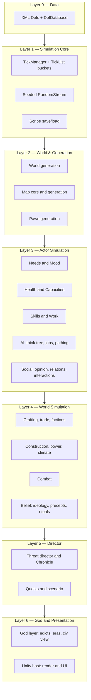

- Dependencies point downward only. A module never references a layer above it.
  Social sits in Layer 3 rather than beside belief in Layer 4, and that placement
  is deliberate: opinion, relations and interactions are per-pawn state of
  exactly the same kind as needs and mood, which is why `Pawn_RelationsTracker`
  can own them without reaching upward. Belief — ideology, precepts, rituals — is
  genuinely world-scale and stays in Layer 4 for the god layer to own. An earlier
  draft lumped the two together as one Layer 4 box, which made the perfectly
  correct `Pawns -> Social` reference look like a violation of this rule.
- Layer 6 is one-way: the host reads simulation state and never mutates it, so
  the core stays headless-testable.

## 3. Data Layer (Defs)

RimWorld's Def system, ported whole. Content is XML under
`src/SimWorld.Core/Data/Core/Defs/<DefTypeName>s/`; the element name selects the
Def class.

```xml
<HediffDef ParentName="DiseaseBase">
  <defName>Flu</defName>
  <label>flu</label>
  <lethalSeverity>1</lethalSeverity>
  <comps>
    <li Class="SimWorld.Health.HediffCompProperties_Immunizable">
      <immunityPerDaySick>0.7</immunityPerDaySick>
      <severityPerDayNotImmune>0.5</severityPerDayNotImmune>
    </li>
  </comps>
</HediffDef>
```

- **Inheritance**: `Name` / `ParentName` / `Abstract="True"`, with
  `Inherit="False"` and list append.
- **Polymorphism**: `Class="…"` on a list item picks the concrete type;
  `Type`-valued fields (`workerClass`, `hediffClass`) resolve by full name.
- **Cross-references** are deferred: bare `defName` strings resolve after every
  file loads, so files may reference each other in any order.
- **Comps**: composition over inheritance — a properties object per comp in XML,
  paired with a runtime comp class.
- **DefOf**: `[DefOf]` static classes bind named Defs to fields at load; a
  missing Def is a load error, which the content test asserts is empty.
- Lifecycle: `PostLoad` → cross-refs → `ResolveReferences` → `ConfigErrors`.
- Duplicate `defName`: later pack wins (mod load-order semantics).

_Planned_: mod content packs and XPath `PatchOperation`s.

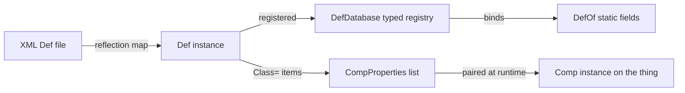

## 3a. Stat Pipeline

RimWorld's stat resolution, ported whole (`src/SimWorld.Core/Stats/`). `ThingDef.GetStatValueAbstract` —
§3's bare `statBases` lookup — stays for the handful of callers with no pawn, trait, hediff or capacity
concerns (`BaseMaxHitPoints`, `BaseMarketValue`); everything that reads a pawn's health, traits or hediffs
goes through this pipeline instead.

- `StatRequest` addresses either a live `Thing`, or an abstract `(ThingDef, ThingDef? stuff)` pair with no
  Thing at all. RimWorld addresses a `BuildableDef` — the base of `ThingDef` and `TerrainDef` — but this port
  has no such base yet and `TerrainDef` carries no stats, so the abstract mode narrows to `ThingDef`.
- `StatWorker.GetValue` runs `GetValueUnfinalized` (base value → pawn offsets → pawn and stuff factors →
  capacity factors) then `FinalizeValue` (stat parts → post-process curve → min/max clamp).
- `StatDef.capacityFactors` reads the Health module's `PawnCapacityDef` levels — the joint that lets a
  wounded pawn's stats degrade and recover with the body. `RestRateMultiplier`'s BloodPumping, Metabolism and
  Breathing (weight 0.3 each) are the shipped example: hurt the pawn's heart and it rests slower; heal it and
  the multiplier recovers.
- `StatPart` (`TransformValue(StatRequest, ref float)`) is real and tested but ships no concrete subclass yet.
  RimWorld's own quality and stuff-derived StatParts need a live `CompQuality`/apparel-stuff on a spawned
  Thing; Crafting's `QualityCategory` exists only on `ItemStack` today, so those parts would read nothing.
- `Thing.GetStatValue(stat)` and `ThingDef.GetStatValue(stat, stuff)` are the call-site sugar (`StatExtension`),
  reading like RimWorld's `GetStatValue`/`GetStatValueAbstract` — named identically on the Thing side, but the
  def-side overload keeps the `GetStatValue` name (rather than RimWorld's `GetStatValueAbstract`) so it cannot
  collide with the pre-existing `ThingDef.GetStatValueAbstract` above.

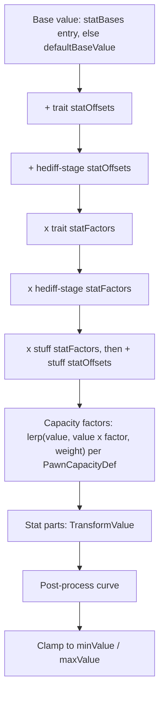

## 4. Simulation Core

- Fixed tick: 60 ticks/second, decoupled from frame rate. `TimeSpeed`
  multipliers 1/3/6/15; pause is multiplier 0. A per-frame cap drops backlog
  rather than spiralling.
- **Tick buckets**: `TickList` per cadence — normal, rare (250 ticks), long
  (2000 ticks) — with deferred register/deregister so a tick may spawn or
  destroy. Per-object work is additionally spread by hash interval.
- Tick order: pre-tickers (world, map) → normal → rare → long → post-tickers.
- **Randomness**: MurmurHash-based `RandomStream`, one per system, plus a
  thread-static `Rand` facade keeping RimWorld's call shape (`Rand.Value`,
  `Rand.MTBEventOccurs`). Thread-static, so parallel tests never share a
  sequence.
- **Calendar**: `GenDate` — 60,000-tick days, quadrums, years, longitude-local
  time, latitude seasons.
- **Save/load**: `Scribe`, a reflection serializer over `IExposable`, in three
  passes — `LoadingVars` → `ResolvingCrossRefs` → `PostLoadInit`. Handles
  polymorphic deep saves (`Class=`), forward and cyclic references, and
  collections.
- **Services**: `Find.TickManager`, `Find.ResearchManager`, `Find.Storyteller`
  are thread-static, matching RimWorld's global-service shape without sharing
  state across tests.

_Note_: this is an object graph with trackers, not an ECS component store. The
port follows RimWorld's real architecture; a data-oriented rewrite would break
1:1 fidelity and is not planned for phase 1.

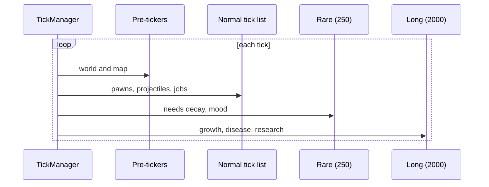

## 5. World & Generation Layer

- **World gen**: seeded noise (Perlin, ridged multifractal) → elevation
  calibrated to a target land fraction → hilliness, temperature by latitude and
  elevation, rainfall, swampiness → biome workers score each tile → rivers flow
  downhill → factions and settlements placed → roads pathed between them.
- Tiles live on a subdivided icosahedron (10·4ⁿ+2 tiles, 5 or 6 neighbours).
- Saves store the seed and world objects; the grid regenerates on load.
- **Pawn gen**: backstory pair → trait roll (exclusion-aware) → skill and
  passion roll → name → age and life stage. Life stages scale body size, health
  and hunger; newborns record a life event, the seed of lineage-driven
  generation.
- **Map gen**: elevation/fertility noise → terrain by biome, fertility and
  rainfall, plus a carved river channel where the tile carries one → rocky
  outcrops and mountains as natural edifices, scaled by hilliness and the
  tile's Stone/Ore deposits → caves cut through mountain by a directional
  random walk → roofs over mountain and cave cells → chunks and wild plants
  scattered by biome density. `MapGen.MapGenerator.GenerateMapFor(worldTile)`
  is the §11.2 seam: a settlement's interior is generated from the world tile
  it sits on, so a tile the world map promised ore or a river on produces a
  map with ore or a river crossing it.
- Every generation step takes an explicit seed → reproducible.

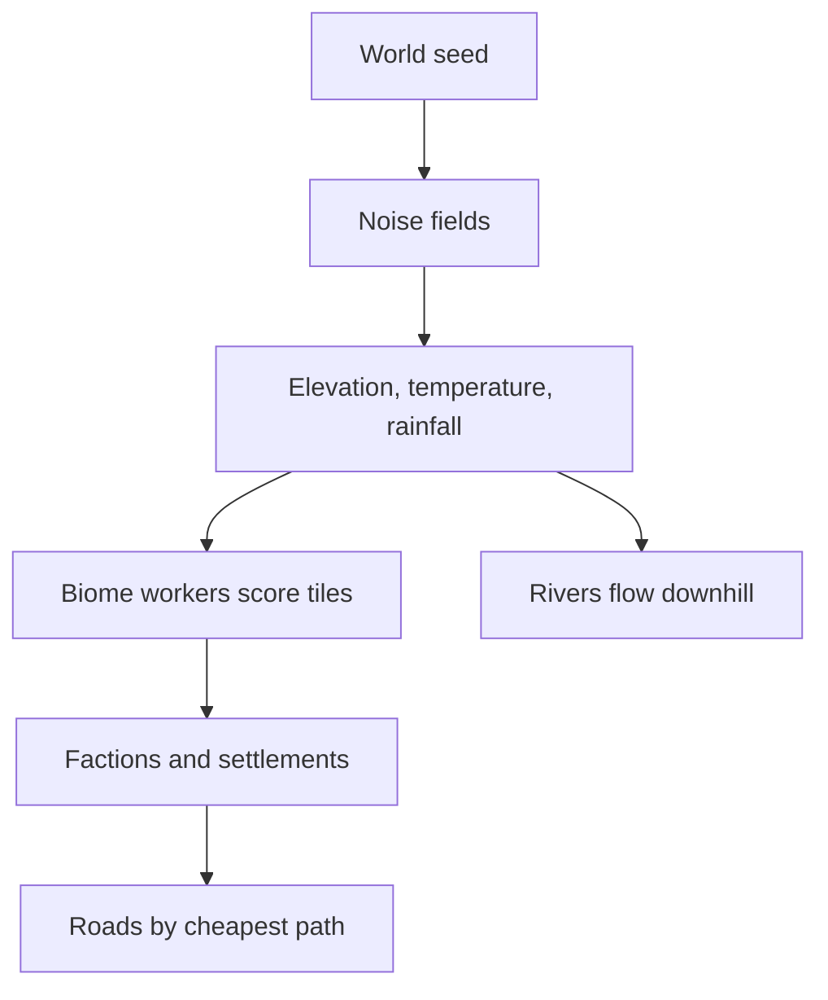

## 5a. Map Core & Thing Runtime

The object layer every later system stands on, ported from RimWorld's `Thing`.

- **Geometry**: `IntVec3`/`IntVec2`, `Rot4`, `CellRect`, adjacency and radial
  cell patterns, cell/index conversion.
- **Things**: `Thing` → `ThingWithComps` → `Pawn`. A Thing owns its def,
  identity, position, rotation, stack count and hit points, and ticks through
  the same buckets as everything else. `ThingComp` is the runtime half of the
  Comp pattern whose data half §3 describes.
- **Grids** per map: terrain, roof, things by cell, edifices, and a path-cost
  grid recomputed when terrain or occupancy changes.
- **Listers**: `ListerThings` by def and group, `MapPawns` per map.
- **Save/load**: run-length terrain and roof grids plus a polymorphic list of
  spawned Things, re-spawned at their saved positions on load.

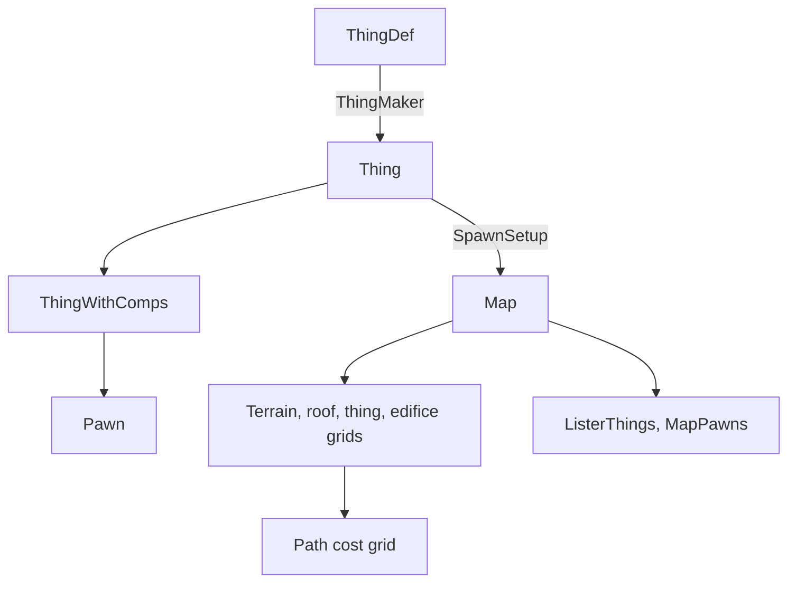

## 5b. Regions, Sites & Settlement Founding

**Built**, except the settlement interior (§11.2's own seam — a separate
module) and civilization emergence (§5b.4 — likewise). A game opens with a
two-stage choice modelled on Manor Lords and Nova Roma: pick a region on the
world map, then place the settlement inside that region against markers
showing what is actually there.

### 5b.1 Stage one — the world map, by region

A raw icosphere tile is a lottery ticket, not a place, so the first choice is
made at a coarser grain. A **region** is a contiguous group of tiles with an
identity: a name, a dominant biome, a climate, and a summarised resource
profile.

- The partition floods out from seed tiles and is cut on natural boundaries —
  ridge lines, major rivers, and the coast — so region edges fall roughly where
  real frontiers fall, rather than on an arbitrary grid. Growth never crosses
  water at all, so the coast is expressed as a cost between two _land_ tiles
  that disagree about whether they touch the sea: a shoreline tile and an inland
  one belong to different places.
- At this stage the player reads climate, terrain character, a coarse resource
  profile and what lies adjacent. Not exact deposits: a region promises a _kind_
  of place, and the specifics are stage two.

### 5b.2 Stage two — the site, by what is visibly there

Inside the chosen region the map shows what a scouting party would see: markers
for fresh water, arable soil, timber, stone, clay, flint, ore, coal, salt,
game, fords and defensible high ground. The player places the settlement
centre against them.

- Deposits are **derived from the terrain that already exists**, not sprinkled
  at random: clay in floodplains and river bends, flint in chalk lowland, ore in
  hills and mountains, coal in ancient swamp and floodplain low ground, salt at
  coasts and springs, deep soil in valleys and on floodplains, timber from the
  biome. A player who learns to read the land is reading something real.
- Site scoring still exists — hard necessities times weighted advantages — but
  for the player's own founding it is **advisory**: it shades the markers rather
  than deciding for them. The same score is what emergent and NPC foundings use,
  and there it is decisive.
- **The necessities are era-independent and the advantages are not.** A
  necessity is a flat gate: fresh water in reach, _some_ food source in reach
  (arable soil, game or timber), a survivable climate. No people of any era
  settle where there is no water. Which food source a civilization prefers, and
  what else it values, is era-dependent — and that belongs entirely to the
  advantage weights. (An earlier draft made "land that feeds the group at this
  era's technology" a necessity, which contradicted the split in the same
  breath and would have needed a farming-technology model that does not exist.)
- The advantage weights are where the historical accuracy lives, and they are
  keyed to the eras that actually exist on the authored ladder — Sticks & Stones
  through Exotic — rather than to loose period names. A Sticks & Stones founding
  reads water, game and flint and is indifferent to defensibility; by Bronze and
  Medieval the ford and the defensible ridge carry real weight, along with ore;
  by Industrial it is mineral wealth and navigable water, scored through trade
  position.
- **Coal is its own deposit, and it is tradeable.** Coal decided where industry
  went, so it gets its own category and its own distribution rather than hiding
  inside Ore — a site chosen in the neolithic for water and game may or may not
  turn out to be an industrial one, and the player will not know for centuries.
  Real coal measures are ancient swamp and floodplain sediment, so
  `World.Gen.WorldGenStep_Deposits` derives it from a tile's swampiness and
  rainfall on low ground, gated off entirely above `SmallHills` — the deliberate
  opposite of Ore's hills-and-mountains rule, so a generated world's two
  distributions are measurably distinct rather than tracking each other
  (`World.DepositTuning`'s Coal block; pinned by a correlation test in
  `SettlementFoundingTests`). In site scoring it is worth nothing through the
  Classical era, a token amount in Medieval, and by Industrial it is the single
  highest advantage weight on the table — above even Ore's own — before easing
  back as later eras diversify their power sources (`SiteWeightDefs/SiteWeights.xml`).
  But geography shapes rather than dictates: `Economy.CoalSupply` gives a
  settlement `CoalAccess` — local, if a deposit is in reach _or_ its real
  `World.Settlement.Stores` already hold Coal (additive, not a replacement:
  nothing mines or trades coal into stores yet, so requiring real stock alone
  would take away access the deposit signal already promises), otherwise the
  cheapest-to-reach other settlement that has one, found over the same
  `Caravans.WorldPathFinder` route a caravan itself would travel. Trading for it
  costs more than sitting on a deposit: the local price is coal's raw market
  value, the traded price runs that through the existing `TradeUtility` buy
  markup and then a further premium scaled by the route's own movement cost, so
  a short hop barely moves the price while a genuine long haul prices coal well
  above local supply. `CoalAccess` is deliberately just a predicate/cost pair —
  it does not gate anything itself; a later era-transition or industrialisation
  check is what reads it, and neither exists yet.
- Trade position comes almost free: the road generator already paths by terrain
  cost, so scoring a tile by how many cheap routes would pass through it is the
  same computation, inverted.

### 5b.3 The founding band

Twenty to forty people in several households — the archaeological range for a
neolithic founding group, and the smallest number at which demography works
unaided: enough unrelated adults for marriage to have real choices, and enough
households for lineages to diverge instead of collapsing into one (§7.5). Every
founder is Full-tier from the first tick (§11.3). `World.SettlementFounder`
builds exactly this: it generates the band, pairs it into households through
the existing `FamilyManager.FoundHousehold` (no second lineage path), records
the founding on the chronicle, and hands back a real `World.Settlement` —
population by tier, a stores ledger, founding tick, name and growth wired to
`FamilyManager.DemographyTick` — registered into `World.worldObjects`.

### 5b.4 Alone at the start

The player's civilization is the only one placed at world generation. The
faction step gains a solo mode that creates the player's faction and nothing
else; rival civilizations **emerge** from the simulation later rather than
existing at time zero. This is the truer sticks-and-stones arc, and its cost is
accepted deliberately: factions, trade and diplomacy sit idle through the
opening hours. Emergence is its own system and is not designed here.

### 5b.5 What this requires that does not exist

| Piece | Today |
| --- | --- |
| Region partition over the icosphere, with names and profiles | built (`World.WorldRegion`, `Gen.WorldGenStep_Regions`) |
| Resource and landmark deposits derived from terrain | built (`World.DepositDef`, `Gen.WorldGenStep_Deposits`) |
| Site scoring: necessities × era-weighted advantages | built (`Siting.SiteScorer`) |
| Settlement as an entity: population by tier, stores, founding tick, name, growth | built (`World.Settlement`, `World.SettlementFounder`) — population is tier-aware (real `Pawn`s above Statistical, a bare count at Statistical), stores are a def→count ledger, growth wires into `FamilyManager.DemographyTick` for the real-`Pawn` slice and a closed-form rate for the Statistical one (see the module's report) |
| Solo-start world generation | built — a flag on the faction gen step (`WorldInfo.soloStart`) |
| A settlement interior when the player enters it | still missing — the §11.2 seam |

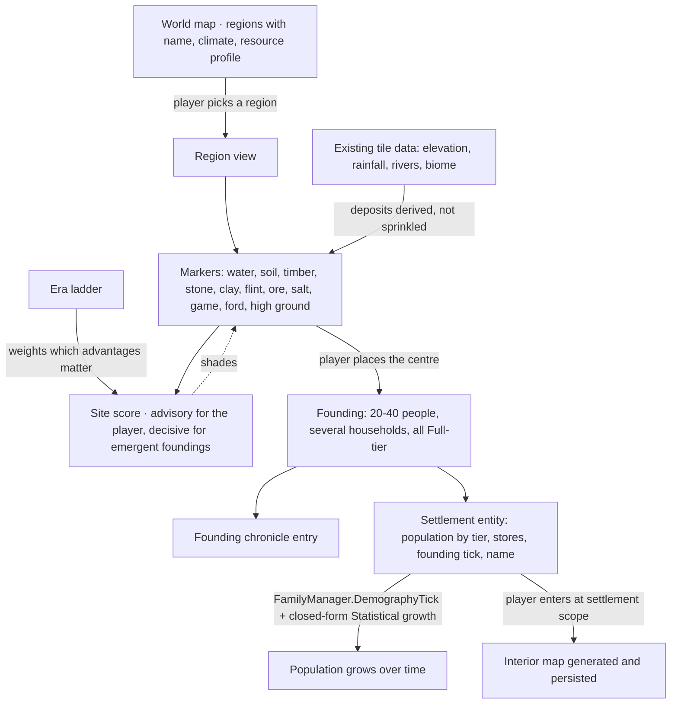

## 6. Cross-System Contracts

There is no pub/sub event bus. Modules connect the way RimWorld's do, and the
dependency rules of §2 are what keep that safe:

- **Trackers**: per-pawn subsystems hang off `Pawn` (`health`, `needs`, `story`,
  `mindState`, `skills`, `workSettings`), each owning its own state and save.
- **`Notify_` hooks**: a virtual method on the owner that other systems call —
  `Notify_HediffChanged`, `Notify_StarvationInterval`, `Notify_TraitsChanged`.
  Cheap, ordered, debuggable.
- **Narrow C# events** where a listener is genuinely unknown at compile time:
  `Storyteller.IncidentFired`, `Faction.GoodwillChanged`,
  `ResearchManager.ProjectFinished`.
- **Interfaces for absent layers**: a system needing something unbuilt takes an
  interface instead — `IIncidentTarget`, `IEnvironmentSampler`, `IBillGiver`.
  This is how modules land before their dependencies exist.

_Planned_: the mod API surfaces these as sanctioned extension points.

## 7. Actor Simulation Layer

### 7.1 Needs & Mood

- Needs decay per 150-tick interval; thresholds gate behaviour and thoughts.
- Mood = 50% + grouped thought total, stacking geometrically per RimWorld.
- Thoughts: timed memories (stack limit, renew-oldest) and situational workers.
- Mood below break bands (0.35 / 0.20 / 0.05) → MTB roll → weighted,
  trait-filtered break table → mental state with a recovery and catharsis path.

### 7.2 Health

- Body-part tree per species; coverage weights drive random hit selection.
- Hediffs attach to a part or the whole body: injuries, staged diseases,
  missing parts, prosthetics. Comps add immunity, tending, decay, scarring,
  infection.
- Eleven capacities computed from part efficiency; downed from pain shock,
  unconsciousness or lost legs; dead from a lethal capacity at zero, core part
  destruction, lethal severity, or total damage past threshold.
- Disease is a severity-versus-immunity race, modified by tend quality.

### 7.3 Skills & Work

- Skill 0–20 on an XP curve, passion multiplies gain, daily saturation caps it,
  unused skills above level 10 rust.
- Work tags from traits and backstories disable skills and work types.
- Per-pawn priority grid; work givers order by priority, then natural priority,
  then priority within type, with emergency givers first.

### 7.4 AI (Think Tree / Jobs / Pathing)

- `ThinkNode_Priority` evaluated top-down per job request: the humanlike
  `ThinkTreeDef` runs a mental-state guard, then the hunger/rest needs guards,
  then queued directed orders, then `JobGiver_Work`'s priority-grid scan, then
  an idle-wander fallback — the first tier to hand back a job wins, so danger
  and mental state override needs, needs override directed orders, and
  directed orders override routine work.
- Jobs run as `JobDriver` toil state machines (`Toils_General`/`Goto`/`Reserve`
  plus `FailOn...` conditions so a vanished target ends the job cleanly, not
  with an exception); `ReservationManager` (one per map) stops two pawns
  claiming the same target, released automatically when a job ends.
- Pathing: `PathFinder` runs `A*` over `PathGrid`'s per-cell cost (terrain cost
  plus impassable edifices, already modelled by §5a) with an array-backed
  binary min-heap open list and diagonal corner-cutting rules;
  `Pawn_PathFollower` then walks the returned `PawnPath` cell by cell at a
  speed derived from the `MoveSpeed` stat. `Reachability` answers "can A reach
  B" from a flat flood-fill cache (one connected-component id per walkable
  cell, recomputed only when the path grid actually changes) rather than the
  region/region-link graph a large, well-subdivided map would eventually want
  — an O(1) cached query today, at the cost of an O(map) recompute on _any_
  path-grid change anywhere, however small. Full-agent populations still need
  shared paths (hierarchical or flow field); today's `PathFinder` runs one
  `A*` search per pawn per path request.

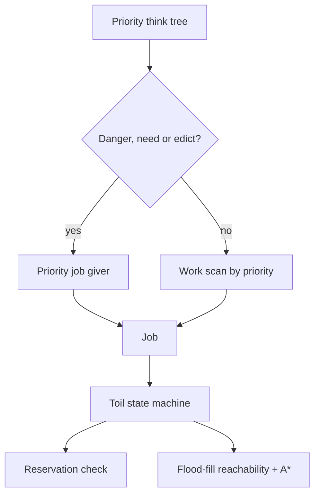

### 7.5 Demography, Lineage & Lifespan

RimWorld has no equivalent to port: a colony of twelve never needs generations.
A civilization does, so this module is SimWorld's own, built on the ported
`Pawn_AgeTracker` clock (`GenDate.TicksPerYear` = 3,600,000 ticks, life stages
at 3 / 13 / 18) rather than on a compressed one.

- **Household as the unit of lineage.** `Family` records one or two founders,
  a surname drawn from the same `NameBankDef` `Last` pools individual pawn
  names come from, its members, generation depth, and living vs. total counts.
  `Pawn_RelationsTracker` carries the back-references: `familyId`, `spouseId`,
  `motherId`, `fatherId`.
- **Marriage founds a new household; it never merges two.** Each couple
  starts a household of its own. The alternative — attaching the couple to one
  partner's existing house — concentrates a civilization into a single dynasty:
  measured at 90% of the population in one household in Epoch
  (`docs/research/epoch-inspiration.md` §5). Under the founding rule, a
  120-year regression run ends with 1,240 living descendants across 284
  households and the largest holding 0.8% of them.
- **Births** roll once per demographic interval per eligible couple, gated by
  the fertility window, a minimum interval since the last child, and food
  security. Only the _shape_ of Epoch's formula is carried over
  (base × mood × food security × doctrine); every constant is SimWorld's own
  and documented at its declaration in `DemographyTuning`.
- **Death from age is a hidden budget, not a curve.** Each pawn rolls a private
  death age at generation — its race's `lifeExpectancy` ± `LifespanSpreadYears`
  — and dies when it reaches it. The budget is deliberately unreadable: no
  public accessor exists, only an `internal` one for tests. The player is never
  shown how long a citizen has left.
- **The budget moves with the civilization.** Medical research completed
  _before_ a pawn is born lengthens it, scaled by the fraction of the
  `MedicineHealth` track finished; starvation intervals spend it, and eating
  again stops the loss without refunding it. Medicine is read at birth on
  purpose — curing a disease in 1650 cannot retroactively have given someone
  born in 1600 a healthier childhood. That is the same write-time rule the
  chronicle's fidelity model needs (§11.4).
- **The sweep** runs on `FamilyManager.DemographyTick` once per simulated year:
  marriages, then births, then deaths from age, then chronicle entries for each.

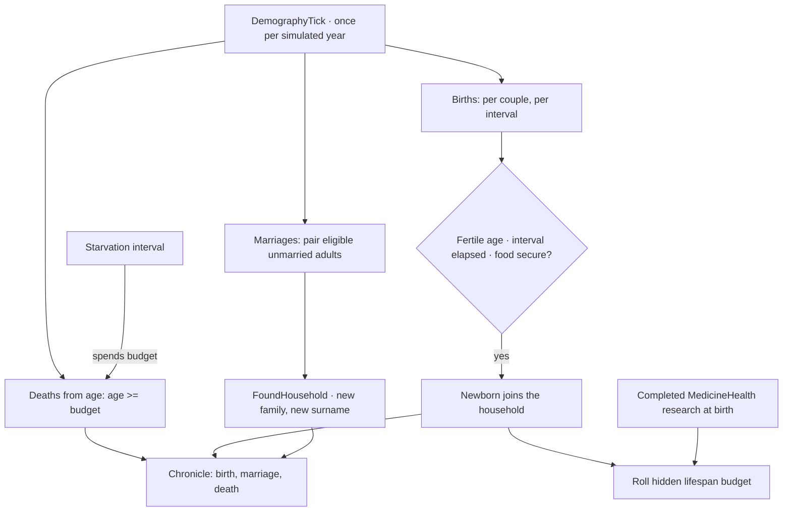

## 8. World Simulation Layer

### 8.1 Crafting, Economy & Factions

- Bills: recipe + ingredient filter + repeat mode (count, target with
  hysteresis, forever); ingredients chosen by a value getter over candidate
  stacks; quality rolled from skill, with inspiration reaching Legendary.
- Items sit in a `ThingCategoryDef` tree that `ThingFilter` selects over, by
  category, stuff, quality and hit points.
- Cooking carries a skill-driven food-poisoning chance; eating feeds the
  nutrition need.
- Trade price = market value × price type × relation and negotiator modifiers.
- Faction goodwill crosses thresholds → hostile / neutral / ally.
- Caravans path the world tile graph at a cost from hilliness, biome and roads.

### 8.2 Building / Power / Climate

- **Construction**: `Blueprint` (no materials yet) → `Frame` (materials
  delivered, work being applied) → `Building`, built entirely on the AI layer's
  real jobs — `WorkGiver_ConstructDeliverResourcesTo{Blueprints,Frames}` haul a
  `ThingDef.costList` ingredient to the site (a Blueprint converts to its Frame
  on first delivery); `WorkGiver_ConstructFinishFrame` then spends work scaled
  by the pawn's Construction skill until the Frame's `WorkToBuild` is met, and
  rolls a skill-scaled success chance. A failed Frame refunds half its
  delivered materials as loose stacks and respawns a fresh Blueprint rather
  than erasing the player's intent. `GenConstruct` checks terrain affordance
  and rejects a cell already holding a blueprint, frame or edifice. Blueprint
  and Frame Defs are hand-authored per buildable Def (one pair each) rather
  than generated per Def at startup the way RimWorld's own
  `ThingDefGenerator_Buildings` does — this port has no graphics layer to
  generate a per-Def blueprint/frame ThingDef for, so content carries the pair
  directly; a Frame's `passability`/`fillPercent`/`pathCost` are copied from
  its `entityToBuild` by hand so a half-built wall already blocks movement and
  room detection like the finished wall would.
- **Power**: `CompPower` (a Thing's presence on a net) with
  `CompPowerTransmitter` (conduits), `CompPowerTrader` (a signed
  `basePowerConsumption` — negative means production, so `CompPowerPlant` is
  nothing more than `CompPowerTrader` under its own name) and
  `CompPowerBattery`. `PowerNetManager` builds `PowerNet`s incrementally as
  comps spawn or despawn — a spawn only inspects its own cardinal neighbours; a
  despawn re-floods only the one net it belonged to, never the whole map.
  Brownout is a real whole-net event: once batteries cannot cover a shortfall,
  every consuming trader loses power in the same tick and regains it together
  the moment supply recovers, not a per-device priority order.
- **Rooms & temperature**: `RoomTracker` flood-fills `Room`s from the edifice
  grid (stopping at any Fillage-`Full` edifice — a wall or a `Door`) lazily,
  off a dirty flag the edifice grid raises on any spawn/despawn, the same
  trade-off `AI.Reachability` already makes for its own reachability cache. A
  `Door` still splits a Room the way a wall does, but `RoomGroup` re-merges
  Rooms joined only by a shared Door back into one thermal unit — since this
  pass's Door has no closed state at all (always `Standable`; no swing, no
  faction-allowed check), the practical effect is that a doorway carries zero
  insulation rather than merely some. Each enclosed RoomGroup's temperature
  equalises toward `Map.outdoorTemperature` every tick, at a rate set by its
  boundary edifices' `Insulation` stat and its cell count;
  `CompHeatPusherPowered` (gated on a sibling `CompPowerTrader`'s `PowerOn`)
  pushes it toward a target. A Room touching the map edge or missing a roof on
  any cell tracks outdoor temperature directly, with no lag. No biome/season
  system exists yet to modulate `outdoorTemperature`, and no roof
  support/collapse mechanic was built — `RoofGrid` itself (Map core) is only
  read, to decide what counts as enclosed.

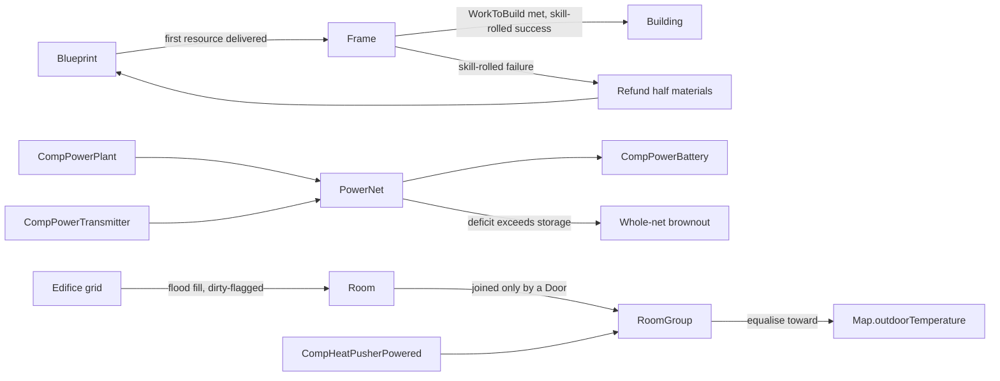

### 8.3 Combat

- Ranged hit chance: shooter accuracy raised to the distance, weapon accuracy
  by range band, target size, cover pass chance, with a floor.
- Melee: hit chance versus dodge, both skill curves; downed targets cannot
  dodge.
- Armor: rating versus penetration rolls deflect, or halve and convert sharp to
  blunt.
- Downed and dead come from the health system, never from combat directly.

### 8.4 Social & Belief

- **Opinion** (`Pawn_RelationsTracker.OpinionOf`): relation type, social memories
  about that specific pawn, personality traits, and a stable compatibility factor
  hashed from the two pawns' ids — RimWorld's own mechanic, so a given pair just
  naturally gets on or doesn't, cheaply and deterministically.
- **Relations** (`PawnRelationDef`): family kinds (spouse, parent, child, sibling)
  are derived on demand from demography's own ids (`spouseId`/`parentIdA`/
  `parentIdB`/`childIds`) rather than stored a second time; friend, rival, lover
  and ex-spouse are stored as a `DirectPawnRelation` on both pawns.
- **Interactions** (`InteractionDef` + `InteractionWorker`): chitchat, deep talk,
  insult and slight, selected by weight per pair on a population-wide sweep every
  2,500 ticks — a rare-tick manager sweep (`SocialInteractionManager`), not
  per-pawn-per-tick work. A sufficiently bad opinion and mood can escalate an
  insult into a social fight, reusing the existing `MentalStateDef` machinery
  rather than a parallel system.
- **Social thoughts** are ordinary memory thoughts with `otherPawn` set (the mood
  system's own stack, not a separate one), feeding both mood and opinion
  (`ThoughtStage.baseOpinionOffset`).

**Belief — _planned_.** Ideology, precepts, memes, rituals and roles are out of
scope for this pass: belief is a separate, much larger design the god layer will
want to own (see `docs/status.json` system 17's `social.ideology` item).

## 9. Director Layer

- Threat points from wealth and per-pawn curves × difficulty × adaptation ×
  days passed, clamped to a band.
- Storyteller personas built from comps (on/off cycle, random main, intro,
  single MTB, disease) choose which incident category fires each interval.
- Incidents gate on earliest day, population, points and refire days.
- **The Chronicle** (SimWorld translation): every fired incident appends a
  narrator record. The persona name is still open — see §15.

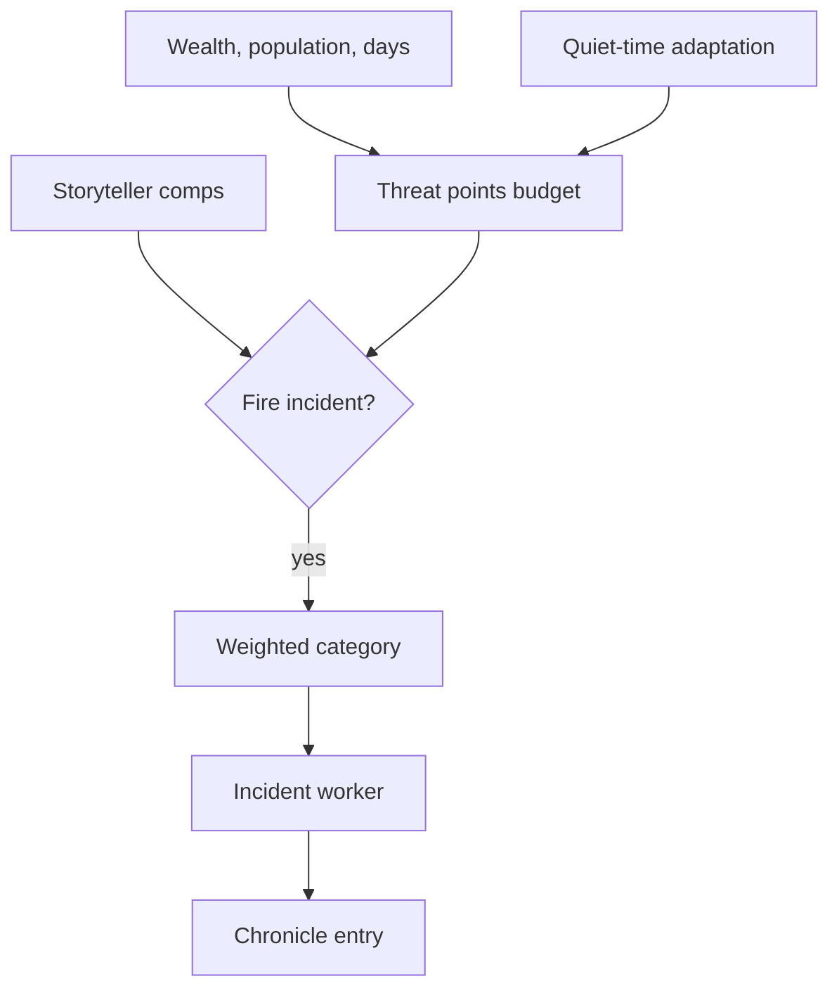

- Quest layer: `QuestScriptDef` node graphs compile over a `Slate` into quest
  parts wired by signals — delay, letter, reward, end — delivered as letters
  with accept and expire timers.
- Scenarios set the start: forced traits, starting research and things, plus
  the civilization parts (era, rival count, biome). Running them needs a
  game-start orchestrator, which lands with the game loop.

## 10. God Layer & Civilization Translation

The re-focus from RimWorld: the player is not a colony overseer but a god
directing one civilization from sticks and stones into exotic technology.
RimWorld systems are **translated**, not replaced — `docs/status.json` records
the translation and its state per system.

- **Scale**: a colony becomes a civilization of settlements; factions become
  rival civilizations; the storyteller becomes the Chronicle, targeting _your_
  civilization.
- **Control**: the god issues edicts (`EdictDef` + `EdictWorker`, the same
  `Class=`-selected Def+Worker shape as `WorkGiverDef`/`WorkGiver` and
  `ThoughtDef`/`ThoughtWorker`) that enter the think tree as `JobGiver_Edicts`,
  sitting strictly between `JobGiver_DirectedOrder` and `JobGiver_Work` (§7.4):
  a queued directed order, and every need/mental-state guard above it, still
  outrank a standing edict, and an edict only ever wins a job routine work
  would otherwise have offered — it can never pre-empt a need. `JobGiver_Edicts`
  never touches `Pawn_WorkSettings`; it reads `WorkTypeDef.WorkGivers` for the
  active edicts' `prioritizedWork` directly (sharing `JobGiver_Work`'s own
  nearest-candidate scan via `WorkGiverScanUtility` rather than duplicating
  it), so deactivating an edict leaves a citizen's own work priorities exactly
  as they were. Citizens keep full agency.
- **Eras**: an `EraDef` ladder over the research DAG carries a civilization from
  neolithic to archotech; era completion gates content, scales threats, and
  gates which edicts a civilization can issue at all (`EdictDef.requiredEra`,
  checked against `ResearchManager.CurrentEra`). Reaching an era is an event,
  not just a readout: `ResearchManager` compares the era before and after each
  project it finishes — so a save can never re-announce history — raises
  `EraReached` once per era crossed, and writes a chronicle line and a letter.
  The era then multiplies the director's threat points
  (`EraDef.threatPointsFactor`, standing in for the wealth term nothing computes
  yet) and gates content through `IncidentDef.minEra`/`maxEra`. A scenario's
  starting era is seeded silently: history begins there, it was not lived through.
- **Aggregation**: per-citizen depth stays, but the god view reads `GodRollup`
  — population by `PawnTier`, mean mood, mean health, a food/industry readout,
  era and research progress — rather than opening every person. Tier-aware by
  construction, not by an if-skip: a Statistical citizen's health contribution
  is `Pawn_TierTracker.SampledHealthFraction`, never a real hediff-set read,
  which is the entire reason §11.3's tiering exists — reading every citizen's
  hediffs to answer a civilization-scale question would defeat it. Cached with
  a recompute cadence and an explicit dirty flag (`Notify_Dirty`), never
  recomputed per tick per reader.

_Status_: all three god-layer pieces are built. **Eras** (§9's ladder) now
announce themselves, scale threats and gate content — see the Eras bullet
above. **Edicts** and the edict think-tree tier live in `src/SimWorld.Core/God`:
`EdictDef`/`EdictWorker` (one concrete worker, `EdictWorker_ExemptMinors`, for
behaviour a def field alone cannot express — a harsh edict that spares
children), `GodManager` (`Find.God`: a slot budget sized as a real trade-off
rather than a checklist, era gating, Chronicle recording on activation and
deactivation, a Scribe round trip), `JobGiver_Edicts`, and `GodRollup`. Five
edicts ship spread across the era ladder, each costing public mood through a
situational thought (`ThoughtWorker_UnderEdict`) that tracks activation on its
own — no explicit per-pawn grant or removal, so nothing lingers once an edict
is rescinded. **Settlements** are entities now (§5b.5) rather than a def and a
tile, which leaves the gap narrow: the god view itself (UI/host work, once
there is a host to render one), and wiring `GodRollup` to a `Settlement`'s own
population instead of a caller-supplied list.


## 11. Scale: Time, Attention & Level of Detail

**Design, not built.** Nothing in this section has code yet. It records
decisions taken up front, because the modules landing next — settlements, the
game loop, the chronicle — are cheap to build against them and expensive to
retrofit.

### 11.1 Two clocks

- The ported clock stays authoritative: 60 ticks/second, 60,000-tick days,
  3,600,000-tick years (§4). Every pawn, job, hediff and research project runs
  on it. It is the only clock that decides anything.
- Above it sits an **abstracted clock** whose only job is to skip. It is the
  default: a civilization runs abstracted, and drops into ticked time only when
  something is worth attending to.
- **The director decides when time slows** — the player does not hand the sim a
  span of years. This is RimWorld's own `TimeSlower` inverted: RimWorld assumes
  speed is the default and takes it away when danger appears, forcing the player
  to 1x. A civilization game wants the same authority pointed the other way —
  abstracted by default, ticked when the storyteller judges a moment worth
  watching. `TimeSlower` is already ported (`Sim/Ticks/TimeSlower.cs`), so this
  is the existing mechanism generalised rather than a new clock.
- **There is therefore no fixed playthrough horizon**, and that is a decision,
  not an omission. Years are not the currency; attention-worthy moments are. A
  century in which nothing happened costs nothing to pass, which is exactly what
  makes an endless arc from sticks and stones to exotic technology playable at
  all — at RimWorld's real clock, 200 ticked years would be 222 hours at maximum
  speed.
- The tech tree is priced against **moments per era**, not years per era. The
  reachability study measured the tree running dry on day 3,074 at a fixed two
  researchers (`docs/research/tech-reachability.md`); that number is a function
  of years, and years have stopped being the unit. Repricing waits until the
  director's pacing exists to measure against.
- Time does not itself cause progression. A century of abstracted time with no
  people, no food and no research advances nothing. Progression comes from
  timers, work and events — whichever clock happens to retire them.
- The rule that keeps the two honest: **the abstract clock may only do what the
  real clock would have done.** Every process it advances needs a closed-form or
  sampled equivalent that agrees with ticking, and — where the span is short
  enough to afford it — a test that runs both ways and asserts the same end
  state. Interval-shaped systems satisfy this naturally: demography's yearly
  sweep (§7.5) is already written as a sweep rather than a per-tick trickle.
- Skipping stays deterministic because the abstract step draws from the same
  seeded streams (§4). A skipped century is reproducible.

### 11.2 Attention: civilization-wide sight, settlement-deep touch

Taken from RimWorld, whose split this codebase already mirrors structurally:

| RimWorld | SimWorld | State |
| --- | --- | --- |
| World map: tiles, factions, settlements, caravans — nothing at colony depth | `World/` (§5) | ported |
| Colony map: cells, things, pawns with jobs and needs at full depth | `Map/` (§5a) | ported |
| A settlement's world tile generates its interior map | `MapGen/` (§5) | ported |
| Entering a settlement (at settlement scope) triggers that generation and persists the result | — | **missing** |

The two halves now have a seam between them: `MapGen.MapGenerator.GenerateMapFor`
takes the world tile a settlement sits on — its biome, elevation, hilliness,
rainfall, rivers and deposits — and generates the interior that tile promised.
What is still missing is the game-loop half: nothing yet calls
`GenerateMapFor` when the player opens a settlement, and a generated map isn't
yet attached to its `WorldObject` and carried across a save. That is the next
piece of work, and it is now a game-loop/scope-switching problem rather than a
map-generation one.

The player's verbs follow the same split. At civilization scope the player sees
everything and acts through edicts, research direction and policy — indirect and
aggregate. At settlement scope the player can open any citizen and act on
particulars. **Sight is global, touch is local.**

### 11.3 Citizens: tiered by significance, not by distance or clock

**Built.** `PawnTier` and `Pawn_TierTracker` (`src/SimWorld.Core/Pawns/`), filed
under the `demography` system in `docs/status.json` (`demography.lod`) — it is
the population-scale half of demography, and shares that system's module path.

Every citizen is a real agent record with a real identity. What varies is how
much of that record is _computed per tick_.

- **Full** — ticked exactly as ported: needs, mood, health, skills, jobs, every
  tick (`Pawn.Tick`, unchanged). The settlement under the player's attention,
  plus anyone promoted into it.
- **Interval** — the full state exists (nothing is deleted or replaced), but
  advances only on the Long tick bucket (`TickerType.Long`, ~2000 ticks) rather
  than per tick. Needs decay for real — an O(1) closed-form
  (`Need.NeedIntervalBulk`) holding each need's own current rate constant across
  the elapsed span, not a per-tick trickle — and age advances the same way
  every other tier does (below). No jobs, no mind state, no skills; hediffs
  already present are carried unchanged rather than bulk-simulated (the one
  tier this module could not make fully faithful — see below).
- **Statistical** — a member of a cohort: identity, family, age and demography
  participation are real; needs are sampled from a cohort distribution rather
  than tracked, and health is a coarse sampled readout rather than a live
  hediff simulation. Also sits on the Long bucket (not fully off any tick
  list — see the note on RimWorld's precedent below) but the coarse tick there
  does far less work.

Promotion is by **significance, not proximity or elapsed time**: the player
looks at their settlement, they take a role (leader, founder, great worker), the
chronicle names them, or a relationship attaches them to someone already
promoted. Any of the four promotes straight to Full from wherever the citizen
currently sits — Statistical included, no forced climb through Interval first.
Demotion is the reverse and is lossless in identity — a demoted citizen is
still exactly who they were: name, family, relationships, age, history; only
their minute-by-minute computation stops. Full falls to Interval the instant
none of the four hold. The further fall, Interval to Statistical, is
deliberately **not automatic** — see §11.5.

**Tier-aware ticking is dispatch by tick list, not a skip inside one.**
`Thing.TickerType` (previously `def.tickerType`, fixed per content def) is now
virtual; `Pawn` overrides it to read the tier tracker, so a demoted pawn
changes which of `TickManager`'s tick lists it is registered on —
`Pawn_TierTracker` deregisters under the old `TickerType`, flips the tier field,
then re-registers under the new one, in that order, since registration itself
reads `TickerType`. `Pawn.Tick()` keeps one defensive guard (a demoted pawn
should never reach it at all, since it is no longer on the Normal list) but
that is a safety net for a list/tier desync, not the mechanism.

**RimWorld already proves the Statistical tier works, and we already ported half
of it.** Its world pawns are people not on any active map: identity,
relationships and ageing are real, while needs, jobs and health stop ticking
entirely. `Pawn_AgeTracker.AgeTickMothballed` — the bulk-interval ageing that
serves exactly that tier — is ported and is exactly what both Interval and
Statistical call to keep age exact regardless of tier. One deliberate
divergence from the RimWorld precedent: a Statistical citizen here still sits
on a (very cheap) tick list rather than leaving ticking altogether, because
without _some_ periodic driver a population that is never promoted would never
age and never die — which would break demography participation, a hard
requirement of this module. RimWorld does not face this because a world pawn's
age is driven by a different global sweep this codebase does not have; putting
Statistical pawns on the Long bucket was the smallest way to get the same
guarantee out of the tick system that already exists.

**The tiers and the clock are one mechanism, not two.** Under §11.1 a
civilization runs abstracted by default, which is to say almost everyone sits at
Interval or Statistical almost always. Dropping into ticked time _is_ promoting
the attended settlement to Full. The director does not slow time and separately
raise fidelity; those are the same act described twice.

**Promotion catch-up.** A citizen promoted after decades at Statistical or
Interval must arrive coherent — aged correctly, with plausible needs, not a
newborn and not a corpse. On promotion, `Pawn_TierTracker` computes the exact
tick gap since it last brought that citizen's state current and applies it in
one step before switching tick lists: `AgeTickMothballed` for age (exact at any
gap size, 2000 ticks or 30 years alike), a real bulk needs update for a
promoted Interval citizen, or a fresh cohort sample (deterministic,
`RandomStream.RangeSeeded` keyed on pawn id + tick + need, never the shared
mutable stream) for a promoted Statistical one. What it deliberately does
**not** do: manufacture hediffs. A Statistical citizen's health is a coarse
sampled fraction, never specific injuries invented on the spot — inventing
detail nobody ever gave the sim would be the §11.4 anti-pattern applied to the
engine's own state, not only to the chronicle. And it does not retroactively
apply an age-of-death that was crossed while off-tier: `ShouldDieOfAge()` is
correct the instant catch-up runs, but nothing kills the pawn until whatever
population sweep processes them next (the existing, unchanged demography
sweep) — a citizen can walk around briefly "overdue" between catch-up and the
next sweep.

**Measured** (`tools/bench/SimWorld.Bench` was not modified; a standalone
harness outside the repo reproduced its methodology — seed 12345, kind
Colonist, age 30, median of 3 runs after 1 discarded warmup). The box was
shared with other build activity throughout (§1's own caveat, sharper here: an
A/B of the pre- and post-tiering Full tier on the same box in the same session
showed 19,230 vs 20,128 µs/pawn-day at N=500 — indistinguishable, i.e. tiering
does not regress Full — while the plain reference number swung from 17,385
(baseline.md, idle box) to 30,000-36,000 across runs taken minutes apart on
this one). Absolute numbers below are this session's, not baseline.md's, for
that reason; the ratios are the load-bearing part:

| tier | µs/pawn-day (N=1,000) | µs/pawn-day (N=100,000) | vs. Full, this session |
| --- | --- | --- | --- |
| Full | ~30,500 (single session; see baseline.md for the fuller sweep) | not re-measured at this N (baseline.md: ~2,500-5,000 healthy pawns is the 15x ceiling) | 1x |
| Interval | 135.4 | 173.4 | ~175-225x cheaper |
| Statistical | 36.5 | 25.4 (29.3 at N=500,000) | ~850-1,200x cheaper |

Both non-Full tiers scale close to linearly through N=100,000 (Statistical
measured clean through N=500,000). Projecting each tier's own largest clean
rate to the 15x budget (66.7s/game-day, §1) — a projection in exactly baseline.md's
sense, not a measurement beyond the tested range — puts the ceiling around
N≈385,000 for Interval and N≈2.3M for Statistical, against Full's measured
~2,500-5,000. That gap is the module's whole justification realized: a
civilization can hold a population three orders of magnitude larger than a
single RimWorld colony as long as only the attended, significant slice runs at
Full depth.

**What this could not make fully faithful:** Interval tier's needs are real
(closed-form, not sampled), but its hediffs are frozen rather than
bulk-simulated — an untended wound does not bleed out, an illness does not
progress, while a citizen sits at Interval. Death from age still works at
every tier (it never depended on the hediff system), so demography stays real,
but death from injury or illness effectively pauses the moment attention
leaves. Building bulk-equivalent hediff physics (bleeding, healing, immunity
progression, all closed-form over an arbitrary elapsed span) was out of reach
for this pass — see the module's own report for why, and treat it as the
natural next piece of this system rather than a silent gap.

**RimWorld already proves the Statistical tier works, and we already ported half
of it.** Its world pawns are people not on any active map: identity,
relationships and ageing are real, while needs, jobs and health stop ticking
entirely. `Pawn_AgeTracker.AgeTickMothballed` — the bulk-interval ageing that
serves exactly that tier — is ported. What is missing is the tier itself, and
the generalisation from RimWorld's rule (_on the map or not_) to this game's
(_significant or not_).

**The tiers and the clock are one mechanism, not two.** Under §11.1 a
civilization runs abstracted by default, which is to say almost everyone sits at
Interval or Statistical almost always. Dropping into ticked time _is_ promoting
the attended settlement to Full. The director does not slow time and separately
raise fidelity; those are the same act described twice.

### 11.4 Fidelity: the level of detail _is_ the historical record

The observation this design turns on: **what the simulation did not record is
what history forgot.** The tier a citizen lived at bounds what the chronicle can
ever say about them. A Full-tier life leaves a detailed record; a Statistical
one leaves a name, a family and two dates — which is precisely what the deep
past leaves in reality.

One hard constraint follows: **fidelity is decided at write time, never at read
time.** The chronicle stores what was knowable when the event happened. Resolve
detail lazily against present knowledge instead, and researching Paper in 1600
retroactively remembers what a peasant ate in 1200.

So a single mechanism does two jobs, which is the reason to build it carefully
rather than as a performance hack:

- **Performance** — cheap citizens cost less, which is what makes civilization
  scale affordable at RimWorld depth.
- **Fiction** — the deep past is thin because it _was_ thin, not because a UI
  filter hid it.

The consequences are the interesting part. Writing, record-keeping and archives
become real technologies with a real effect. Losing them — to collapse, fire or
conquest — genuinely loses history. And the player's own attention shapes what
the civilization is able to remember about itself.

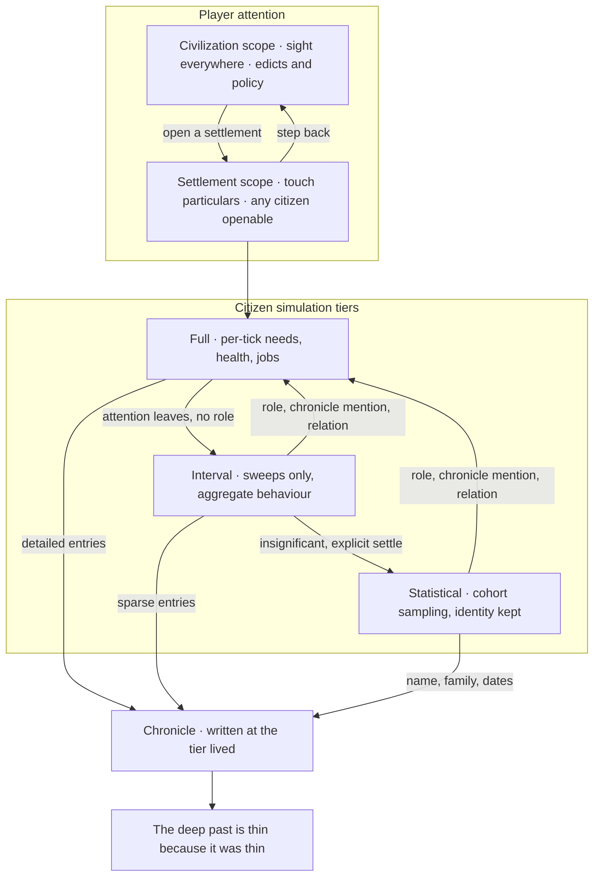

### 11.5 What this section deliberately does not decide

- **Tier budgets.** How many citizens each tier can afford comes from
  measurement, not guesswork. What is now measured (§11.3): the Full tier is
  affordable in the low hundreds once injury and illness are normal rather than
  exceptional (`docs/perf/baseline.md`), and demography's own growth — 4.5% a
  year, doubling every ~16 years — crosses that from a 20-40 person founding
  band somewhere around year 40; Interval and Statistical sustain roughly two
  to three orders of magnitude more (projected ~385,000 and ~2.3M respectively
  at 15x) precisely because they are cheap rather than absent. Still not
  decided: the exact population curve a real campaign needs across an era, and
  what fraction of citizens a director would realistically keep Full/Interval
  at once — those need the director itself (§11.1) to measure against.
- **Whether Interval and Statistical are two tiers or samples of a
  continuum — still open, but narrower than before.** Promotion is settled: any
  of the four significance triggers promotes straight to Full from either
  coarser tier, so there is no continuum on the way up. What remains genuinely
  undecided is the way down: this pass built the mechanism for Interval to
  settle to Statistical (`Pawn_TierTracker.DemoteToStatistical`, gated on
  "insignificant and already Interval") but deliberately left _when_ to call it
  unspecified — that is a director/game-loop policy (which citizens, on what
  cadence, under what pressure), not something this module should invent
  without the director to measure it against. Until the director exists,
  Interval is the resting tier for every insignificant citizen; nothing demotes
  itself to Statistical without an explicit call.
- How the abstract clock and the director interact — a skipped century still
  needs incidents, and they cannot all fire at the seam.

## 12. Presentation & Host

- `SimWorld.Core` is `netstandard2.1` with no engine reference and an asmdef
  marked `noEngineReferences`; Unity consumes it as a local package.
- The host renders and issues commands; it holds no simulation state.
- A launch path appears only once a playable loop exists — the Blueprint
  tracker shows the launch control disabled with its reason until then.

## 13. Determinism & Testing

- All randomness routes through seeded streams, so tests assert exact outcomes.
- Thread-static `Rand`, `Scribe` and `Find` state keeps xUnit's parallel
  collections isolated; tests touching the global `DefDatabase` share one
  collection.
- The core content loads in CI with zero config or DefOf errors — asserted, not
  assumed.
- Every module ships save/load round-trip tests alongside behaviour tests.
- CI runs build and test, the Blueprint build (which validates `status.json`),
  markdown lint, link check and mermaid validation.

## 14. Roadmap

Per-system state, checklists and translation decisions live in
`docs/status.json` and render in the Blueprint tracker. Phase 1 ships every
system as an isolated tested module; the god layer and a playable loop follow.

## 15. Open Questions

- **Narrator name**: Scribe, Historian, or The Chronicle. Code module stays
  `Director` until chosen.
- Population ceiling: the tiering design (§11.3) fixes the shape; the actual
  per-tier budgets wait on measurement from the benchmark harness, plus a
  pathing pass once AI lands.
- Endless tech beyond the authored era ladder: procedural generation shape.
- Multiplayer determinism, which would constrain RNG stream design.
- Director behaviour across an abstracted-time skip (§11.5): a skipped century
  still needs incidents, and they cannot all fire at the seam.
- Settlement generation and the opening state of a game — how a founding band
  picks a site, and what a settlement _is_ once it has an interior.
