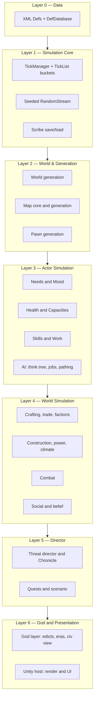
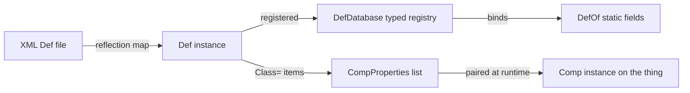
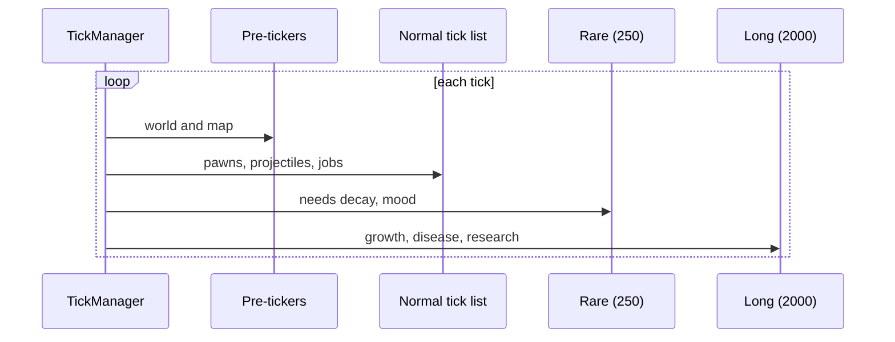
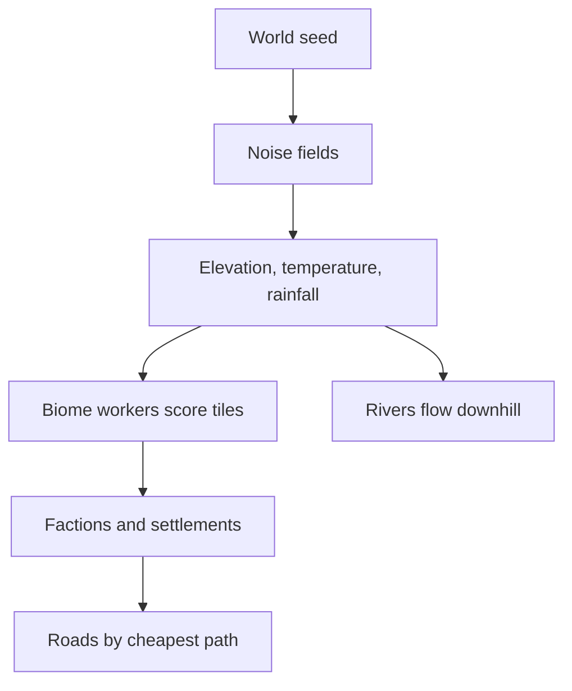
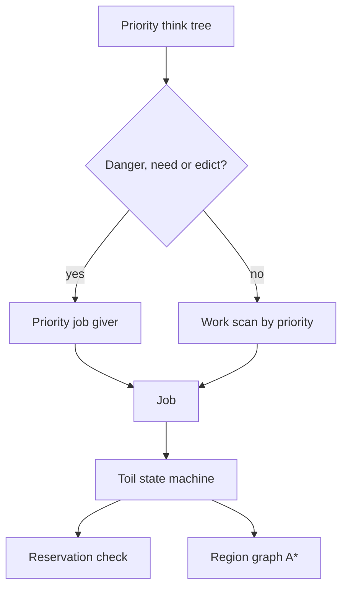
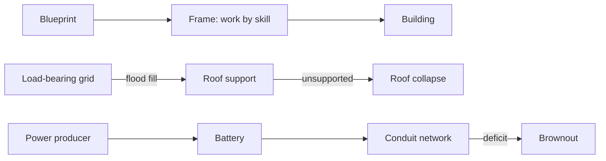
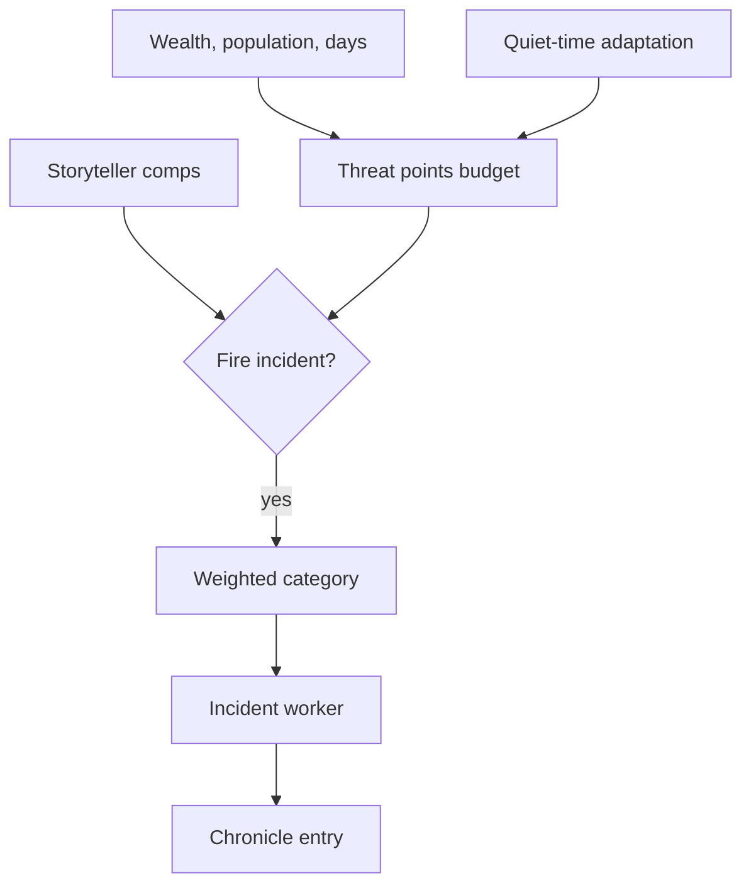
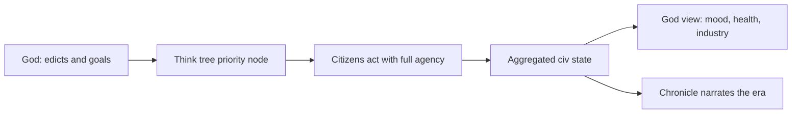

# SimWorld — Technical Spec / Outline

Civilization-scale god-game on RimWorld-depth simulation. Every citizen is a full
agent. Phase 1 ports RimWorld's systems 1:1 as isolated tested modules
(see `docs/research/rimworld-mechanics.md`); the god layer comes after.

This document describes the architecture **as built**. `docs/status.json` is the
source of truth for per-system progress; the Blueprint tracker renders it.
Sections marked _planned_ have no code yet.

## 1. Pillars

- Emergent story from simulation, not scripted narrative.
- Data-driven content: designers add content via XML Defs, not code.
- Deterministic simulation: same seed + same inputs → same outcome.
- 1:1 RimWorld mechanics first, translated to civilization scale second.
- Engine-free core: no `UnityEngine` reference anywhere in `SimWorld.Core`.

## 2. Layered Architecture



- Dependencies point downward only. A module never references a layer above it.
- Layer 6 is one-way: the host reads simulation state and never mutates it, so
  the core stays headless-testable.

## 3. Data Layer (Defs)

RimWorld's Def system, ported whole. Content is XML under
`src/SimWorld.Core/Data/Core/Defs/<DefTypeName>s/`; the element name selects the
Def class.

```xml
<HediffDef ParentName="DiseaseBase">
  <defName>Flu</defName>
  <label>flu</label>
  <lethalSeverity>1</lethalSeverity>
  <comps>
    <li Class="SimWorld.Health.HediffCompProperties_Immunizable">
      <immunityPerDaySick>0.7</immunityPerDaySick>
      <severityPerDayNotImmune>0.5</severityPerDayNotImmune>
    </li>
  </comps>
</HediffDef>
```

- **Inheritance**: `Name` / `ParentName` / `Abstract="True"`, with
  `Inherit="False"` and list append.
- **Polymorphism**: `Class="…"` on a list item picks the concrete type;
  `Type`-valued fields (`workerClass`, `hediffClass`) resolve by full name.
- **Cross-references** are deferred: bare `defName` strings resolve after every
  file loads, so files may reference each other in any order.
- **Comps**: composition over inheritance — a properties object per comp in XML,
  paired with a runtime comp class.
- **DefOf**: `[DefOf]` static classes bind named Defs to fields at load; a
  missing Def is a load error, which the content test asserts is empty.
- Lifecycle: `PostLoad` → cross-refs → `ResolveReferences` → `ConfigErrors`.
- Duplicate `defName`: later pack wins (mod load-order semantics).

_Planned_: mod content packs and XPath `PatchOperation`s.



## 4. Simulation Core

- Fixed tick: 60 ticks/second, decoupled from frame rate. `TimeSpeed`
  multipliers 1/3/6/15; pause is multiplier 0. A per-frame cap drops backlog
  rather than spiralling.
- **Tick buckets**: `TickList` per cadence — normal, rare (250 ticks), long
  (2000 ticks) — with deferred register/deregister so a tick may spawn or
  destroy. Per-object work is additionally spread by hash interval.
- Tick order: pre-tickers (world, map) → normal → rare → long → post-tickers.
- **Randomness**: MurmurHash-based `RandomStream`, one per system, plus a
  thread-static `Rand` facade keeping RimWorld's call shape (`Rand.Value`,
  `Rand.MTBEventOccurs`). Thread-static, so parallel tests never share a
  sequence.
- **Calendar**: `GenDate` — 60,000-tick days, quadrums, years, longitude-local
  time, latitude seasons.
- **Save/load**: `Scribe`, a reflection serializer over `IExposable`, in three
  passes — `LoadingVars` → `ResolvingCrossRefs` → `PostLoadInit`. Handles
  polymorphic deep saves (`Class=`), forward and cyclic references, and
  collections.
- **Services**: `Find.TickManager`, `Find.ResearchManager`, `Find.Storyteller`
  are thread-static, matching RimWorld's global-service shape without sharing
  state across tests.

_Note_: this is an object graph with trackers, not an ECS component store. The
port follows RimWorld's real architecture; a data-oriented rewrite would break
1:1 fidelity and is not planned for phase 1.



## 5. World & Generation Layer

- **World gen**: seeded noise (Perlin, ridged multifractal) → elevation
  calibrated to a target land fraction → hilliness, temperature by latitude and
  elevation, rainfall, swampiness → biome workers score each tile → rivers flow
  downhill → factions and settlements placed → roads pathed between them.
- Tiles live on a subdivided icosahedron (10·4ⁿ+2 tiles, 5 or 6 neighbours).
- Saves store the seed and world objects; the grid regenerates on load.
- **Pawn gen**: backstory pair → trait roll (exclusion-aware) → skill and
  passion roll → name → age and life stage. _In progress._
- **Map gen**: terrain, elevation, scatterers, caves. _Planned_, on the map core.
- Every generation step takes an explicit seed → reproducible.



## 6. Cross-System Contracts

There is no pub/sub event bus. Modules connect the way RimWorld's do, and the
dependency rules of §2 are what keep that safe:

- **Trackers**: per-pawn subsystems hang off `Pawn` (`health`, `needs`, `story`,
  `mindState`, `skills`, `workSettings`), each owning its own state and save.
- **`Notify_` hooks**: a virtual method on the owner that other systems call —
  `Notify_HediffChanged`, `Notify_StarvationInterval`, `Notify_TraitsChanged`.
  Cheap, ordered, debuggable.
- **Narrow C# events** where a listener is genuinely unknown at compile time:
  `Storyteller.IncidentFired`, `Faction.GoodwillChanged`,
  `ResearchManager.ProjectFinished`.
- **Interfaces for absent layers**: a system needing something unbuilt takes an
  interface instead — `IIncidentTarget`, `IEnvironmentSampler`, `IBillGiver`.
  This is how modules land before their dependencies exist.

_Planned_: the mod API surfaces these as sanctioned extension points.

## 7. Actor Simulation Layer

### 7.1 Needs & Mood

- Needs decay per 150-tick interval; thresholds gate behaviour and thoughts.
- Mood = 50% + grouped thought total, stacking geometrically per RimWorld.
- Thoughts: timed memories (stack limit, renew-oldest) and situational workers.
- Mood below break bands (0.35 / 0.20 / 0.05) → MTB roll → weighted,
  trait-filtered break table → mental state with a recovery and catharsis path.

### 7.2 Health

- Body-part tree per species; coverage weights drive random hit selection.
- Hediffs attach to a part or the whole body: injuries, staged diseases,
  missing parts, prosthetics. Comps add immunity, tending, decay, scarring,
  infection.
- Eleven capacities computed from part efficiency; downed from pain shock,
  unconsciousness or lost legs; dead from a lethal capacity at zero, core part
  destruction, lethal severity, or total damage past threshold.
- Disease is a severity-versus-immunity race, modified by tend quality.

### 7.3 Skills & Work

- Skill 0–20 on an XP curve, passion multiplies gain, daily saturation caps it,
  unused skills above level 10 rust.
- Work tags from traits and backstories disable skills and work types.
- Per-pawn priority grid; work givers order by priority, then natural priority,
  then priority within type, with emergency givers first.

### 7.4 AI (Think Tree / Jobs / Pathing) — _planned_

- Priority tree evaluated top-down per job request; danger, needs and directed
  orders outrank routine work.
- Jobs run as toil state machines; a reservation system prevents two pawns
  claiming the same target.
- Pathing: region graph for reachability plus a per-cell cost grid feeding A*.
  Full-agent populations will need shared paths (hierarchical or flow field).



## 8. World Simulation Layer

### 8.1 Crafting, Economy & Factions

- Bills: recipe + ingredient filter + repeat mode; ingredients chosen by value
  getter; quality rolled from skill.
- Trade price = market value × price type × relation and negotiator modifiers.
- Faction goodwill crosses thresholds → hostile / neutral / ally.
- Caravans path the world tile graph at a cost from hilliness, biome and roads.

### 8.2 Building / Power / Climate — _planned_

- Blueprint → frame → building, work speed from skill.
- Roof support by flood fill; unsupported roof collapses.
- Power as a producer/storage/conduit graph with a brownout policy.
- Per-room heat diffusion modulated by biome and season.



### 8.3 Combat

- Ranged hit chance: shooter accuracy raised to the distance, weapon accuracy
  by range band, target size, cover pass chance, with a floor.
- Melee: hit chance versus dodge, both skill curves; downed targets cannot
  dodge.
- Armor: rating versus penetration rolls deflect, or halve and convert sharp to
  blunt.
- Downed and dead come from the health system, never from combat directly.

### 8.4 Social & Belief — _planned_

- Opinion from traits, shared history, interactions and belief alignment.
- Belief system feeding the thought system; group rituals with quality outcome.

## 9. Director Layer

- Threat points from wealth and per-pawn curves × difficulty × adaptation ×
  days passed, clamped to a band.
- Storyteller personas built from comps (on/off cycle, random main, intro,
  single MTB, disease) choose which incident category fires each interval.
- Incidents gate on earliest day, population, points and refire days.
- **The Chronicle** (SimWorld translation): every fired incident appends a
  narrator record. The persona name is still open — see §12.



## 10. God Layer & Civilization Translation

The re-focus from RimWorld: the player is not a colony overseer but a god
directing one civilization from sticks and stones into exotic technology.
RimWorld systems are **translated**, not replaced — `docs/status.json` records
the translation and its state per system.

- **Scale**: a colony becomes a civilization of settlements; factions become
  rival civilizations; the storyteller becomes the Chronicle, targeting _your_
  civilization.
- **Control**: the god issues edicts and goals that enter the think tree above
  routine work, instead of drafting individuals. Citizens keep full agency.
- **Eras**: an `EraDef` ladder over the research DAG carries a civilization from
  neolithic to archotech; era completion gates content and scales threats.
- **Aggregation**: per-citizen depth stays, but the god view reads rollups —
  public mood, population health, industry — rather than opening every person.

_Status_: eras and the Chronicle hook exist. Edicts, rollups and the god view
itself are planned and depend on the AI layer.



## 11. Presentation & Host

- `SimWorld.Core` is `netstandard2.1` with no engine reference and an asmdef
  marked `noEngineReferences`; Unity consumes it as a local package.
- The host renders and issues commands; it holds no simulation state.
- A launch path appears only once a playable loop exists — the Blueprint
  tracker shows the launch control disabled with its reason until then.

## 12. Determinism & Testing

- All randomness routes through seeded streams, so tests assert exact outcomes.
- Thread-static `Rand`, `Scribe` and `Find` state keeps xUnit's parallel
  collections isolated; tests touching the global `DefDatabase` share one
  collection.
- The core content loads in CI with zero config or DefOf errors — asserted, not
  assumed.
- Every module ships save/load round-trip tests alongside behaviour tests.
- CI runs build and test, the Blueprint build (which validates `status.json`),
  markdown lint, link check and mermaid validation.

## 13. Roadmap

Per-system state, checklists and translation decisions live in
`docs/status.json` and render in the Blueprint tracker. Phase 1 ships every
system as an isolated tested module; the god layer and a playable loop follow.

## 14. Open Questions

- **Narrator name**: Scribe, Historian, or The Chronicle. Code module stays
  `Director` until chosen.
- Population ceiling: full-agent depth at civilization scale needs a pathing and
  tick-budget pass before a real target can be set.
- Endless tech beyond the authored era ladder: procedural generation shape.
- Multiplayer determinism, which would constrain RNG stream design.
