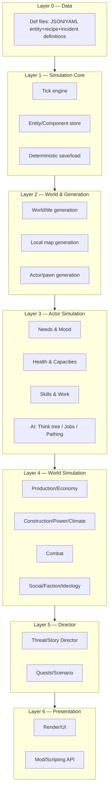
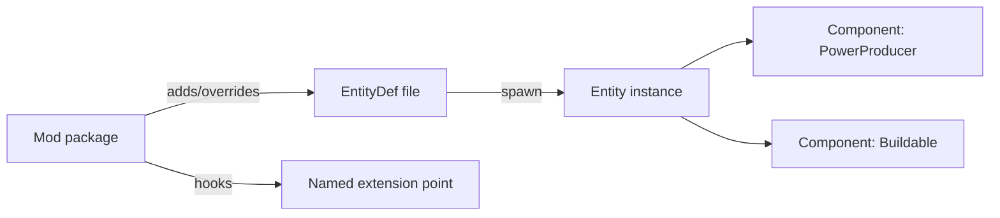
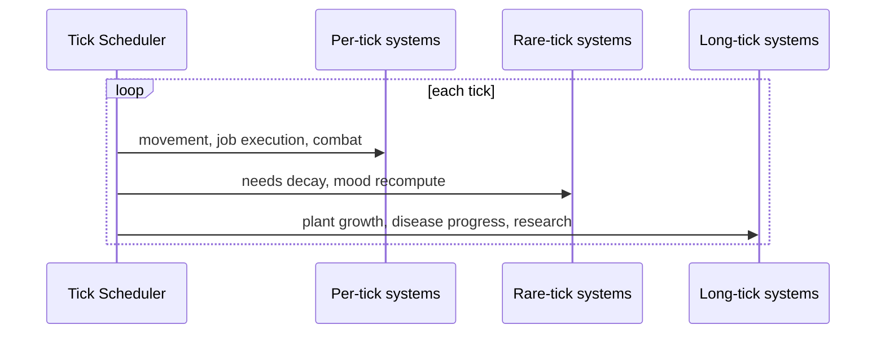
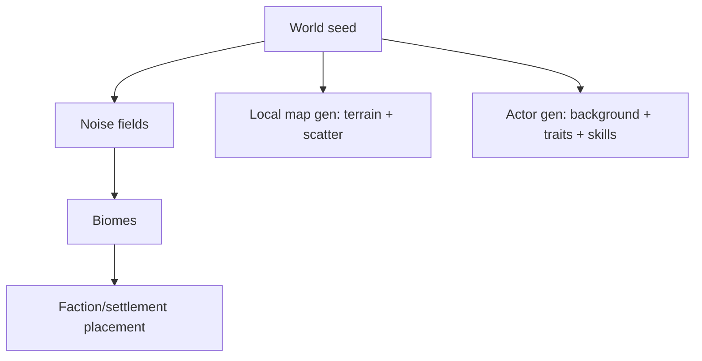
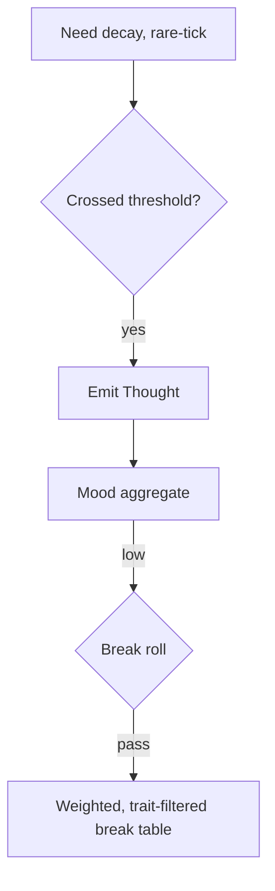
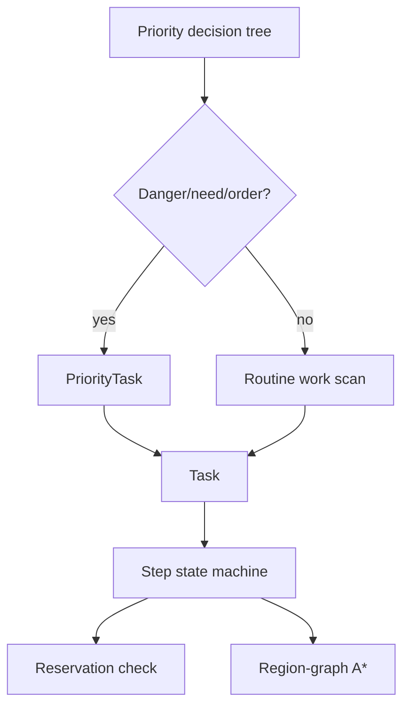
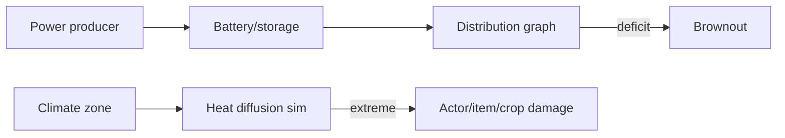
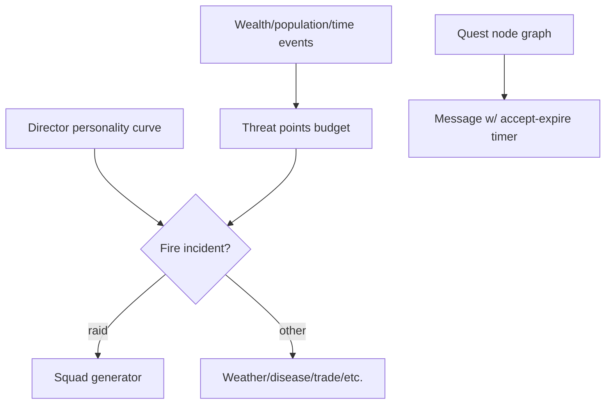

# SimWorld — Technical Spec / Outline

New colony-sim, architecture generalized from RimWorld's proven systems
(see `docs/research/rimworld-mechanics.md`). Engine-agnostic; short facts,
not prose.

## 1. Pillars

- Emergent story from simulation, not scripted narrative.
- Data-driven content: designers add content via data files, not code.
- Deterministic simulation: same seed + same inputs → same outcome.
- Layered systems: each layer only depends on layers below it.

## 2. Layered Architecture



- Each layer reads/writes only its own state; cross-layer effects go through
  events (see §6), never direct field access, to keep mods/patches safe.

## 3. Data Layer (Defs)

- All content as declarative files: `EntityDef`, `RecipeDef`, `TraitDef`,
  `IncidentDef`, `BiomeDef`, `HediffDef`.
- Composition via **Component blocks** per Def, not subclassing:

```json
{
  "defName": "SolarPanel",
  "type": "Building",
  "components": [
    { "type": "PowerProducer", "wattage": 1700, "dayNightCurve": true },
    { "type": "Buildable", "materialCost": { "Steel": 50, "Component": 5 } }
  ]
}
```

- Mods add/override Defs by `defName`; scripting hooks patch behavior at
  named extension points (no core-source edits required).
- Load order: base → expansions → mods; later entries override by `defName`.



## 4. Simulation Core

- Fixed-tick simulation (e.g. 60 ticks/sec), decoupled from render frame
  rate; speed = tick-step multiplier, pause = multiplier 0.
- Entities live in a component store keyed by id; systems iterate components,
  not entity types (data-oriented, cache-friendly).
- Tick buckets by update frequency: per-tick (movement, jobs), rare-tick
  (~every 4s: needs decay), long-tick (~every 33s: growth, disease progress)
  — matches RimWorld's perf pattern.
- Save = serialize component store + RNG seed/stream position; load replays
  no logic, only restores state (fully deterministic).



## 5. World & Generation Layer

- **World gen**: tile grid + noise fields (elevation/rainfall/temperature) →
  biome table → faction/settlement placement → relation seeding.
- **Map gen**: biome + hilliness → terrain/resource scatter → structures/ruins.
- **Actor gen**: background template (childhood/adulthood analogue) → trait
  roll (exclusion-aware) → skill + passion roll → appearance/name → starting
  gear from faction loadout table.
- All generation steps take an explicit seed parameter → reproducible.



## 6. Event Bus (cross-layer contract)

- Layers communicate via typed events (`NeedCrossedThreshold`,
  `DamageApplied`, `ItemCrafted`, `IncidentFired`) on a pub/sub bus.
- Prevents tight coupling; mods subscribe without patching core systems.
- Director layer (L5) is pure event-consumer + event-producer: it never
  reaches into actor/world state directly.

## 7. Actor Simulation Layer

### 7.1 Needs & Mood

- Needs (Food/Rest/Recreation/Comfort/Social/...) decay per rare-tick;
  crossing a threshold emits an event and adjusts behavior priority.
- Mood = weighted sum of active Thought instances (timed memory thoughts +
  recomputed situational thoughts).
- Mood below break bands → break-roll → weighted break-type table filtered
  by the actor's trait set.



### 7.2 Health

- Body-part tree per actor species Def; Hediffs attach to parts.
- Capacities derived each rare-tick from part efficiency × active hediffs.
- Capacity floor breach → downed/dead event.
- Disease = severity-vs-immunity race, modifiable by treatment quality.

### 7.3 Skills & Work

- Skill = level + XP; passion multiplies XP gain; unused skills slowly rust.
- Work priority grid per actor per work category; WorkGiver-equivalent
  scans available tasks per category, ordered by priority then urgency.

### 7.4 AI (Think Tree / Jobs / Pathing)

- Priority tree of decision nodes evaluated top-down per actor per
  job-request; override branches (danger/needs/directed) outrank routine work.
- Selected task runs as a step state machine (goto → act → complete/fail).
- Reservation system prevents two actors claiming the same resource/cell.
- Pathing: region-graph reachability + per-cell cost grid feeding A*.



## 8. World Simulation Layer

### 8.1 Economy & Production

- Production order queue per station: recipe + input filter + repeat mode.
- Quality roll on output: skill-weighted distribution + temporary buffs.
- Trade price = base value × market noise × relation modifier × stock category.

### 8.2 Building / Power / Climate

- Blueprint → in-progress → complete, work-speed from relevant skill.
- Structural support: flood-fill distance from load-bearing elements;
  unsupported sections collapse.
- Power: producers → storage → distribution graph; brownout policy on deficit.
- Climate: per-zone heat diffusion, modulated by biome/season; extremes
  damage actors/items/crops.



### 8.3 Combat

- Hit chance = base accuracy × range-band × cover reduction × target size ×
  actor skill/condition modifiers.
- Damage type vs. armor-per-type; penetration-vs-deflect roll.
- Downed/dead from health capacity floors; capture/recruit loop optional.

### 8.4 Social / Faction / Ideology

- Opinion score = sum of modifiers (trait compatibility, shared history,
  interactions, belief alignment).
- Faction goodwill crosses thresholds → stance change (hostile/neutral/ally).
- Belief system (optional module): tenets that flag actions approved/
  disapproved, feeding the Thought system; group rituals with quality outcome.

## 9. Director Layer

- Consumes world-state summary events (wealth, population, elapsed time) to
  compute a threat-points budget.
- Personality profile (curve shape: rising / steady-low / random) selects
  which incident category fires on each check interval, subject to cooldowns.
- Raid-type incidents spend points via a squad generator (composition +
  tactic) constrained by faction tech tier.
- Quest layer: node-graph scripts (trigger → branch → reward/threat),
  delivered as in-game messages with accept/expire timers.



## 10. Presentation & Mod API

- Render layer subscribes to entity/component state only — never mutates
  simulation state (one-way dependency, keeps sim headless-testable).
- Mod API surface: Def overlay/patching, event subscription, named extension
  points in each layer's systems (no core edits, mirrors Harmony-style
  patching but via sanctioned hooks instead of arbitrary method rewriting).

## 11. Determinism & Testing

- All randomness routed through a seeded stream per system (world/map/actor/
  combat) so unit tests can assert exact outcomes.
- Simulation core is engine-decoupled (no direct render/audio calls) →
  runnable headless in CI for regression tests on save/load and event flow.

## 12. Module Checklist / Roadmap

| Milestone | Systems |
|---|---|
| MVP | Data layer, sim core (tick+save), map gen, actor gen, needs, basic AI/jobs, building |
| Alpha | Health/capacities, skills+work priorities, economy/crafting, power+climate |
| Beta | Combat, director/incidents, social/opinion, quests |
| Post-beta | Belief/ideology module, mod API hardening, advanced pathing perf pass |

## 13. Open Questions

- Single shared world map vs. multi-site (world tile + local map) from MVP.
- Multiplayer/determinism requirements (affects RNG-stream design up front).
- Scope of belief/ideology module: core system vs. optional plugin.
