# SimWorld — Technical Spec / Outline

Civilization-scale god-game on RimWorld-depth simulation. Every citizen is a full
agent. Phase 1 ports RimWorld's systems 1:1 as isolated tested modules
(see `docs/research/rimworld-mechanics.md`); the god layer comes after.

This document describes the architecture **as built**. `docs/status.json` is the
source of truth for per-system progress; the Blueprint tracker renders it.
Sections marked _planned_ have no code yet.

## 1. Pillars

- Emergent story from simulation, not scripted narrative.
- Data-driven content: designers add content via XML Defs, not code.
- Deterministic simulation: same seed + same inputs → same outcome.
- 1:1 RimWorld mechanics first, translated to civilization scale second.
- Engine-free core: no `UnityEngine` reference anywhere in `SimWorld.Core`.

## 2. Layered Architecture

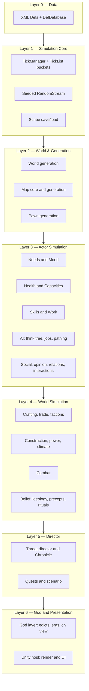

- Dependencies point downward only. A module never references a layer above it.
  Social sits in Layer 3 rather than beside belief in Layer 4, and that placement
  is deliberate: opinion, relations and interactions are per-pawn state of
  exactly the same kind as needs and mood, which is why `Pawn_RelationsTracker`
  can own them without reaching upward. Belief — ideology, precepts, rituals — is
  genuinely world-scale and stays in Layer 4 for the god layer to own. An earlier
  draft lumped the two together as one Layer 4 box, which made the perfectly
  correct `Pawns -> Social` reference look like a violation of this rule.
- Layer 6 is one-way: the host reads simulation state and never mutates it, so
  the core stays headless-testable.

## 3. Data Layer (Defs)

RimWorld's Def system, ported whole. Content is XML under
`src/SimWorld.Core/Data/Core/Defs/<DefTypeName>s/`; the element name selects the
Def class.

```xml
<HediffDef ParentName="DiseaseBase">
  <defName>Flu</defName>
  <label>flu</label>
  <lethalSeverity>1</lethalSeverity>
  <comps>
    <li Class="SimWorld.Health.HediffCompProperties_Immunizable">
      <immunityPerDaySick>0.7</immunityPerDaySick>
      <severityPerDayNotImmune>0.5</severityPerDayNotImmune>
    </li>
  </comps>
</HediffDef>
```

- **Inheritance**: `Name` / `ParentName` / `Abstract="True"`, with
  `Inherit="False"` and list append.
- **Polymorphism**: `Class="…"` on a list item picks the concrete type;
  `Type`-valued fields (`workerClass`, `hediffClass`) resolve by full name.
- **Cross-references** are deferred: bare `defName` strings resolve after every
  file loads, so files may reference each other in any order.
- **Comps**: composition over inheritance — a properties object per comp in XML,
  paired with a runtime comp class.
- **DefOf**: `[DefOf]` static classes bind named Defs to fields at load; a
  missing Def is a load error, which the content test asserts is empty.
- Lifecycle: `PostLoad` → cross-refs → `ResolveReferences` → `ConfigErrors`.
- Duplicate `defName`: later pack wins (mod load-order semantics).

- **Content packs**: a pack is a folder with `About/About.xml`, `Defs/` and
  `Patches/` (`ModContentPack`). Core is a pack like any other so the loader has
  one notion of where content comes from; the only special case is that Core
  loads first. `ModLoadOrder` topologically sorts packs by `modDependencies`,
  `loadAfter` and `loadBefore`, with the declared order as the tie-break so the
  same folder set always loads the same way. A missing dependency and a
  constraint cycle are both reported and then survived — content loading says
  what is wrong and keeps going, the way an unresolvable cross-reference does.
- **Patching**: XPath `PatchOperation`s (`Add`, `Insert`, `Remove`, `Replace`,
  the three attribute operations, `SetName`, plus `Sequence`, `Conditional` and
  `FindMod` for control flow) let a pack edit content it does not own. Every
  pack's Defs are combined into one document, then every pack's patches run
  against it in load order, **before** inheritance resolves — so a patch sees
  the authored XML, and one edit to an abstract parent reaches everything that
  derives from it. An operation matching nothing is an error unless it declares
  `<success>Always</success>`. A Def a patch adds is credited to the patching
  pack, not to the file it landed beside.

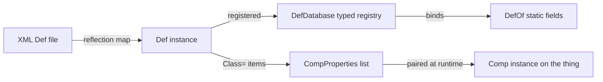

## 3a. Stat Pipeline

RimWorld's stat resolution, ported whole (`src/SimWorld.Core/Stats/`). `ThingDef.GetStatValueAbstract` —
§3's bare `statBases` lookup — stays for the handful of callers with no pawn, trait, hediff or capacity
concerns (`BaseMaxHitPoints`, `BaseMarketValue`); everything that reads a pawn's health, traits or hediffs
goes through this pipeline instead.

- `StatRequest` addresses either a live `Thing`, or an abstract `(ThingDef, ThingDef? stuff)` pair with no
  Thing at all. RimWorld addresses a `BuildableDef` — the base of `ThingDef` and `TerrainDef` — but this port
  has no such base yet and `TerrainDef` carries no stats, so the abstract mode narrows to `ThingDef`.
- `StatWorker.GetValue` runs `GetValueUnfinalized` (base value → skill-need factors, then skill-need offsets →
  pawn offsets → pawn and stuff factors → capacity factors) then `FinalizeValue` (stat parts → post-process
  curve → min/max clamp). Pawn offsets and factors are trait, then hediff-stage, then gene
  (`pawngen.genes`, §7.6) — three sources feeding the same two passes rather than three separate mechanisms,
  so a pawn with no genes reads exactly as it did before they existed.
- `StatDef.skillNeedFactors`/`skillNeedOffsets` (system: `work.stats`) are lists of `SkillNeed` — polymorphic
  content the way `StatPart`/`HediffComp` already are (`Class="SimWorld.Stats.SkillNeed_Direct"` or
  `SkillNeed_BaseBonus`) — read off the pawn's own `SkillRecord` level for `SkillNeed.skill`.
  `SkillNeed_Direct` looks a value up from an explicit per-level table (clamping past its last entry rather
  than throwing); `SkillNeed_BaseBonus` is `baseValue + bonusPerLevel * level`. A skill a trait or backstory
  disables reads as level 0 here for free, since `SkillRecord.Level` itself already collapses to 0 when
  `SkillRecord.TotallyDisabled` (§7.3) — no extra check needed on the Stats side. Shipped content:
  `WorkSpeedGlobal`, `MedicalTendQuality`, `MiningSpeed`, `ConstructionSpeed`, `CookSpeed`, `ResearchSpeed`
  (all new), plus `skillNeedOffsets` on the already-shipped `ShootingAccuracyPawn`/`MeleeHitChance`/
  `MeleeDodgeChance`. None of RimWorld's own curve numbers were sourceable in this sandbox — every curve is
  this port's own invention (see `Stats_Work.xml`'s own remarks), so only the trend (higher skill, higher
  value; level 0, the plain base) is asserted, never a literal. Nothing outside the Stats/Work modules reads
  these new stats yet — Building's `JobDriver_ConstructFinishFrame` and AI's `JobDriver_Mine` still read a
  skill level directly and apply their own pre-existing hand-rolled curve (each says so in its own doc
  comment) rather than through `ConstructionSpeed`/`MiningSpeed`; likewise Combat's `CombatStats` for
  `ShootingAccuracyPawn`/`MeleeHitChance`/`MeleeDodgeChance` and Health's `SurgeryTuning` for
  `MedicalSurgerySuccessChance` (§7.2). Migrating those call sites onto the stats belongs to the modules that
  own them.
- `StatDef.capacityFactors` reads the Health module's `PawnCapacityDef` levels — the joint that lets a
  wounded pawn's stats degrade and recover with the body. `RestRateMultiplier`'s BloodPumping, Metabolism and
  Breathing (weight 0.3 each) are the shipped example: hurt the pawn's heart and it rests slower; heal it and
  the multiplier recovers.
- `StatPart` (`TransformValue(StatRequest, ref float)`) ships its first concrete subclass, `StatPart_Quality`
  (`Stats/StatPart_Quality.cs`), multiplying by a content-authored curve keyed on the quality index of a
  `Things.CompQuality` on the requested Thing — wired onto `MarketValue`'s own content (`Stats_Economy.xml`).
  `Thing.Stuff` (set by `ThingMaker.MakeThing`) is what makes the stuff factor/offset step below actually fire
  for a live Thing rather than only for the abstract `(def, stuff)` request — `StatRequest.For(Thing)` now
  reads it instead of always passing `null`.
- `Thing.GetStatValue(stat)` and `ThingDef.GetStatValue(stat, stuff)` are the call-site sugar (`StatExtension`),
  reading like RimWorld's `GetStatValue`/`GetStatValueAbstract` — named identically on the Thing side, but the
  def-side overload keeps the `GetStatValue` name (rather than RimWorld's `GetStatValueAbstract`) so it cannot
  collide with the pre-existing `ThingDef.GetStatValueAbstract` above.

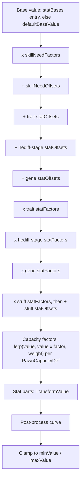

## 4. Simulation Core

- Fixed tick: 60 ticks/second, decoupled from frame rate. `TimeSpeed`
  multipliers 1/3/6/15; pause is multiplier 0. A per-frame cap drops backlog
  rather than spiralling.
- **Tick buckets**: `TickList` per cadence — normal, rare (250 ticks), long
  (2000 ticks) — with deferred register/deregister so a tick may spawn or
  destroy. Per-object work is additionally spread by hash interval.
- Tick order: pre-tickers → normal → rare → long → post-tickers, driven by
  `Game.NewGame`/`Game.ExposeData` populating `TickManager.PreTickers`/
  `PostTickers` (delegates aren't Scribed, so both a fresh game and a loaded
  one rebuild them the same way — `Game.WireTickHooks`). Pre-tickers: the
  world (`World.WorldTick`, which is also where a settlement's own
  `GrowthTick`/demography sweep runs — see §5b.3). Post-tickers, in order:
  every live map's `MapTick`; the civilization's story-state roster sync
  (`CivilizationTarget`, gated to the storyteller's own interval);
  `Storyteller.StorytellerTick`; the population-wide social interaction sweep
  (`SocialInteractionManager.SocialInteractionTick`, gated to its own
  interval so the population list is never built on a tick that would no-op
  inside it); `GodManager.GodTick`; `FactionManager.FactionManagerTick`
  (goodwill drift, itself gated per faction); `LetterStack.LetterStackTick`;
  `QuestManager.QuestManagerTick` (the quest tick loop — undriven before this
  existed); and the autosave cadence. Nothing here re-tunes a cadence any of
  these already self-gated to; the pre/post-ticker wiring only decides the
  order they run in.
- **Randomness**: MurmurHash-based `RandomStream`, one per system, plus a
  thread-static `Rand` facade keeping RimWorld's call shape (`Rand.Value`,
  `Rand.MTBEventOccurs`). Thread-static, so parallel tests never share a
  sequence. `Game.NewGame` seeds `Rand.Current` from the game's own seed
  string, so pawn generation (which reads `Rand.Current`, not an explicit
  stream) is reproducible from a seed the same way world generation's own
  per-step `SeededStream`s already are.
- **Calendar**: `GenDate` — 60,000-tick days, quadrums, years, longitude-local
  time, latitude seasons.
- **Save/load**: `Scribe`, a reflection serializer over `IExposable`, in three
  passes — `LoadingVars` → `ResolvingCrossRefs` → `PostLoadInit`. Handles
  polymorphic deep saves (`Class=`), forward and cyclic references, and
  collections. `Game` is now the one Scribe root that ties a whole save
  together — `Scribe.SaveToString(game, "game")`/`Scribe.Load<Game>(...)` —
  rather than each system round-tripping only its own piece in isolation.
  The saver writes through an `XmlWriter`, as RimWorld's own always did:
  `Scribe.SaveToStream`/`SaveToFile` push straight to a sink, so a
  civilization-sized save never has to exist as XML objects beside the
  simulation that produced it, while `SaveToXDocument`/`SaveToString` keep
  their exact shape by pointing that same writer at an `XDocument`. Loading
  still parses the whole document: the three passes re-read nodes after
  cross-references resolve, and a forward-only reader cannot serve that.
- **`Game`** (`Sim/Game.cs`, RimWorld: `Verse.Game`): owns the `World`, the
  live `Map`s (read off which settlements currently have an entered
  interior, not a separately-tracked list — see §11.2), and every manager
  that used to be reached only through `Find` — research, the storyteller
  plus its one `CivilizationTarget`, factions, letters, quests, the running
  scenario, family, social, and the god layer. `Game.NewGame` generates a
  world, runs the scenario's `PostWorldGenerate`, founds the starting
  settlement (`SettlementFounder`) and then runs `PostGameStart` against
  that settlement's own citizens (StartingPawns has to be populated before
  PostGameStart per its own contract, but `SettlementFounder` — another
  lane's territory this pass — has no seam to accept a pre-built founder
  list, so founding runs first and PostGameStart's forced traits/starting
  research/starting items land on the real founders a beat later instead of
  a beat earlier; the end state is identical). **Autosave**
  (`simcore.autosave`) is a cadence and a hook only — `Game.AutosaveIntervalTicks`
  and the `Game.AutosaveDue` event — wired into the post-tick order; writing
  the file to disk is the host's job, not the core's.
- **Services**: `Find.TickManager`, `Find.ResearchManager`, `Find.Storyteller`,
  and friends are thread-static, matching RimWorld's global-service shape
  without sharing state across tests. `Find` now resolves through
  `Find.CurrentGame` when one exists (RimWorld: `Verse.Current.Game`, folded
  into `Find` here rather than porting a separate `Current` class) and falls
  back to its own thread-static field exactly as before when it doesn't —
  every pre-`Game` test wires `Find` by hand with no game in sight, and
  `Find.Reset()` (which also drops `CurrentGame`) is what keeps that
  working unchanged.

_Note_: this is an object graph with trackers, not an ECS component store. The
port follows RimWorld's real architecture; a data-oriented rewrite would break
1:1 fidelity and is not planned for phase 1.

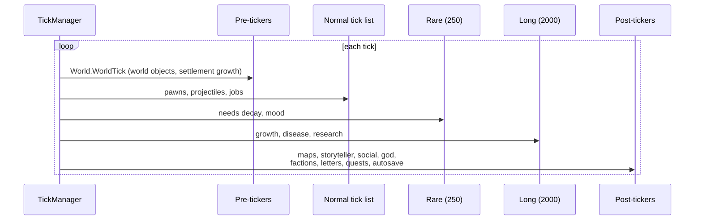

## 5. World & Generation Layer

- **World gen**: seeded noise (Perlin, ridged multifractal) → elevation
  calibrated to a target land fraction → hilliness, temperature by latitude and
  elevation, rainfall, swampiness → biome workers score each tile → rivers flow
  downhill → factions and settlements placed → roads pathed between them. In
  solo-start mode only the player's own civilization is placed this way;
  every other civilization **emerges** from play afterward (§5b.4).
- Tiles live on a subdivided icosahedron (10·4ⁿ+2 tiles, 5 or 6 neighbours).
- Saves store the seed and world objects; the grid regenerates on load.
- **Pawn gen**: backstory pair → trait roll (exclusion-aware) → skill and
  passion roll → name → age and life stage → weapon (`PawnWeaponGenerator`,
  humanlike non-newborns only). Life stages scale body size, health and
  hunger; newborns record a life event, the seed of lineage-driven generation.
- **Gear — weapon and apparel.** `PawnKindDef.weaponTags`/`weaponMoneyRange`
  pick among loaded weapon `ThingDef`s by `weaponTags`, `MarketValue` and
  `techLevel` — capped at the generated pawn's own `Pawn.faction`'s
  `FactionDef.techLevel`, so a neolithic raiding faction is never issued
  anything above Neolithic gear. Carried gear lives on the new
  `Pawn_EquipmentTracker` (`Pawn.equipment`). `PawnKindDef.apparelTags`/
  `apparelMoneyRange` drive `PawnApparelGenerator` the same way, offering every
  eligible `ThingDef.apparel` piece once in a randomized weighted order and
  keeping whichever don't conflict with what's already worn
  (`Pawn_ApparelTracker`); it runs after the pawn's hidden lifespan roll so it
  never perturbs the RNG sequence any earlier generation step depends on. See
  §7.2 for what a worn piece actually does once on the pawn.
- **Map gen**: elevation/fertility noise → terrain by biome, fertility and
  rainfall, plus a carved river channel where the tile carries one → rocky
  outcrops and mountains as natural edifices, scaled by hilliness and the
  tile's Stone/Ore deposits → caves cut through mountain by a directional
  random walk → roofs over mountain and cave cells → chunks and wild plants
  scattered by biome density → weathered ruins scattered onto open ground
  (`MapGen.GenStep_Ruins`: gap-and-rubble wall rectangles, some roofed, some
  looted, material drawn from content, walls weathered off full hit points —
  a hand-written stand-in for RimWorld's RuleDef/SymbolResolver ruin grammar
  and `GenStep_ScatterShrines`, not a port of either; every ruin keeps at
  least two forced-open gaps so it can never wall a pawn into an unreachable
  pocket, checked against the real region graph by test) → world-tile roads
  carried onto the map as streets last, clearing whatever an earlier step
  left in their path. `MapGen.MapGenerator.GenerateMapFor(worldTile)` is the
  §11.2 seam: a settlement's interior is generated from the world tile it
  sits on, so a tile the world map promised ore or a river on produces a map
  with ore or a river crossing it.
- Every generation step takes an explicit seed → reproducible.

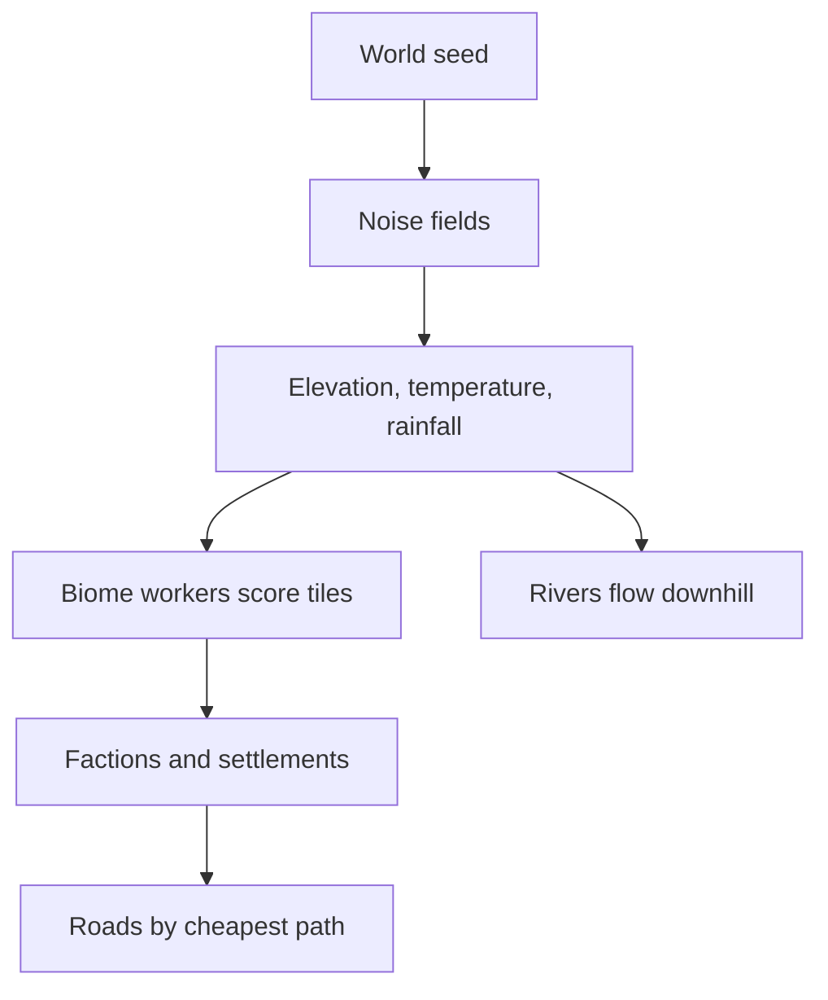

## 5a. Map Core & Thing Runtime

The object layer every later system stands on, ported from RimWorld's `Thing`.

- **Geometry**: `IntVec3`/`IntVec2`, `Rot4`, `CellRect`, adjacency and radial
  cell patterns, cell/index conversion.
- **Things**: `Thing` → `ThingWithComps` → `Pawn`. A Thing owns its def,
  identity, position, rotation, stack count and hit points, and ticks through
  the same buckets as everything else. `ThingComp` is the runtime half of the
  Comp pattern whose data half §3 describes.
- **Grids** per map: terrain, roof, things by cell, edifices, and a path-cost
  grid recomputed when terrain or occupancy changes.
- **Listers**: `ListerThings` by def and group, `MapPawns` per map.
- **Save/load**: run-length terrain and roof grids plus a polymorphic list of
  spawned Things, re-spawned at their saved positions on load.
- **Regions**: `Region`/`RegionLink`/`RegionGrid`/`RegionMaker`/
  `RegionAndRoomUpdater` (system 9's `AI.Reachability` is the consumer, §7.4) —
  a graph over the path grid's passability, cardinal-flood-filled per region
  and linked across region edges, with doors as their own single-cell `Portal`
  regions so a door's state can change without merging or splitting the rooms
  it joins. A passability change dirties and rebuilds only the region(s) it
  touches; regions are never saved, only rebuilt from the map on load, same as
  the path-cost grid itself.

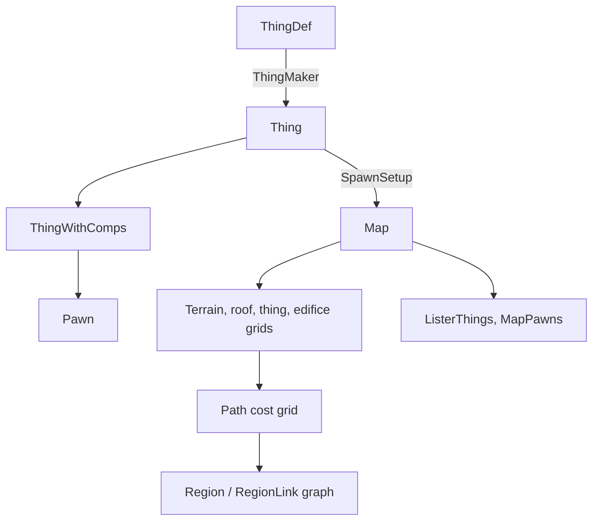

## 5b. Regions, Sites & Settlement Founding

**Built**, including the settlement interior (§11.2's own seam) and
civilization emergence (§5b.4). A game opens with a two-stage choice modelled
on Manor Lords and Nova Roma: pick a region on the world map, then place the
settlement inside that region against markers showing what is actually there.

### 5b.1 Stage one — the world map, by region

A raw icosphere tile is a lottery ticket, not a place, so the first choice is
made at a coarser grain. A **region** is a contiguous group of tiles with an
identity: a name, a dominant biome, a climate, and a summarised resource
profile.

- The partition floods out from seed tiles and is cut on natural boundaries —
  ridge lines, major rivers, and the coast — so region edges fall roughly where
  real frontiers fall, rather than on an arbitrary grid. Growth never crosses
  water at all, so the coast is expressed as a cost between two _land_ tiles
  that disagree about whether they touch the sea: a shoreline tile and an inland
  one belong to different places.
- At this stage the player reads climate, terrain character, a coarse resource
  profile and what lies adjacent. Not exact deposits: a region promises a _kind_
  of place, and the specifics are stage two.

### 5b.2 Stage two — the site, by what is visibly there

Inside the chosen region the map shows what a scouting party would see: markers
for fresh water, arable soil, timber, stone, clay, flint, ore, coal, salt,
game, fords and defensible high ground. The player places the settlement
centre against them.

- Deposits are **derived from the terrain that already exists**, not sprinkled
  at random: clay in floodplains and river bends, flint in chalk lowland, ore in
  hills and mountains, coal in ancient swamp and floodplain low ground, salt at
  coasts and springs, deep soil in valleys and on floodplains, timber from the
  biome. A player who learns to read the land is reading something real.
- Site scoring still exists — hard necessities times weighted advantages — but
  for the player's own founding it is **advisory**: it shades the markers rather
  than deciding for them. The same score is what emergent and NPC foundings use,
  and there it is decisive.
- **The necessities are era-independent and the advantages are not.** A
  necessity is a flat gate: fresh water in reach, _some_ food source in reach
  (arable soil, game or timber), a survivable climate. No people of any era
  settle where there is no water. Which food source a civilization prefers, and
  what else it values, is era-dependent — and that belongs entirely to the
  advantage weights. (An earlier draft made "land that feeds the group at this
  era's technology" a necessity, which contradicted the split in the same
  breath and would have needed a farming-technology model that does not exist.)
- The advantage weights are where the historical accuracy lives, and they are
  keyed to the eras that actually exist on the authored ladder — Sticks & Stones
  through Exotic — rather than to loose period names. A Sticks & Stones founding
  reads water, game and flint and is indifferent to defensibility; by Bronze and
  Medieval the ford and the defensible ridge carry real weight, along with ore;
  by Industrial it is mineral wealth and navigable water, scored through trade
  position.
- **Coal is its own deposit, and it is tradeable.** Coal decided where industry
  went, so it gets its own category and its own distribution rather than hiding
  inside Ore — a site chosen in the neolithic for water and game may or may not
  turn out to be an industrial one, and the player will not know for centuries.
  Real coal measures are ancient swamp and floodplain sediment, so
  `World.Gen.WorldGenStep_Deposits` derives it from a tile's swampiness and
  rainfall on low ground, gated off entirely above `SmallHills` — the deliberate
  opposite of Ore's hills-and-mountains rule, so a generated world's two
  distributions are measurably distinct rather than tracking each other
  (`World.DepositTuning`'s Coal block; pinned by a correlation test in
  `SettlementFoundingTests`). In site scoring it is worth nothing through the
  Classical era, a token amount in Medieval, and by Industrial it is the single
  highest advantage weight on the table — above even Ore's own — before easing
  back as later eras diversify their power sources (`SiteWeightDefs/SiteWeights.xml`).
  But geography shapes rather than dictates: `Economy.CoalSupply` gives a
  settlement `CoalAccess` — local, if a deposit is in reach _or_ its real
  `World.Settlement.Stores` already hold Coal (additive, not a replacement:
  nothing mines or trades coal into stores yet, so requiring real stock alone
  would take away access the deposit signal already promises), otherwise the
  cheapest-to-reach other settlement that has one, found over the same
  `Caravans.WorldPathFinder` route a caravan itself would travel. Trading for it
  costs more than sitting on a deposit: the local price is coal's raw market
  value, the traded price runs that through the existing `TradeUtility` buy
  markup and then a further premium scaled by the route's own movement cost, so
  a short hop barely moves the price while a genuine long haul prices coal well
  above local supply. `CoalAccess` is deliberately just a predicate/cost pair —
  it does not gate anything itself; a later era-transition or industrialisation
  check is what reads it, and neither exists yet.
- Trade position comes almost free: the road generator already paths by terrain
  cost, so scoring a tile by how many cheap routes would pass through it is the
  same computation, inverted.

### 5b.3 The founding band

Twenty to forty people in several households — the archaeological range for a
neolithic founding group, and the smallest number at which demography works
unaided: enough unrelated adults for marriage to have real choices, and enough
households for lineages to diverge instead of collapsing into one (§7.5). Every
founder is Full-tier from the first tick (§11.3). `World.SettlementFounder`
builds exactly this: it generates the band, pairs it into households through
the existing `FamilyManager.FoundHousehold` (no second lineage path), records
the founding on the chronicle, and hands back a real `World.Settlement` —
population by tier, a stores ledger, founding tick, name and growth wired to
`FamilyManager.DemographyTick` — registered into `World.worldObjects`.

### 5b.4 Alone at the start, civilizations emerge

The player's civilization is the only one placed at world generation. The
faction step gains a solo mode that creates the player's faction and nothing
else; rival civilizations **emerge** from the simulation over time instead of
existing at time zero (`World.EmergenceManager`, ticked from `World.WorldTick`
— "something a caller ticks", not a second game loop). This is the truer
sticks-and-stones arc, and its cost is accepted deliberately: factions, trade
and diplomacy sit idle through the opening decades. When a rival civilization
does emerge it is founded exactly like the player's own start — a real
`Settlement` via `SettlementFounder.Found` (a live 20-40 person Full-tier
founding band, chronicled), sited by `Siting.SiteScorer` decisively against
wherever the world actually rewards settling, never sprinkled at random.

Two things shape _how_ emergence happens, both reusing content already
authored for world generation rather than inventing a parallel scale:

- **Era seeding.** A civilization cannot emerge more advanced than the most
  advanced civilization already known to the world —
  `Research.ResearchManager.CurrentEra`, the only civilization-wide era this
  simulation tracks, stands in for that ceiling (`EmergenceManager.EligibleFactionDefs`).
  A sticks-and-stones opening only ever sees Neolithic-tech rivals; each era
  the player's own civilization reaches widens the pool of civilizations that
  could appear next.
- **Population scaling.** The mean time between emergence events is scaled by
  the same `OverallPopulation` multiplier world generation itself uses for
  faction and settlement counts (`Gen.WorldGenStep_Factions.PopulationMultiplier`)
  — a "High" population world sees rivals rise faster than an "AlmostNone" one.

A civilization is more than one settlement. Once an existing settlement is
large enough to spare people (`EmergenceTuning.ExpansionPopulationThreshold`),
its civilization may found a second — `SettlementFounder.FoundColony`, a
Statistical-tier population seeded fresh rather than a live founding band,
sited within the parent's own region: expansion is routine demographic
growth, not an origin story, and earns its own chronicle line ("Expansion:
…") rather than "Founding: …". A civilization stops expanding once it holds
as many settlements as `Gen.WorldGenStep_Factions.SettlementsPerFactionRange`'s
own cap allows any faction at world generation — the same ceiling, not a
second one.

Pacing (`EmergenceTuning.NewCivilizationMTBYears`, `.ExpansionMTBYears`) is
SimWorld's own — no RimWorld source exists for a game that starts alone and
watches rivals appear — pinned by a simulated-span band test (after N years
the world holds somewhere between X and Y civilizations) rather than by the
literal mean-time-between-events number. It is fully deterministic:
`EmergenceManager` draws only from its own `RandomStream`, seeded once from
the world at construction and Scribe round-tripped, so the same seed produces
the same emergence history regardless of what else in the game has consumed
the ambient random stream by the time a check runs.

Every settlement world generation itself places is a real `Settlement` too,
via the same `SettlementFounder.FoundColony` — population already
established (`SettlementTuning.EstablishedColonyPopulationRange`), no live
founding band and no chronicle entry, since it is backstory the player never
watched happen (the same "history begins there, it was not lived through"
reasoning `Research.ResearchManager.SetProjectFinishedForSetup` already
applies to a scenario's starting era). `World.Settlements` is typed
`Settlement`, never a `WorldObject` mix.

### 5b.5 What this requires that does not exist

| Piece | Today |
| --- | --- |
| Region partition over the icosphere, with names and profiles | built (`World.WorldRegion`, `Gen.WorldGenStep_Regions`) |
| Resource and landmark deposits derived from terrain | built (`World.DepositDef`, `Gen.WorldGenStep_Deposits`) |
| Site scoring: necessities × era-weighted advantages | built (`Siting.SiteScorer`) |
| Settlement as an entity: population by tier, stores, founding tick, name, growth | built (`World.Settlement`, `World.SettlementFounder`) — population is tier-aware (real `Pawn`s above Statistical, a bare count at Statistical), stores are a def→count ledger, growth wires into `FamilyManager.DemographyTick` for the real-`Pawn` slice and a closed-form rate for the Statistical one (see the module's report) |
| Solo-start world generation | built — a flag on the faction gen step (`WorldInfo.soloStart`) |
| A settlement interior when the player enters it | built (`World.Settlement.EnterMap`) — the §11.2 seam, sized by `TotalPopulation` and persisted only once entered |
| Civilization emergence: new civilizations and settlement expansion over time, era-seeded and population-scaled | built (`World.EmergenceManager`, `World.EmergenceTuning`) — ticked from `World.WorldTick`; see §5b.4 |

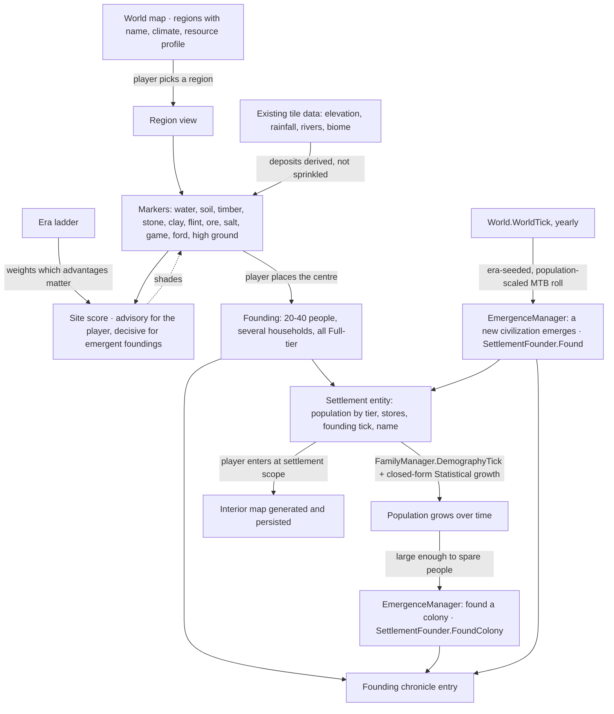

## 6. Cross-System Contracts

There is no pub/sub event bus. Modules connect the way RimWorld's do, and the
dependency rules of §2 are what keep that safe:

- **Trackers**: per-pawn subsystems hang off `Pawn` (`health`, `needs`, `story`,
  `mindState`, `skills`, `workSettings`), each owning its own state and save.
- **`Notify_` hooks**: a virtual method on the owner that other systems call —
  `Notify_HediffChanged`, `Notify_StarvationInterval`, `Notify_TraitsChanged`.
  Cheap, ordered, debuggable.
- **Narrow C# events** where a listener is genuinely unknown at compile time:
  `Storyteller.IncidentFired`, `Faction.GoodwillChanged`,
  `ResearchManager.ProjectFinished`.
- **Interfaces for absent layers**: a system needing something unbuilt takes an
  interface instead — `IIncidentTarget`, `IEnvironmentSampler`, `IBillGiver`.
  This is how modules land before their dependencies exist.

_Planned_: the mod API surfaces these as sanctioned extension points.

## 7. Actor Simulation Layer

### 7.1 Needs & Mood

- Needs decay per 150-tick interval; thresholds gate behaviour and thoughts.
- Mood = 50% + grouped thought total, stacking geometrically per RimWorld.
- Thoughts: timed memories (stack limit, renew-oldest) and situational workers.
- Mood below break bands (0.35 / 0.20 / 0.05) → MTB roll → weighted,
  trait-filtered break table → mental state with a recovery and catharsis path.
- **Social seam**: a memory thought carries a nullable `otherPawn` and feeds
  opinion as well as mood (`ThoughtDef.IsSocial`); a social fight is a real
  `MentalStateDef` (`MentalState_SocialFighting`) that trades blows through
  Combat's existing melee verb rather than a parallel system. See §8.4.

### 7.2 Health

- Body-part tree per species; coverage weights drive random hit selection.
- Hediffs attach to a part or the whole body: injuries, staged diseases,
  missing parts, prosthetics. Comps add immunity, tending, decay, scarring,
  infection.
- Eleven capacities computed from part efficiency; downed from pain shock,
  unconsciousness or lost legs; dead from a lethal capacity at zero, core part
  destruction, lethal severity, or total damage past threshold.
- Disease is a severity-versus-immunity race, modified by tend quality.
- **Surgery** is a `RecipeDef` with `isSurgery`, queued as a `Bill_Medical` on
  the patient's own bill stack rather than a workbench's, and carried out by a
  `Recipe_Surgery` worker selected by `workerClass` — amputation, excision of a
  hediff, installing a part. The outcome is rolled against the surgeon's
  Medicine skill times the recipe's own difficulty; a failed operation injures
  the patient where the surgeon was working and may kill them, and never
  silently does nothing. RimWorld routes surgeon competence through a
  `MedicalSurgerySuccessChance` stat whose value comes from `SkillNeed` curves.
  That mechanism now exists (`work.stats`, §3a), but Health's own
  `SurgeryTuning` predates it and still reads the Medicine skill directly;
  migrating that call site belongs to the Health module. Installing a prosthetic ships as content
  too: `SimpleProstheticLeg` is a real, tradeable `ThingDef`, and
  `InstallSimpleProstheticLeg` names it as a `RecipeDef.ingredients` entry —
  `SurgeryUtility.PerformNextSurgery` takes an optional `ingredientsOnHand` list
  and only fires an ingredient-naming bill once a matching Thing is supplied
  and consumed, leaving every ingredient-less surgery (amputation, excision)
  unaffected.
- **Apparel** is `ThingDef.apparel` (`ApparelProperties`: covered
  `BodyPartGroupDef`s, `ApparelLayerDef`s, tags) plus `Pawn_ApparelTracker`.
  Wearing a piece registers it as a `Combat.IArmorSource` through the
  `PawnArmor` hook Combat already shipped for this — armor rating and coverage
  route through the stat pipeline exactly like natural armor, so quality and
  stuff (§3a) bend a worn item's protection the same way they bend anything
  else. `PawnApparelGenerator` consumes `PawnKindDef.apparelTags`/
  `apparelMoneyRange` the way `PawnWeaponGenerator` consumes the weapon half.
- **Drugs and addiction**: a drug `ThingDef` carries `CompDrug`, bound to a
  `ChemicalDef` naming a tolerance hediff and an addiction hediff. Tolerance
  builds per dose and decays per day; addiction can start once tolerance
  crosses the chemical's own threshold, and a further dose once addicted
  relieves its severity instead of stacking a second one. Withdrawal reaches
  `Need_Mood` through content alone — a `ThoughtDef` using the pre-existing
  `ThoughtWorker_Hediff` mirrors the addiction hediff's own stage as a
  mood-affecting Thought. Overdose and any self-cure of an addiction are out of
  scope for this pass.

### 7.3 Skills & Work

- Skill 0–20 on an XP curve, passion multiplies gain, daily saturation caps it,
  unused skills above level 10 rust.
- Work tags from traits and backstories disable skills and work types.
  `BackstoryDef.workDisables`/`skillGains` (`Pawns/Backstory.cs`, content in
  `Data/Core/Defs/BackstoryDefs/`) land with Pawn Generation: `PawnGenerator`
  picks a childhood and (age-gated) adulthood backstory and applies both
  backstories' `skillGains`; `Pawn_StoryTracker.DisabledWorkTagsBackstoryAndTraits`
  ORs both backstory slots' `workDisables` in with every trait's, and
  `Pawn.WorkTagIsDisabled`/`WorkTypeIsDisabled` read the combined result — the
  same path a trait-disabled work type already went through, so a
  backstory-disabled one is zeroed out of the priority grid
  (`Pawn_WorkSettings.EnableAndInitialize`/`Notify_DisabledWorkTypesChanged`)
  and dropped from work-giver scanning identically. Shipped content disables
  real work (e.g. `NobleChild` bars `ManualDumb`, `Scientist` bars
  `ManualSkilled`+`Violent`, `TribalElder` bars `Violent`).
- Per-pawn priority grid; work givers order by priority, then natural priority,
  then priority within type, with emergency givers first.
- **Skill-driven stats (`work.stats`, built — see §3a).** `StatDef.skillNeedOffsets`/
  `skillNeedFactors` let a stat's value read a pawn's own skill level through a
  `SkillNeed` (`SkillNeed_Direct`/`SkillNeed_BaseBonus`); `WorkSpeedGlobal`,
  `MedicalTendQuality`, `MiningSpeed`, `ConstructionSpeed`, `CookSpeed` and
  `ResearchSpeed` ship as new content, and the already-shipped
  `ShootingAccuracyPawn`/`MeleeHitChance`/`MeleeDodgeChance` (§3a) picked up
  `skillNeedOffsets` too. A `TotallyDisabled` skill (the work-tags rule above)
  reads as level 0 in every one of these for free. `ResearchSpeed` shipped with
  no consumer at first (`docs/research/tech-reachability.md` had to model
  `speed(skill)` by hand for exactly that reason); `JobDriver_Research`
  (`research.work`, below) is what reads it for real.
- **Policy (SimWorld translation, `work.policy`, built).** A civilization cannot
  set twelve priority numbers per citizen the way a RimWorld player sets them
  per colonist, so a standing `RoleDef` (Farmer, Miner, Artisan, Scholar ship as
  content) stands in for the grid: it names the work types it emphasizes, and
  `Pawn_WorkSettings.ApplyRole` sets those to the pawn's best priority while
  leaving everything else at the default. This is deliberately not the same
  "leaves no trace" guarantee an `EdictDef` gives (§10) — a role is _standing_,
  not temporary, and does write into the grid — but it protects the one thing
  that guarantee is really about: `Pawn_WorkSettings` remembers every work type
  a caller set directly (`SetPriority`), and a role's own writes always skip
  those, so a person's own explicit choice is never silently overwritten, and
  unassigning a role reverts everything it touched back to default.
  `WorkPolicyUtility.ApplyRoleToPopulation` is the civilization-scale lever —
  one call assigns a role across an entire settlement's citizens at once,
  rather than one grid at a time.

### 7.4 AI (Think Tree / Jobs / Pathing)

- `ThinkNode_Priority` evaluated top-down per job request: the humanlike
  `ThinkTreeDef` runs a mental-state guard, then the hunger/rest needs guards,
  then queued directed orders, then `JobGiver_Work`'s priority-grid scan, then
  an idle-wander fallback — the first tier to hand back a job wins, so danger
  and mental state override needs, needs override directed orders, and
  directed orders override routine work.
- Jobs run as `JobDriver` toil state machines (`Toils_General`/`Goto`/`Reserve`
  plus `FailOn...` conditions so a vanished target ends the job cleanly, not
  with an exception); `ReservationManager` (one per map) stops two pawns
  claiming the same target, released automatically when a job ends.
- Pathing: `PathFinder` runs `A*` over `PathGrid`'s per-cell cost (terrain cost
  plus impassable edifices, already modelled by §5a) with an array-backed
  binary min-heap open list and diagonal corner-cutting rules;
  `Pawn_PathFollower` then walks the returned `PawnPath` cell by cell at a
  speed derived from the `MoveSpeed` stat. `Reachability` answers "can A reach
  B" by BFS over §5a's Region/RegionLink graph (`RegionTraverser`) — a
  handful of coarse region hops rather than a per-cell search, and rather
  than the flat flood-fill cache this class used to keep for itself (one
  connected-component id per walkable cell, recomputed in full on _any_
  path-grid change anywhere, however small — see `docs/status.json`'s
  `ai.regions` history). The region graph fixes that cost at its source:
  `Map.regionAndRoomUpdater` dirties and rebuilds only the region(s) a
  passability change actually touches, so building one wall no longer forces
  a whole-map recompute. `CanReachTarget`/`CanReach`'s public shape is
  unchanged throughout.
- **Path sharing** (`docs/status.json`'s `ai.pathing.sharing`, translated — full-
  agent civilization scale, not something RimWorld's own single-colony
  `Verse.AI.PathFinder` had to solve): `AI.RegionPathCorridorCache` builds one
  unweighted BFS tree over the same Region/RegionLink graph, rooted at a
  destination's region(s), the moment the first pawn asks to go there — the
  expensive part (every region reachable from that destination) is paid once
  per unique destination and reused verbatim by every later pawn walking
  there, whatever room each one starts in; reading one pawn's own corridor
  back out costs only its hop distance to the destination. `PathFinder.FindPath`
  tries a search constrained to that corridor's cells first and only ever
  falls back to its original unconstrained search — never the reverse — so a
  stale or inapplicable corridor can make a call slower, never wrong: two
  regions are only ever linked when they truly share a walkable border, so a
  corridor can never route through a wall, and an unconstrained retry catches
  anything the corridor could not complete. The trade this makes deliberately:
  the tree minimizes region _hop count_, not cell distance, so a
  corridor-constrained path can come out longer than `PathFinder`'s own
  unconstrained optimum — disclosed and bounded by test
  (`PathSharingTests.Hierarchical_corridor_can_be_longer_than_optimal_but_is_still_a_valid_path`)
  rather than hidden. The whole cache is thrown away the moment
  `RegionAndRoomUpdater.Version` moves (any rebuild replaces whichever regions
  it touches rather than patching them, so a tree from before a rebuild can
  hold parent pointers through regions that no longer exist) — coarser than
  strictly necessary but simple to state and cheap to pay again. Measured
  (`docs/perf/baseline.md` §9): the before/after speedup on "N pawns to one
  shared destination" grows with N — roughly 1.5–2.5x at N=100–1,000, 9.7x at
  N=10,000 — an asymptotic win (`before` grows with map area, `after` with map
  diameter) rather than a constant factor, which is what a growing population
  needs. Flow fields were not attempted; the region-graph corridor already
  delivers that asymptotic improvement without a second grid to maintain.
- **Animals get a real second `ThinkTreeDef`** (`RaceProperties.intelligence`
  picks it per pawn, not a flag inside the humanlike one): a failed-taming
  anger guard, then `JobGiver_AnimalFlee` (an untamed, sufficiently wild animal
  paths away from the nearest humanlike it can see), then the same
  hunger/rest-needs guards and idle-wander fallback the humanlike tree uses —
  no work-scan or directed-order tiers, since an animal does neither.
  **Taming** is `TameUtility.TryTame`: a chance from the tamer's Animals skill
  against `RaceProperties.wildness`, rolled once per completed `Tame` job
  (`JobDriver_Tame`, found by the already-shipped `TameAnimals` `WorkGiverDef`
  now wired to a real scanner); success sets the animal's faction and
  `Pawn_MindState.tameness` to 1, failure can instead anger it at the tamer
  (`Pawn_MindState.angryAt`) — RimWorld's manhunter would attack; Combat is a
  different module's ground, so this port's consequence is behavioural
  (`ThinkNode_ConditionalAngryAtHandler` pre-empts the animal's tree) rather
  than damage. **Training** is `TrainableDef`/`TrainabilityDef` content plus
  `Pawn_TrainingTracker`: a step counter per def, gated by the race's
  trainability floor and the def's own prerequisites, advanced one point per
  completed `Train` job and clawed back by an MTB roll if the animal goes
  untended past a grace window — more than a bool per def, the way RimWorld's
  own tracker is.
- **Warden work** closes the capture loop (§8.3): `WorkGiver_Warden_AttemptRecruit`
  (the `WardenAttemptRecruit` `WorkGiverDef`) scans a warden's own faction's
  prisoners for one set to `PrisonerInteractionModeDefOf.AttemptRecruit`, then
  `JobDriver_Warden_AttemptRecruit` walks over and calls the already-shipped
  `WardenUtility.TryInteract` once per completed job — RimWorld loops several
  `ConvinceRecruitee` rounds inside one `JobDriver_ChatWithPrisoner`; this port's
  own `TryInteract` already collapsed that into "one visit either lowers
  resistance or, once it's already at zero, recruits outright," so one call per
  job is the faithful shape, with a fresh job restarting the next visit.
  `WorkGiver_Warden_Feed` (`WardenFeed`) finds a **downed**, hungry prisoner of
  the warden's own faction and carries the nearest reachable food to them,
  feeding them directly (`JobDriver_Warden_Feed`, `FeedPatient` `JobDef`) —
  standing in for RimWorld's own "in bed and needs medical rest" trigger, since
  this port has no bed/room system. A prisoner that is _not_ downed already
  reaches food entirely on its own through the ordinary `JobGiver_GetFood` tier
  (nothing in job selection checks guest status or faction at all), so RimWorld's
  `WardenDeliverFood` counterpart — food left for a prisoner capable of
  self-service but with nothing reachable — has no distinct case left to cover
  here and stays the `WorkGiver_Pending` placeholder its `WorkGiverDef` shipped
  with.
- **Hauling** (`HaulGeneral`) is `WorkGiver_Haul` (RimWorld:
  `RimWorld.WorkGiver_Haul`/`HaulAIUtility`/`JobDriver_HaulToCell`, trimmed to
  this port's single storage kind): it scans every spawned Item-category
  `Thing` — this port's own answer for "haulable", since no separate
  `alwaysHaulable`/`EverHaulable` split exists (nothing here can _hold_ an item
  the way an equipment/apparel tracker would, so every spawned Item is a
  candidate) — skips one already resting on a `Zone_Stockpile` cell its
  `ThingFilter` allows, and carries the rest to the nearest reachable,
  reservable stockpile cell with room for it (`HaulAIUtility.TryFindBestStockpileCell`,
  nearest to the _item_, not the pawn, matching RimWorld's own `StoreUtility`).
  A destination cell already holding a stack of the same def merges the count
  exactly; an empty one gets a freshly made `Thing` carrying the same `Stuff`.
  No stockpile at all (or every matching one already full) is this giver's
  honest "no job" — one storage kind, no priority tiers, so there is nowhere
  else for `StoreUtility`'s job to send it, and this port does not invent a
  dumping ground. Carrying itself is modelled the same abstract way
  `JobDriver_HaulToBuildingSite`/`JobDriver_Warden_Feed` already do it (no
  carry-tracker exists in this codebase): the source stack's count drops the
  moment the pawn reaches it, nothing visibly follows the pawn to the
  stockpile in between. `HaulCorpses`, the other `WorkGiverDef` in the same
  content file, stays `WorkGiver_Pending`: no `Corpse` class exists anywhere in
  this codebase, so it cannot be wired honestly.

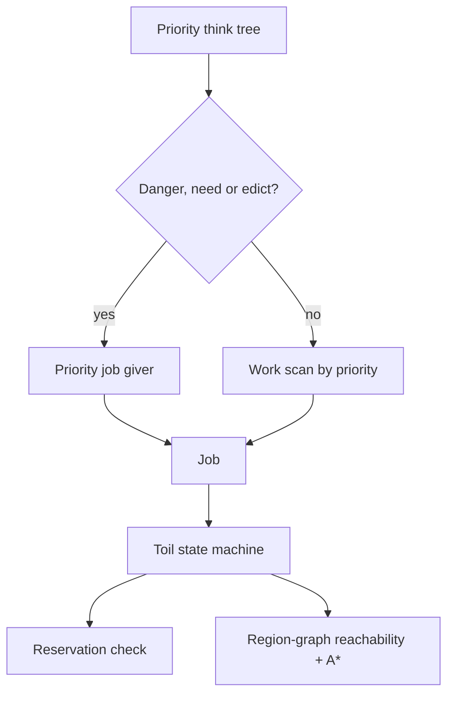

_(The diagram above is the Humanlike tree; the Animal tree drops the
directed-order and work-scan tiers entirely and adds its own flee guard —
see the animals bullet above.)_

### 7.5 Demography, Lineage & Lifespan

RimWorld has no equivalent to port: a colony of twelve never needs generations.
A civilization does, so this module is SimWorld's own, built on the ported
`Pawn_AgeTracker` clock (`GenDate.TicksPerYear` = 3,600,000 ticks, life stages
at 3 / 13 / 18) rather than on a compressed one.

- **Household as the unit of lineage.** `Family` records one or two founders,
  a surname drawn from the same `NameBankDef` `Last` pools individual pawn
  names come from, its members, generation depth, and living vs. total counts.
  `Pawn_RelationsTracker` carries the back-references: `familyId`, `spouseId`,
  `motherId`, `fatherId`.
- **Marriage founds a new household; it never merges two.** Each couple
  starts a household of its own. The alternative — attaching the couple to one
  partner's existing house — concentrates a civilization into a single dynasty:
  measured at 90% of the population in one household in Epoch
  (`docs/research/epoch-inspiration.md` §5). Under the founding rule, a
  120-year regression run ends with 1,240 living descendants across 284
  households and the largest holding 0.8% of them.
- **Births** roll once per demographic interval per eligible couple, gated by
  the fertility window, a minimum interval since the last child, and food
  security. Only the _shape_ of Epoch's formula is carried over
  (base × mood × food security × doctrine); every constant is SimWorld's own
  and documented at its declaration in `DemographyTuning`.
- **Death from age is a hidden budget, not a curve.** Each pawn rolls a private
  death age at generation — its race's `lifeExpectancy` ± `LifespanSpreadYears`
  — and dies when it reaches it. The budget is deliberately unreadable: no
  public accessor exists, only an `internal` one for tests. The player is never
  shown how long a citizen has left.
- **The budget moves with the civilization.** Medical research completed
  _before_ a pawn is born lengthens it, scaled by the fraction of the
  `MedicineHealth` track finished; starvation intervals spend it, and eating
  again stops the loss without refunding it. Medicine is read at birth on
  purpose — curing a disease in 1650 cannot retroactively have given someone
  born in 1600 a healthier childhood. That is the same write-time rule the
  chronicle's fidelity model needs (§11.4).
- **The sweep** runs on `FamilyManager.DemographyTick` once per simulated year:
  marriages, then births, then deaths from age, then chronicle entries for each.
- **Migration (SimWorld translation, `demography.migration`, built).** Births
  alone are not what makes a civilization's population more than generations
  multiplying in place — people arrive and found households, and leave when a
  place stops being worth living in. `MigrationManager` mirrors the birth
  formula's own shape (base × (0.5 + quality) × a situational factor), where
  quality reads the same per-citizen mood/food signal births already read, and
  the situational factor is the civilization's era — a more advanced
  settlement has more to offer. An arrival generates one adult migrant and
  founds their household through the existing `FamilyManager.FoundHousehold`
  single-founder hook (built for exactly this); a settlement's bare Statistical
  cohort grows by the same closed-form percentage idiom natural growth already
  uses, never by materialising thousands of real `Pawn`s for it. Departures
  remove a distressed household together from a caller-owned population list.
  One stated limitation: `Settlement` exposes no public way to shrink its
  Statistical population or remove a citizen, so a settlement that has become
  unlivable can only ever stop attracting people through the settlement-aware
  entry point, not shed the people it already has — see `MigrationManager`'s
  own doc.

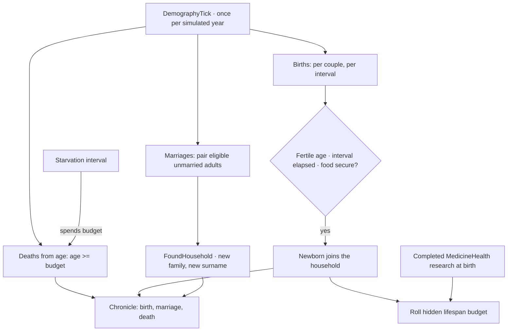

### 7.6 Genes & Xenotypes (Biotech)

RimWorld's Biotech gene system (`pawngen.genes`), ported at the fidelity trimmed
to what actually moves a number here — see `Pawns/Genes/GeneDef.cs`'s own class
doc for the exact field-by-field mapping and what was left out (archite genes,
gated behind a research/economy system this port does not have).

- **`GeneDef`/`Gene` split, mirroring `TraitDef`/`Trait`.** A `GeneDef` carries
  `statOffsets`/`statFactors`, `capMods`, `disabledWorkTags`, the RimWorld-named
  `biostatCpx`/`biostatMet` pair, an `exclusionTags` conflict list, and
  SimWorld's own `lifespanBonusYears` (see below). `Gene` is the per-pawn
  instance: a def reference plus one bit, `xenogene`.
- **Germline vs. acquired, not endogene-list-vs-xenogene-list content.**
  `XenotypeDef` names a germline — a gene list a pawn generated as that
  xenotype receives as **endogenes**. Nothing in this port implants a
  xenogerm yet (no such surgery exists), so every gene a pawn carries today
  arrived as an endogene, either from `PawnGenerationRequest.Xenotype` or from
  inheritance at birth — but `Gene.xenogene` and `Pawn_GeneTracker`'s
  `AddGene(def, xenogene)` parameter are real, so a future implant mechanic has
  somewhere to land without reshaping the tracker.
- **Genes reuse three existing seams; they do not add a fourth pipeline.**
  Stat offsets/factors join the list `StatWorker.GetValueUnfinalized` already
  sums for traits and hediff stages (§3a). Capacity modifiers join the list
  `PawnCapacityUtility.CalculateCapacityLevel` already sums for hediff stages
  (§7.2). Disabled work OR's into `Pawn.CombinedDisabledWorkTags` next to
  `Pawn_StoryTracker.DisabledWorkTagsBackstoryAndTraits` (§7.3). Metabolism
  folds into `Pawn.HungerRate` next to the life-stage and health factors
  already there. A pawn with no genes costs nothing extra at any of the three
  call sites — `Pawn_GeneTracker.ActiveGenesListForReading` returns a shared
  empty array rather than allocating, which matters because `StatWorker` reads
  it from `Pawn_PathFollower.PatherTick`'s own per-tick `MoveSpeed` lookup, a
  path this repo already has an allocation-free regression test guarding.
- **Exclusion resolution.** Two genes sharing an `exclusionTags` entry cannot
  both be active; `Pawn_GeneTracker.ActiveGenesListForReading` keeps a
  xenogene over a conflicting endogene, and otherwise the one added first —
  the overridden gene stays stored (and saved) rather than removed, so
  removing the gene that is overriding it reactivates the one it silenced.
- **Generation is opt-in and RNG-safe by construction.**
  `PawnGenerationRequest.Xenotype` defaults to null; `PawnGenerator` only
  touches genes when it is set, and assigning a named germline is a
  deterministic lookup with zero `Rand` calls, applied after every other roll
  — including the hidden-lifespan-budget roll (§7.5), so a `GeneDef` with
  `lifespanBonusYears` set (SimWorld's own translation of RimWorld's Deathless
  gene — see `GeneDef`'s own doc for why a revive-on-death mechanic became a
  budget nudge instead) has an existing budget to adjust. A request that never
  asks for a xenotype therefore rolls byte-for-byte the same pawn as it did
  before this module existed — the specific regression a fixed-seed
  integration test in this repo has broken on before, when an earlier module
  was inserted mid-pipeline instead of at the end.
- **Inheritance is `FamilyManager`'s birth path, not a second generation
  pipeline.** `GeneInheritanceUtility.InheritEndogenesFrom` reads both
  parents' endogenes — xenogenes never pass down, the one part of RimWorld's
  own inheritance rule this port is confident it sourced correctly. A gene
  both parents carry is inherited for certain; a gene only one parent carries
  is an independent 50% roll per gene. RimWorld's own per-gene
  selection-weight math was not available to source in this sandbox (no
  decompiled source, no network access here), so this is SimWorld's own,
  defensible stand-in — pinned by a test asserting the _property_ (shared
  genes breed true; a single-parent gene lands both ways across a population;
  the same seed reproduces the same child) rather than a literal gene list.
  Consumes zero `Rand` calls when neither parent carries any gene, so wiring
  it unconditionally into every birth does not perturb a population nobody
  has ever assigned a xenotype to.
- **Content.** 14 `GeneDef`s and four `XenotypeDef`s ship: `Baseliner` (an
  empty gene list — functionally identical to a request with no `Xenotype` at
  all) plus three invented, non-baseline xenotypes (`Swiftbred`, `Ironclad`,
  `Stillfolk`) built only from those 14 genes, so generation, the stat/
  capacity/work-tag seams, and inheritance are all exercised end to end by
  real content.

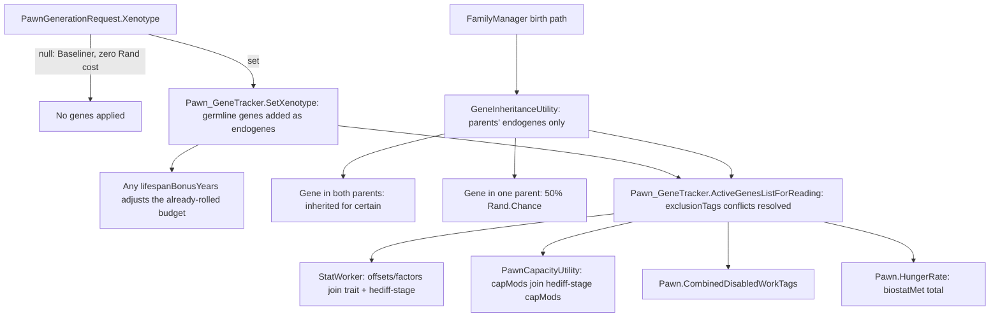

## 8. World Simulation Layer

### 8.1 Crafting, Economy & Factions

- Bills: recipe + ingredient filter + repeat mode (count, target with
  hysteresis, forever); ingredients chosen by a value getter over candidate
  stacks; quality rolled from skill, with inspiration reaching Legendary.
- Items sit in a `ThingCategoryDef` tree that `ThingFilter` selects over, by
  category, stuff, quality and hit points.
- Cooking carries a skill-driven food-poisoning chance; eating feeds the
  nutrition need.
- **Animal husbandry.** Butchering is a `RecipeDef` with `isButchery`,
  applied straight to a dead animal pawn by a `Recipe_ButcherAnimal` worker
  the same way `isSurgery` applies a `Recipe_Surgery` to a live one — no
  separate `Corpse` thing exists yet, so `ButcherUtility.TryButcher` is the
  same no-job-driver call shape `SurgeryUtility.PerformNextSurgery` already
  established. Yield (meat from `RaceProperties.meatDef`, leather from
  `leatherDef` where the race has one) scales with the animal's body size.
  Produce cycles — milk, wool, eggs — are `CompMilkable`/`CompShearable`/
  `CompEggLayer`, all `CompHasGatherableBodyResource`: fullness rises toward 1
  over a per-species interval and `Gather` spawns the real item (stopping at
  unfertilized eggs — no breeding system exists to fertilize one).
- **Guilds** (`crafting.guilds`, built): the civilization-scale form of the
  workbench bill queue. A `GuildDef` names the `RoleDef` that staffs a guild,
  the skill its craftsmen are measured by, and the recipes it may queue; a
  `Guild` holds a real `BillStack` — repeat modes and target-count hysteresis
  unchanged — but belongs to a `Settlement`, draws its ingredients from that
  settlement's `Stores` ledger and puts its products back into it, so a
  target-count bill reads as "keep two hundred units in the granary" rather
  than "on the shelf". Members are the settlement's citizens carrying the
  role, plus an assigned share of its Statistical cohort whose skill is one
  deterministic cohort sample — `GodRollup`'s own idiom, for the same reason.
  Labour banks across intervals, because a batch that costs more than one
  interval's work must be finishable at all; a guild with no runnable bill
  banks nothing, so idle craftsmen do not stockpile labour. **Not modelled**,
  all for one reason — it belongs to the settlement interior rather than to
  the civilization: no workbench `Thing`, no hauling, no job driver, no
  per-iteration worker. When a settlement is opened and its citizens walk a
  real map, RimWorld's own bill and job path is what should run there; this is
  what happens to the other ninety-nine towns. A recipe whose ingredients are
  a category filter ("any meat") is refused in `ConfigErrors` rather than
  silently skipped: a def-count ledger has no stockpile to make that choice
  in.
- Trade price = market value × price type × relation and negotiator modifiers.
- Faction goodwill crosses thresholds → hostile / neutral / ally.
- Caravans path the world tile graph at a cost from hilliness, biome and roads.
- **Trade sessions with real stock** (`TraderKindDef.stockGenerators` → `Economy.StockGenerator`/
  `StockGenerator_SingleDef`/`StockGenerator_MultiDef`): a trader kind's stock is rolled per arrival, not a
  fixed table, and `Director.IncidentWorker_TraderCaravanArrival` generates one — a real faction not
  hostile to the player, a `TraderKindDef` from that faction's own `FactionDef.caravanTraderKinds`
  (weighted, the same `GetGroupMaker`/`ChoosePawnGenOptionsByPoints` idiom raids already use), real priced
  stock — the same seam the raid worker leaves for a squad's map arrival: it stops at generating a fully
  attributed trader, since nothing in the civilization-scale incident model yet carries a reachable map or
  settlement for it to walk onto. `Economy.SettlementTradeUtility` opens a session against a real
  `World.Settlement`'s own def→count store ledger (seeding `countInPlayer` from it, guaranteeing a currency
  line even when the trader carries no silver of its own) and, on a completed deal, writes the result back
  into real stores on both ends — a trade with a settlement moves real stock, not a notional number, and a
  settlement can itself be wrapped as the seller side of a settlement-to-settlement trade.
- **Diplomacy** (SimWorld's own translation — see `docs/status.json`'s `economy` system entry): goodwill and
  the Hostile/Neutral/Ally relation kind are unchanged, but two more layers now sit on top of them, both
  affecting the same goodwill/hostility rather than replacing it. War and peace are explicit states per
  relation (`Faction.DeclareWar`/`MakePeace`) rather than goodwill silently crossing a threshold — a
  permanent enemy starts at war as well as Hostile; declaring war drops goodwill toward the floor; peace is
  its own act, refused for a permanent enemy. `TreatyDef`/`Treaty` are a Def-driven agreement two factions
  sign (`Faction.SignTreaty`), each with a duration and flag-shaped terms — non-aggression (blocks
  `DeclareWar` while active; signing one while at war ends the war outright) and trade access (a price gain
  folded into `TradeDeal.settlementGain` the same slot a negotiator's own gain occupies). Trade routes
  between settlements reuse `Economy.CoalSupply`'s own shape almost exactly (`Economy.TradeRouteUtility`,
  `WorldPathFinder`/`WorldPathGrid`-priced, a route-distance premium) and close while the two settlements'
  factions are at war, reopening at peace with no separate step since it is evaluated fresh every call.
- **Squad composition** (`FactionDef.pawnGroupMakers`): each faction's own
  list of `PawnGroupMaker`s (per `PawnGroupKindDef` — only `Combat` is
  consumed today) holds weighted `PawnGenOption`s spent against a points
  budget by `PawnGroupMakerUtility.ChoosePawnGenOptionsByPoints` — pick an
  affordable option by weight, deduct its `PawnKindDef.combatPower`, repeat
  until nothing fits (never empty: an unaffordable budget still buys the
  cheapest option). A faction's tech level is enforced structurally, not by a
  runtime check: its `pawnGroupMakers` simply never list a `PawnKindDef` above
  its own `TechLevel`. The Director layer's raid worker (§9) is the one
  consumer so far.

### 8.2 Building / Power / Climate

- **Construction**: `Blueprint` (no materials yet) → `Frame` (materials
  delivered, work being applied) → `Building`, built entirely on the AI layer's
  real jobs — `WorkGiver_ConstructDeliverResourcesTo{Blueprints,Frames}` haul a
  `ThingDef.costList` ingredient to the site (a Blueprint converts to its Frame
  on first delivery); `WorkGiver_ConstructFinishFrame` then spends work scaled
  by the pawn's Construction skill until the Frame's `WorkToBuild` is met, and
  rolls a skill-scaled success chance. A failed Frame refunds half its
  delivered materials as loose stacks and respawns a fresh Blueprint rather
  than erasing the player's intent. `GenConstruct` checks terrain affordance
  and rejects a cell already holding a blueprint, frame or edifice. Blueprint
  and Frame Defs are hand-authored per buildable Def (one pair each) rather
  than generated per Def at startup the way RimWorld's own
  `ThingDefGenerator_Buildings` does — this port has no graphics layer to
  generate a per-Def blueprint/frame ThingDef for, so content carries the pair
  directly; a Frame's `passability`/`fillPercent`/`pathCost` are copied from
  its `entityToBuild` by hand so a half-built wall already blocks movement and
  room detection like the finished wall would.
- **Power**: `CompPower` (a Thing's presence on a net) with
  `CompPowerTransmitter` (conduits), `CompPowerTrader` (a signed
  `basePowerConsumption` — negative means production, so `CompPowerPlant` is
  nothing more than `CompPowerTrader` under its own name) and
  `CompPowerBattery`. `PowerNetManager` builds `PowerNet`s incrementally as
  comps spawn or despawn — a spawn only inspects its own cardinal neighbours; a
  despawn re-floods only the one net it belonged to, never the whole map.
  Brownout is a real whole-net event: once batteries cannot cover a shortfall,
  every consuming trader loses power in the same tick and regains it together
  the moment supply recovers, not a per-device priority order.
- **Rooms & temperature**: `RoomTracker` flood-fills `Room`s from the edifice
  grid (stopping at any Fillage-`Full` edifice — a wall or a `Door`) lazily,
  off a dirty flag the edifice grid raises on any spawn/despawn — a full
  re-flood rather than an incremental update, which is cheap because it happens
  only on a spawn or despawn. (Reachability used to make the same trade-off and
  no longer does, having moved onto the region graph in §5a; rooms could follow,
  but thermal enclosure and reachability partitioning are different questions
  and rooms were left alone rather than rewritten in the same pass.) A
  `Door` still splits a Room the way a wall does, but `RoomGroup` re-merges
  Rooms joined only by a shared Door back into one thermal unit — since this
  pass's Door has no closed state at all (always `Standable`; no swing, no
  faction-allowed check), the practical effect is that a doorway carries zero
  insulation rather than merely some. Each enclosed RoomGroup's temperature
  equalises toward `Map.outdoorTemperature` every tick, at a rate set by its
  boundary edifices' `Insulation` stat and its cell count;
  `CompHeatPusherPowered` (gated on a sibling `CompPowerTrader`'s `PowerOn`)
  pushes it toward a target. A Room touching the map edge or missing a roof on
  any cell tracks outdoor temperature directly, with no lag. No biome/season
  system exists yet to modulate `outdoorTemperature`.
- **Roof support & collapse**: a roofed, edifice-free cell needs a
  `Fillage.Full` edifice (a wall, a door, a Frame mid-construction of one, or
  unmined natural rock — the same "wall-like" test `RoomTracker` already uses)
  within a straight-line radius (`RoofCollapseUtility.RoofSupportMaxRadius`);
  losing its last one collapses it — the roof comes off and everything under it
  takes Blunt damage, more for a thick natural roof than a thin or constructed
  one. Event-driven off `Map.EdificeGrid.DeRegister` (a Fillage-`Full` edifice
  despawning is the only way support is ever lost), not a per-tick scan, so an
  undisturbed map pays nothing for it. Built on neither the region graph nor
  Room/RoomGroup: both partition the map by a different question (reachability
  crossing a doorway; thermal enclosure) than "how far is the nearest wall",
  so a direct radius query over `GenRadial` answers the actual question more
  directly than reusing either graph would. `DestroyMode.WillReplace` (declared
  since system 9 shipped, unused until now) stops `Frame.CompleteConstruction`'s
  Frame→Building swap at one cell from reading its own momentary despawn as
  support genuinely lost.
- **Zones & the home area**: `Zone`/`Zone_Stockpile`/`Zone_Growing` are named,
  player-designated cell sets a `ZoneManager` per map enforces one-per-cell for;
  the home area is a separate, non-exclusive `Area` (`AreaManager.Home`) any
  number of which can overlap a cell and a Zone both — RimWorld's own Zone/Area
  split, kept distinct here too. `Zone_Growing` names a plant def to sow;
  `Zone_Stockpile`'s real `ThingFilter` is now a genuine hauling destination —
  `HaulGeneral` is wired (§7.4's hauling bullet) to `AI.WorkGiver_Haul`/
  `AI.JobDriver_HaulToCell`, which read `Zone.cells` and the filter directly
  rather than through any new member on `Zone` itself.
- **Plant growth**: `Plant` (RimWorld: `Verse.Plant`) grows on the long tick at
  fertility × light × temperature, RimWorld's own three-factor product —
  fertility straight off `TerrainDef.fertility`, light from `GenDate`'s
  day/night clock (no per-map longitude exists yet, so every map shares one
  clock), temperature from a recalled-not-decompiled-verified RimWorld curve
  (no growth at/below freezing or above 58°C, full rate across a 10–42°C
  band). `WorkGiver_GrowerSow` (cell-scanning) sows an active growing zone's
  empty, fertile-enough cells; `WorkGiver_GrowerHarvest` harvests any
  harvestable-now `Plant` map-wide, same as RimWorld — a zone controls sowing,
  not harvesting. Harvesting yields `PlantProperties.harvestedThingDef`, scaled
  by how grown the plant actually was.

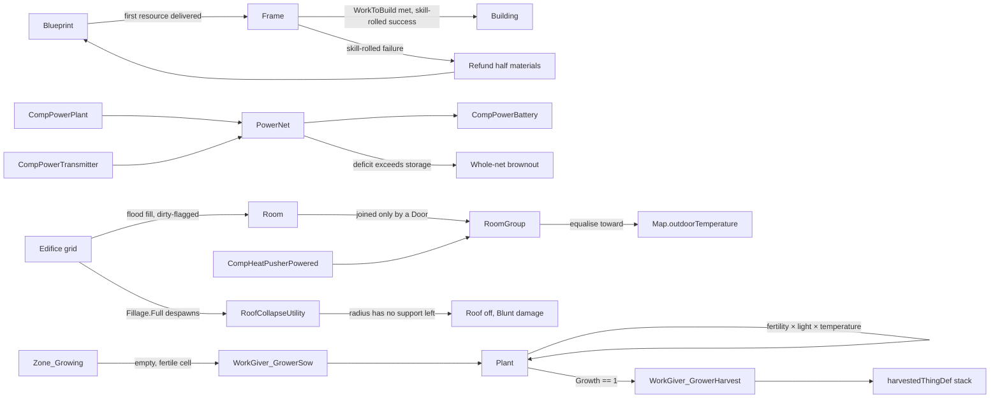

### 8.3 Combat

- Ranged hit chance: shooter accuracy raised to the distance, weapon accuracy
  by range band, target size, cover pass chance, with a floor.
- Melee: hit chance versus dodge, both skill curves; downed targets cannot
  dodge.
- Armor: rating versus penetration rolls deflect, or halve and convert sharp to
  blunt.
- Downed and dead come from the health system, never from combat directly.
- **Cover and line of sight** are real map geometry, not a stand-in: `Map.GenSight`
  is a Bresenham "supercover" walk over the map's own grids (an edifice with
  `FillCategory.Full` blocks it), and `Combat.CoverUtility.CalculateCoverGiverSet`
  is RimWorld's own 8-adjacent-cell algorithm — what stands beside the _target_,
  weighted by the angle it makes with the shooter's line and by point-blank
  range — resolved automatically once caster and target are spawned on the same
  map. This is deliberately not a region-graph query: `Region`/`RegionGrid`
  answer reachability (can a pawn ever walk from A to B, crossing no doorway
  they can't), which is a different question from "is there an unbroken line of
  sight between these two cells right now."
- **Structures** — turrets, traps and explosions — are `ThingDef`s with comps,
  the Building module's existing shape (RimWorld itself gives a turret and a
  trap their own `Thing` subclass; this port keeps everything comp-composed
  instead). A turret's `CompTurretGun` throttles its hostile-pawn scan to a
  15-tick hash interval (RimWorld's own cadence) so it costs nothing on ticks
  it isn't due; `Combat.GenExplosion` computes a blast's cells by radius and
  line of sight the same way (`DamageWorker_AddInjury.ExplosionCellsToHit`),
  so a wall shields whatever is behind it and takes the hit that stopped the
  blast itself, with an optional linear falloff from center to edge.
- **Capture**: a downed pawn of a hostile faction can be captured
  (`Factions.CaptureUtility`) into a `Pawn_GuestTracker` — RimWorld's own name,
  though it lives on the _host_ `Faction` here (`Faction.prisoners`) rather
  than on `Pawn`, which carries no such field in this port. `WardenUtility`
  reduces resistance per visit and recruits once it hits zero, or releases a
  prisoner outright. The Warden work type actually drives this: a colonist's
  own work-giver scan finds a prisoner and walks over on its own — see §7.4's
  "Warden work" bullet for `WorkGiver_Warden_AttemptRecruit`/`_Feed`.

### 8.4 Social & Belief

- **Opinion** (`Pawn_RelationsTracker.OpinionOf`): relation type, social memories
  about that specific pawn, personality traits, and a stable compatibility factor
  hashed from the two pawns' ids — RimWorld's own mechanic, so a given pair just
  naturally gets on or doesn't, cheaply and deterministically.
- **Relations** (`PawnRelationDef`): family kinds (spouse, parent, child, sibling)
  are derived on demand from demography's own ids (`spouseId`/`parentIdA`/
  `parentIdB`/`childIds`) rather than stored a second time; friend, rival, lover
  and ex-spouse are stored as a `DirectPawnRelation` on both pawns.
- **Romance** (`social.romance`, built): courtship and its ending, built as two
  more interactions rather than a sweep of their own — a romance attempt and a
  breakup are things one person does to another, which is what `InteractionDef`
  already models. `InteractionWorker_RomanceAttempt` weighs zero for anyone
  married, related, too young, already together or not liked enough, and
  acceptance turns on opinion plus the pair's compatibility factor.
  `InteractionWorker_Breakup` is offered only to a couple whose social
  **memories** of each other have gone negative — measured on memories alone,
  because total opinion also carries the `Lover` relation's own +20 (a couple
  happy because they are a couple) and the compatibility factor (two people who
  click could never fall out). A marriage ends as a divorce: both spouse ids
  cleared and a mutual `ExSpouse` recorded, the shape widowhood already used,
  leaving the `Family` standing, because a household here is a lineage rather
  than a residence. Deliberately absent: infidelity (a married citizen never
  courts, and half of RimWorld's cheating model would be worse than none) and
  orientation (no pawn carries one, and a gate the data cannot support would be
  invented rather than ported).
- **Scope of the sweep**: one sweep per settlement, not one over the planet.
  The sweep pairs people up to chat, insult, court and fall out with each
  other, so its scope decides who can have a relationship at all — and two
  citizens of rival civilizations a continent apart have never met. Since
  `World.EmergenceManager` began founding rivals, most candidate pairs in a
  whole-world sweep were exactly that. A settlement is the smallest unit this
  port has that means "the people among whom you live"; when caravans and
  travel make strangers meet, that is the seam to widen.
- **Interactions** (`InteractionDef` + `InteractionWorker`): chitchat, deep talk,
  insult and slight, selected by weight per pair on a population-wide sweep every
  2,500 ticks — a rare-tick manager sweep (`SocialInteractionManager`), not
  per-pawn-per-tick work. A sufficiently bad opinion and mood can escalate an
  insult into a social fight (`SocialFightUtility.TryStartSocialFight`), reusing
  the existing `MentalStateDef` machinery rather than a parallel system:
  `MentalState_SocialFighting` runs on both participants at once (each pointing
  at the other via `otherPawn`, wired by `TryStartSocialFight` right after both
  are created) and actually trades blows — a bare-knuckled `Tool` resolved
  through Combat's own `MeleeVerbUtility`/`Verb_MeleeAttack` path, the same one
  a weapon uses, not a second combat system. The fight ends at the `MentalStateDef`'s
  own duration/MTB recovery or the instant either side goes down, dies, or is no
  longer in the same fight — whichever comes first.
- **Social thoughts** are ordinary memory thoughts with `otherPawn` set (the mood
  system's own stack, not a separate one), feeding both mood and opinion
  (`ThoughtStage.baseOpinionOffset`). `ThoughtDef.IsSocial` (true when any stage
  moves opinion at all) names the distinction RimWorld draws with a separate
  `Thought_MemorySocial` subclass; this port folds both kinds into one
  `Thought_Memory` class with a nullable `otherPawn` instead of forking the type.
- **Situational thoughts from social life**: `ThoughtWorker_HasDirectRelation`
  (content: `HasFriend`/`HasRival`) is active for as long as a pawn holds a
  stored relation of the given kind with anyone — this module's stand-in for
  RimWorld's spatial "a friend is nearby"/"a rival is present" thoughts, since
  no Map/room concept reaches Social or Thoughts yet; one generic, content-driven
  worker rather than a bespoke class per relation kind.

**Belief** (`src/SimWorld.Core/Social/Ideology`, tracker item `social.ideology`).
RimWorld's own meme/precept split is ported faithfully: a `MemeDef` is a broad
theme — a `Structure` meme (exactly one per ideoligion, `IdeoDef.ConfigErrors`
enforces it) or a `Normal` one — that either grants `autoPrecepts` outright or
opens a slot (a free-form issue tag, e.g. `"Apparel"`) some `PreceptDef` must
fill; a `PreceptDef` is the specific rule, reaching mood through the _existing_
thought pipeline exactly as briefed rather than a parallel one — its
`moodThought` is an ordinary situational `ThoughtDef` whose worker is
`ThoughtWorker_UnderPrecept`, built directly on the `ThoughtWorker_UnderEdict`
precedent (a worker scanning the owning defs for one pointing at it, rather
than a back-reference). A `PreceptWorker` (mirroring `EdictWorker`) decides
_whether_ a citizen currently upholds the rule — the base class is
unconditionally true (a belonging/flavour precept); `PreceptWorker_Trait`,
`PreceptWorker_Unclothed` and `PreceptWorker_RoleHolder` read a citizen's
already-tracked state (traits, worn apparel, an ideoligion role) rather than
needing a new event hook into another module. One worker class serves _both_
directions of a judgment — the divergent mood sign lives entirely in each
precept's own `ThoughtDef` stages, so the same "wears nothing" condition is a
mood boost under one ideoligion and a mood penalty under another. Content ships
two contrasting ideoligions this way (`TheHearthway`, communal/nudist/kindness-
celebrating; `TheForgeCovenant`, individualist/modest/bloodlust-celebrating) so
a bare citizen reads opposite judgments depending purely on which civilization
they belong to.

An `Ideo` is the runtime belief system a civilization actually holds — one
per civilization in this pass, not one per citizen (see "not built" below) —
generated from an `IdeoDef` preset (RimWorld: its own fixed-ideoligion
presets) the way a `Pawn` is generated from a `PawnKindDef`, Scribe round-
tripped whole. **Roles** are a precept-granted position (`IdeoRoleDef`, capped
by `maxHolders`, assignment tracked by `IdeoRoleTracker` — a `Pawn`→role
dictionary, Scribe'd by reference) — deliberately a _second_ concept from
`Work.RoleDef` (renamed to avoid a silent Def-type-name collision:
`DefTypeResolver` resolves an XML element to a .NET type by bare class name,
so two classes both named `RoleDef` would collide with no error at all) rather
than an extension of it: `Work.RoleDef` is standing work-priority policy
applicable to any number of citizens with no cap or grant mechanism, while an
ideoligion role only exists because a precept names it and is capped by
design. **Rituals** (`RitualDef` + `RitualUtility`) roll a quality in [0, 1]
from participant count (diminishing returns), whether a holder of the
ritual's `officiantRole` is present, and the participants' own mean mood — a
documented stand-in for RimWorld's physical-setting term (room, altar,
weather), none of which reaches `Social` yet — then grant every living
participant a memory thought forced to the stage the rolled quality
proportionally lands on. RimWorld's own `RitualOutcomeEffectDef` quality
table could not be sourced from this environment, so only the _shape_ (several
independent factors summing into one quality) is ported; the numbers are this
port's own, pinned by trend tests (more/better participants never score a
ritual lower) rather than trusted as literals.

`IdeoManager` (a thread-static `Ideo? Current`, in `Social/Ideology`) is a
deliberate self-gate, not a `Find.Ideo`: `Sim/**` — where a `Find.Ideo`/
`Game.Ideo` slot belongs, beside `Find.God` — was out of this pass's file
ownership. Every worker here reads it the way `ThoughtWorker_UnderEdict` reads
`Find.God`; wiring a real slot into `Sim/Find.cs`/`Sim/Game.cs` and pointing
this class through it is the follow-up.

**Not built this pass** (see `docs/status.json`'s own item for the up-to-date
line): per-citizen ideoligion membership — RimWorld lets colonists follow
different ideoligions with certainty, conversion and an outsider-opinion
penalty; this pass assumes every Humanlike citizen belongs to whichever `Ideo`
is current, which is exactly the "belief is a separate, much larger design"
the original scope note named. Event-tracked precepts (cannibalism, a
corpse's treatment, self-mutilation) are not attempted either — this port has
no consumption/corpse event stream for a precept worker to read, and inventing
one to check a box would have meant a hollow condition rather than a real
one; every precept this pass ships instead reads state some other module
already tracks durably (a trait, worn apparel, a granted role).

## 9. Director Layer

- Threat points from wealth and per-pawn curves × difficulty × adaptation ×
  days passed, clamped to a band.
- Storyteller personas built from comps (on/off cycle, random main, intro,
  single MTB, disease) choose which incident category fires each interval.
- Incidents gate on earliest day, population, points and refire days.
- **A civilization of several settlements, not a colony**
  (`director.multi-settlement`, built): `CivilizationTarget` derives what it
  reports from the player faction's own settlements rather than being kept in
  sync by hand — the roster is their citizens (previously every citizen on the
  planet, rival civilizations included, once `EmergenceManager` started
  founding them), the seat is the oldest settlement with ties broken by tile,
  and `PlayerWealthForStoryteller` is the market value of what they hold: the
  wealth term `EraDef.threatPointsFactor` was written as a stand-in for, which
  stays, because scaling threat by the age a civilization has reached is
  SimWorld's own idea rather than a substitute. An incident that has to happen
  somewhere picks a settlement weighted by population — never below weight 1,
  so an emptied town cannot become invisible to the narrator. The target stays
  singular: one `StoryState`, one refire memory, one adaptation curve, because
  "a raid this decade" is a fact about the civilization rather than about a
  town.
- **Raids** (`IncidentWorker_RaidEnemy`): picks a hostile faction
  (`FactionManager.RandomEnemyFaction`), a `RaidStrategyDef` tactic that
  faction's tech level allows (weighted among the usable ones; `Siege` needs
  Industrial, `ImmediateAttack` needs nothing), multiplies the threat points
  by the tactic's `pointsFactor`, and spends the result against that
  faction's squad composition (§8.1) — every generated raider is a full,
  gear-equipped `Pawn` attributed to its faction (`Pawn.faction`), not a stat
  block. **Where it stops:** nothing yet links a
  physical `Map.Map` to the civilization-scale incident target unless someone
  has entered the settlement the raid picked — the raid resolves to that
  settlement's `InteriorMap` when it has one, falling back to the settable
  `CivilizationTarget.Map` hook; when a map is found, the squad spawns at a
  random map edge, otherwise it is generated and handed back unspawned.
  Generating a map just to stage an off-screen raid would be the tail wagging
  the dog, so an unentered settlement is raided without one. Actually walking the squad to the
  colony and fighting is the AI/Map systems' to build on top of this.
- **The Chronicle** (SimWorld translation): every fired incident appends a
  narrator record. The persona name is still open — see §15.
- **Moments** (SimWorld translation, `quests.moments`, built): the Chronicle
  already records every birth, death, edict and era transition unconditionally
  — a log. `MomentCurator` (owned by the `Storyteller` alongside the chronicle
  itself) additionally decides which entries are worth remembering as a
  civilization's _history_: the first occurrence of a category (an incident's
  own `defName`, a death cause, or a free-form line's own category), every era
  transition without exception (`§10`: "reaching an era is an event, not just
  a readout"), and a new record for longevity at death. Each rule is bounded in
  count on its own terms — by how many distinct categories ever occur, by the
  fixed size of the era ladder, or by a monotonic ratchet — so a moment that
  fires on everything (a log with extra steps) is exactly what this design
  avoids: a simulated routine century produces a handful of moments, not
  hundreds.

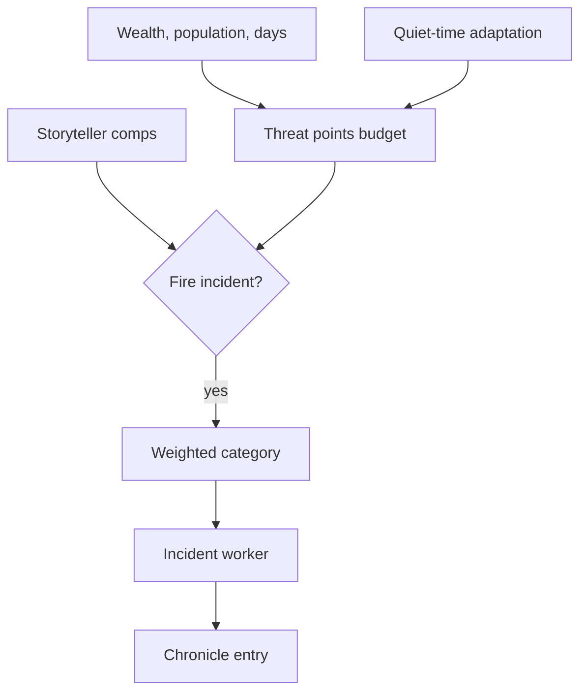

- Quest layer: `QuestScriptDef` node graphs compile over a `Slate` into quest
  parts wired by signals — delay, letter, reward, end — delivered as letters
  with accept and expire timers.
- Scenarios set the start: forced traits, starting research and things, plus
  the civilization parts (era, rival count, biome). Running them needs a
  game-start orchestrator, which lands with the game loop.

## 10. God Layer & Civilization Translation

The re-focus from RimWorld: the player is not a colony overseer but a god
directing one civilization from sticks and stones into exotic technology.
RimWorld systems are **translated**, not replaced — `docs/status.json` records
the translation and its state per system.

- **Scale**: a colony becomes a civilization of settlements; factions become
  rival civilizations; the storyteller becomes the Chronicle, targeting _your_
  civilization.
- **Control**: the god issues edicts (`EdictDef` + `EdictWorker`, the same
  `Class=`-selected Def+Worker shape as `WorkGiverDef`/`WorkGiver` and
  `ThoughtDef`/`ThoughtWorker`) that enter the think tree as `JobGiver_Edicts`,
  sitting strictly between `JobGiver_DirectedOrder` and `JobGiver_Work` (§7.4):
  a queued directed order, and every need/mental-state guard above it, still
  outrank a standing edict, and an edict only ever wins a job routine work
  would otherwise have offered — it can never pre-empt a need. `JobGiver_Edicts`
  never touches `Pawn_WorkSettings`; it reads `WorkTypeDef.WorkGivers` for the
  active edicts' `prioritizedWork` directly (sharing `JobGiver_Work`'s own
  nearest-candidate scan via `WorkGiverScanUtility` rather than duplicating
  it), so deactivating an edict leaves a citizen's own work priorities exactly
  as they were. Citizens keep full agency.
- **Growth** (`building.initiative`, built): a settlement decides for itself
  what it needs and places the blueprint — the player never places a wall
  directly. `SettlementConstructionInitiative` reads a real `Settlement`'s own
  state (its `Citizens` count — never `StatisticalPopulation`, since a
  Statistical citizen has no individual `Pawn` to physically house, by §11.3's
  own design — what is already built or already planned on its `InteriorMap`,
  and what its `Stores` ledger holds) and derives a small, concrete need list:
  a bed per citizen, a handful of walls once there is anyone to shelter, a
  storage hut once `Stores` holds enough to want one — never a speculative
  economy. Shortfalls place blueprints through the existing
  `GenConstruct`/`Blueprint`/`Frame` pipeline (§8.2), sampling cells at random
  off the ambient `RandomStream` rather than scanning the map, validated
  entirely by `GenConstruct.CanPlaceBlueprintAt` so a blueprint never overlaps
  or blocks what is already there, and throttled per gated tick so a large
  shortfall grows over many ticks instead of flooding the map at once.
  Self-gated on the rare tick bucket, the same shape `GodManager.GodTick`/
  `Storyteller.StorytellerTick`/`Settlement.GrowthTick` already use; a
  settlement nobody has entered has no `InteriorMap`, so this is a deliberate
  no-op there rather than a triggered generation. The edict seam reuses
  `prioritizedWork`'s own shape rather than inventing a second mechanism:
  `EdictDef.prioritizedConstruction` is a declarative, read-live list of
  buildable Defs an active edict biases a settlement toward — no
  activation-time side effect, so deactivating leaves no trace, exactly like
  `prioritizedWork`'s own guarantee. `GreatWorksMandate` ships it as real
  content ("quarry and building site before anything else"). A citizen now
  actually sleeps in the bed this system builds for them: `JobGiver_GetRest`
  claims the nearest reachable, unclaimed `Bed` via `AI.RestUtility.FindBedFor`
  before falling back to the ground, and rests faster there
  (`Need_Rest.BedRestEffectiveness`) than on it — no ownership/assignment UI,
  since every bed this settlement builds is unowned and open to anyone, which
  is all RimWorld's own `CompAssignableToPawn` machinery would buy here.
- **Policy** (`work.policy`, §7.3): edicts are the _temporary_ civilization-scale
  lever; policy is the _standing_ one. A citizen's role (`RoleDef`) shapes what
  work they take up — `Pawn_WorkSettings.ApplyRole` — rather than the player
  setting a per-pawn priority grid one citizen at a time. Not the same
  mechanism as an edict (a role does write into the grid, where an edict never
  touches it at all) but the same discipline: it never overwrites a work type a
  person set for themselves directly, and clearing a role leaves no more trace
  in the grid than the role was ever there. `WorkPolicyUtility` applies a role
  across a whole population in one call — policy acts on the aggregate, the
  same way `GodManager.Activate` does for an edict.
- **Endless tech** (`research.endless`, built): the authored tree ends; the game
  does not. An `EndlessResearchDef` is content naming a tag of the authored tree
  to continue, title fragments to name refinements with, and a cost that grows,
  and `EndlessResearch` mints a real `ResearchProjectDef` per track per tier into
  the global `DefDatabase` — so cost, gating, progress and the letter on
  completion are handled by exactly the code that handles an authored project,
  and nothing else has to learn that endless tech exists. It is **derived, not
  rolled**: `defName`, label, cost and prerequisite are pure functions of track
  and tier, which is stronger than a seeded stream would be — a save stores one
  integer, the tier reached, and reloads byte-identical tech rather than a
  growing list of invented defs. A tier is minted only when nothing in the
  authored tree can be started, so a civilization that has not finished the tree
  pays nothing for it. Generated projects carry no era and are invisible to
  `EraDef.Projects`, so they cannot hold the ladder open: the ladder is a finite
  authored artefact that ends at Exotic, and this is what comes after it.
- **Eras**: an `EraDef` ladder over the research DAG carries a civilization from
  neolithic to archotech; era completion gates content, scales threats, and
  gates which edicts a civilization can issue at all (`EdictDef.requiredEra`,
  checked against `ResearchManager.CurrentEra`). The DAG itself is authored for
  divergence rather than priced for it: `tools/content/gen_techtree.py`
  de-linearizes prerequisite chains and gives every track a genuine leaf in
  every era it appears, so a civilization's spine (the projects an era's
  completion, `EraDef.SpineProjects`, actually requires) is a minority of most
  eras — 28-54% per era, down from the original tree's 48-85% — leaving the
  rest as real, skippable choice for two civilizations to differ on
  (`docs/research/tech-reachability.md` §11). Reaching an era is an event,
  not just a readout: `ResearchManager` compares the era before and after each
  project it finishes — so a save can never re-announce history — raises
  `EraReached` once per era crossed, and writes a chronicle line and a letter.
  The era then multiplies the director's threat points
  (`EraDef.threatPointsFactor`, standing in for the wealth term nothing computes
  yet) and gates content through `IncidentDef.minEra`/`maxEra`. A scenario's
  starting era is seeded silently: history begins there, it was not lived through.
  The god layer itself reacts, not just the director: `GodManager` subscribes to
  `EraReached` and re-evaluates active edicts on every crossing.
  `EdictDef.obsoleteEra` mirrors `requiredEra` the same way `IncidentDef.maxEra`
  mirrors `minEra` — a thing a civilization outgrows — except the comparison is
  `>=` rather than `>`: reaching the named era is itself the retirement moment.
  An edict past its `obsoleteEra` auto-deactivates with its own Chronicle line
  ("Edict outgrown: …"); separately, one Chronicle line ("New edicts
  available: …") names every edict the crossing newly unlocks, never one line
  per edict and never a line at all when nothing unlocked. The subscription
  itself is idempotent (unsubscribe-then-resubscribe, not a bare `+=`) so a
  loaded save can never end up doubly subscribed and double-firing Chronicle
  entries — `GodManager`'s constructor subscribes for a fresh civilization,
  its `ExposeData`'s `PostLoadInit` branch resubscribes for a loaded one.
- **Research work** (`research.work`, built): the `Research` `WorkTypeDef`
  finally has a worker. `WorkGiver_Research` (a `WorkGiver_Scanner`, `Research`'s
  own `giverClass`) scans for a reachable, unclaimed `ResearchBench`
  (`Data/Core/Defs/ThingDefs_Buildings/Buildings_Research.xml`) and issues
  `JobDriver_Research`, which walks to it and, every tick, adds
  `ResearchManager.ResearchPointsPerWorkTick * pawn.GetStatValue(StatDefOf.ResearchSpeed)`
  to `ResearchManager.CurrentProj` through the real `ResearchPerformed` — the
  same `points/day = researchers x WorkTicksPerDay x ResearchPointsPerWorkTick x
  speed(skill)` formula `docs/research/tech-reachability.md` §1.2 had to model
  by hand, now driven by the `ResearchSpeed` `StatDef` instead of that harness's
  own stand-in curve. **A bench is required, matching RimWorld**: with none
  built, or none reachable/unclaimed, the giver simply finds no job, the same
  "no bench, no job" outcome as a bench that exists but is claimed by another
  researcher; `ResearchBench` itself carries no `researchPrerequisites`, so this
  is never a lock a civilization cannot build its way out of. `ShouldSkip`
  short-circuits the scan entirely when `CurrentProj` is null. A project
  finishing mid-toil (`ResearchPerformed` itself clears `CurrentProj` the tick
  progress reaches `baseCost`) ends the job `Succeeded` the same tick rather
  than leaving the pawn idling at a bench with nothing current. The bench is
  buildable through the ordinary `Blueprint`/`Frame`/`GenConstruct` pipeline
  (`ThingDefs_Buildings/Buildings_Research.xml`'s own `Blueprint_ResearchBench`/
  `Frame_ResearchBench` pair) like any other building.
- **Aggregation**: per-citizen depth stays, but the god view reads `GodRollup`
  — population by `PawnTier`, mean mood, mean health, a food/industry readout,
  era and research progress — rather than opening every person. `GodRollup`
  is fed by a real `Settlement` (`Recompute(Settlement)`) or several, for a
  whole civilization (`Recompute(IReadOnlyList<Settlement>)`) — or a bare
  population list, for a caller or test that already has one assembled.
  Tier-aware by construction, not by an if-skip: a Statistical citizen's
  health contribution is `Pawn_TierTracker.SampledHealthFraction`, never a
  real hediff-set read, which is the entire reason §11.3's tiering exists —
  reading every citizen's hediffs to answer a civilization-scale question
  would defeat it. A settlement's _bare_ Statistical population — a count
  with no `Pawn` object per person at all — is folded into the same means by
  one deterministic cohort sample per settlement per statistic (mood, food,
  health, industry skill; `GodRollup.AccumulateStatisticalCohort`, reusing
  `Pawn_TierTracker`'s own sampling idiom rather than a second one), weighted
  by population count in the running mean rather than walked member by
  member — the "fold the cohort in with a stated sampled value" choice, so a
  settlement recomputes in O(settlements) + O(Full/Interval citizens), never
  O(Statistical population): a 40,000-person settlement costs the same as a
  40-person one. Cached with a recompute cadence and an explicit dirty flag
  (`Notify_Dirty`), never recomputed per tick per reader.

_Status_: all three god-layer pieces are built, and the two seams the module
was first left with are now closed. **Eras** (§9's ladder) now announce
themselves, scale threats, gate content, and — the god layer's own reaction —
retire and unlock edicts on crossing; see the Eras bullet above. **Edicts**
and the edict think-tree tier live in `src/SimWorld.Core/God`:
`EdictDef`/`EdictWorker` (one concrete worker, `EdictWorker_ExemptMinors`, for
behaviour a def field alone cannot express — a harsh edict that spares
children), `GodManager` (`Find.God`: a slot budget sized as a real trade-off
rather than a checklist, era gating in both directions (`requiredEra`,
`obsoleteEra`), Chronicle recording on activation, deactivation and era
transitions, a Scribe round trip), `JobGiver_Edicts`, and `GodRollup`. Five
edicts ship spread across the era ladder, each costing public mood through a
situational thought (`ThoughtWorker_UnderEdict`) that tracks activation on its
own — no explicit per-pawn grant or removal, so nothing lingers once an edict
is rescinded; `HuntersMandate` also carries `obsoleteEra` as real content, not
just an ad-hoc test case. **Settlements** are entities now (§5b.5) rather than
a def and a tile, and `GodRollup` reads one (or a civilization of them)
directly rather than a caller-supplied list. **Policy** (see the Policy bullet
above) is now built too, in `src/SimWorld.Core/Work`: `RoleDef`,
`Pawn_WorkSettings.SetRole`/`ApplyRole` and `WorkPolicyUtility`. **Growth**
(see the Growth bullet above) is built too, in `src/SimWorld.Core/Building`:
`SettlementConstructionInitiative`, `ConstructionInitiativeTuning`,
`ConstructionThingDefOf`, and `EdictDef.prioritizedConstruction`; not yet
wired into a host tick loop — `SettlementConstructionInitiative.Tick()` is
the civilization-wide entry point waiting for one, the same shape
`God.GodTick()` already has in `Sim/Game.cs`'s `WireTickHooks`. What remains
is the god view itself — UI/host work, once there is a host to render one.

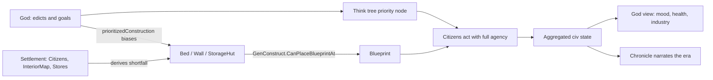

## 11. Scale: Time, Attention & Level of Detail

**Design, not built.** Nothing in this section has code yet. It records
decisions taken up front, because the modules landing next — settlements, the
game loop, the chronicle — are cheap to build against them and expensive to
retrofit.

### 11.1 Two clocks

- The ported clock stays authoritative: 60 ticks/second, 60,000-tick days,
  3,600,000-tick years (§4). Every pawn, job, hediff and research project runs
  on it. It is the only clock that decides anything.
- Above it sits an **abstracted clock** whose only job is to skip. It is the
  default: a civilization runs abstracted, and drops into ticked time only when
  something is worth attending to.
- **The director decides when time slows** — the player does not hand the sim a
  span of years. This is RimWorld's own `TimeSlower` inverted: RimWorld assumes
  speed is the default and takes it away when danger appears, forcing the player
  to 1x. A civilization game wants the same authority pointed the other way —
  abstracted by default, ticked when the storyteller judges a moment worth
  watching. `TimeSlower` is already ported (`Sim/Ticks/TimeSlower.cs`), so this
  is the existing mechanism generalised rather than a new clock.
- **There is therefore no fixed playthrough horizon**, and that is a decision,
  not an omission. Years are not the currency; attention-worthy moments are. A
  century in which nothing happened costs nothing to pass, which is exactly what
  makes an endless arc from sticks and stones to exotic technology playable at
  all — at RimWorld's real clock, 200 ticked years would be 222 hours at maximum
  speed.
- The tech tree is priced against **moments per era**, not years per era. The
  reachability study measured the tree running dry on day 3,074 at a fixed two
  researchers (`docs/research/tech-reachability.md`); that number is a function
  of years, and years have stopped being the unit. Repricing waits until the
  director's pacing exists to measure against.
- Time does not itself cause progression. A century of abstracted time with no
  people, no food and no research advances nothing. Progression comes from
  timers, work and events — whichever clock happens to retire them.
- The rule that keeps the two honest: **the abstract clock may only do what the
  real clock would have done.** Every process it advances needs a closed-form or
  sampled equivalent that agrees with ticking, and — where the span is short
  enough to afford it — a test that runs both ways and asserts the same end
  state. Interval-shaped systems satisfy this naturally: demography's yearly
  sweep (§7.5) is already written as a sweep rather than a per-tick trickle.
- Skipping stays deterministic because the abstract step draws from the same
  seeded streams (§4). A skipped century is reproducible.

### 11.2 Attention: civilization-wide sight, settlement-deep touch

Taken from RimWorld, whose split this codebase already mirrors structurally:

| RimWorld | SimWorld | State |
| --- | --- | --- |
| World map: tiles, factions, settlements, caravans — nothing at colony depth | `World/` (§5) | ported |
| Colony map: cells, things, pawns with jobs and needs at full depth | `Map/` (§5a) | ported |
| A settlement's world tile generates its interior map | `MapGen/` (§5) | ported |
| Entering a settlement (at settlement scope) triggers that generation and persists the result | `World.Settlement.EnterMap` | ported |
| The settlement's own citizens are actually standing on that interior, not merely implied by a population count | `World.Settlement.SyncCitizenSpawns` | ported |

The two halves are now joined at the seam: `MapGen.MapGenerator.GenerateMapFor`
takes the world tile a settlement sits on — its biome, elevation, hilliness,
rainfall, rivers, roads and deposits — and generates the interior that tile
promised. `Settlement.EnterMap` is the game-loop half: called the first time
the player opens a settlement, it generates that interior once, sized by
`TotalPopulation` rather than a flat constant, caches the result on the
`Settlement` itself, and returns the same `Map` instance on every later entry.
A settlement never opened carries no map at all, so most of a large
civilization's settlements cost the save file nothing beyond the entity
itself — a real interior is real weight (tens of thousands of individually-
saved Things on a rock-heavy map), so it is only ever paid for the settlements
the player actually looks inside.

`EnterMap` also closes the last gap in this seam: it calls
`Settlement.SyncCitizenSpawns`, which spawns every not-yet-spawned Full-tier
citizen onto the interior (near whatever the settlement has already built,
never a map corner), and the same method runs again on a rare gated cadence
after that (`SettlementTuning.CitizenMapSyncIntervalTicks`) so a newborn, a
migrant, or a citizen who died or fell out of Full tier is reconciled without
anyone re-entering the settlement. Only Full ever spawns — see §11.3's own
tiering rationale for why Interval, which the tracker already keeps jobless
and mindless, would gain nothing by occupying a cell, and why a Statistical
citizen was never eligible to begin with. A citizen's departure from the map
(death, or falling out of Full) is the only "release" this design has:
nothing here ever discards an already-generated interior once cached, so
there is no larger "close the settlement" event to react to — a citizen
simply stops qualifying, the same way one starts.

The player's verbs follow the same split. At civilization scope the player sees
everything and acts through edicts, research direction and policy — indirect and
aggregate. At settlement scope the player can open any citizen and act on
particulars. **Sight is global, touch is local.**

### 11.3 Citizens: tiered by significance, not by distance or clock

**Built.** `PawnTier` and `Pawn_TierTracker` (`src/SimWorld.Core/Pawns/`), filed
under the `demography` system in `docs/status.json` (`demography.lod`) — it is
the population-scale half of demography, and shares that system's module path.

Every citizen is a real agent record with a real identity. What varies is how
much of that record is _computed per tick_.

- **Full** — ticked exactly as ported: needs, mood, health, skills, jobs, every
  tick (`Pawn.Tick`, unchanged). The settlement under the player's attention,
  plus anyone promoted into it.
- **Interval** — the full state exists (nothing is deleted or replaced), but
  advances only on the Long tick bucket (`TickerType.Long`, ~2000 ticks) rather
  than per tick. Needs decay for real — an O(1) closed-form
  (`Need.NeedIntervalBulk`) holding each need's own current rate constant across
  the elapsed span, not a per-tick trickle — and age advances the same way
  every other tier does (below). No jobs, no mind state, no skills; hediffs
  already present are carried unchanged rather than bulk-simulated (the one
  tier this module could not make fully faithful — see below).
- **Statistical** — a member of a cohort: identity, family, age and demography
  participation are real; needs are sampled from a cohort distribution rather
  than tracked, and health is a coarse sampled readout rather than a live
  hediff simulation. Also sits on the Long bucket (not fully off any tick
  list — see the note on RimWorld's precedent below) but the coarse tick there
  does far less work.

Promotion is by **significance, not proximity or elapsed time**: the player
looks at their settlement, they take a role (leader, founder, great worker), the
chronicle names them, or a relationship attaches them to someone already
promoted. Any of the four promotes straight to Full from wherever the citizen
currently sits — Statistical included, no forced climb through Interval first.
Demotion is the reverse and is lossless in identity — a demoted citizen is
still exactly who they were: name, family, relationships, age, history; only
their minute-by-minute computation stops. Full falls to Interval the instant
none of the four hold. The further fall, Interval to Statistical, is
deliberately **not automatic** — see §11.5.

**Tier-aware ticking is dispatch by tick list, not a skip inside one.**
`Thing.TickerType` (previously `def.tickerType`, fixed per content def) is now
virtual; `Pawn` overrides it to read the tier tracker, so a demoted pawn
changes which of `TickManager`'s tick lists it is registered on —
`Pawn_TierTracker` deregisters under the old `TickerType`, flips the tier field,
then re-registers under the new one, in that order, since registration itself
reads `TickerType`. `Pawn.Tick()` keeps one defensive guard (a demoted pawn
should never reach it at all, since it is no longer on the Normal list) but
that is a safety net for a list/tier desync, not the mechanism.

**RimWorld already proves the Statistical tier works, and we already ported half
of it.** Its world pawns are people not on any active map: identity,
relationships and ageing are real, while needs, jobs and health stop ticking
entirely. `Pawn_AgeTracker.AgeTickMothballed` — the bulk-interval ageing that
serves exactly that tier — is ported and is exactly what both Interval and
Statistical call to keep age exact regardless of tier. One deliberate
divergence from the RimWorld precedent: a Statistical citizen here still sits
on a (very cheap) tick list rather than leaving ticking altogether, because
without _some_ periodic driver a population that is never promoted would never
age and never die — which would break demography participation, a hard
requirement of this module. RimWorld does not face this because a world pawn's
age is driven by a different global sweep this codebase does not have; putting
Statistical pawns on the Long bucket was the smallest way to get the same
guarantee out of the tick system that already exists.

**The tiers and the clock are one mechanism, not two.** Under §11.1 a
civilization runs abstracted by default, which is to say almost everyone sits at
Interval or Statistical almost always. Dropping into ticked time _is_ promoting
the attended settlement to Full. The director does not slow time and separately
raise fidelity; those are the same act described twice.

**Promotion catch-up.** A citizen promoted after decades at Statistical or
Interval must arrive coherent — aged correctly, with plausible needs, not a
newborn and not a corpse. On promotion, `Pawn_TierTracker` computes the exact
tick gap since it last brought that citizen's state current and applies it in
one step before switching tick lists: `AgeTickMothballed` for age (exact at any
gap size, 2000 ticks or 30 years alike), a real bulk needs update for a
promoted Interval citizen, or a fresh cohort sample (deterministic,
`RandomStream.RangeSeeded` keyed on pawn id + tick + need, never the shared
mutable stream) for a promoted Statistical one. What it deliberately does
**not** do: manufacture hediffs. A Statistical citizen's health is a coarse
sampled fraction, never specific injuries invented on the spot — inventing
detail nobody ever gave the sim would be the §11.4 anti-pattern applied to the
engine's own state, not only to the chronicle. And it does not retroactively
apply an age-of-death that was crossed while off-tier: `ShouldDieOfAge()` is
correct the instant catch-up runs, but nothing kills the pawn until whatever
population sweep processes them next (the existing, unchanged demography
sweep) — a citizen can walk around briefly "overdue" between catch-up and the
next sweep.

**Measured** (`tools/bench/SimWorld.Bench` was not modified; a standalone
harness outside the repo reproduced its methodology — seed 12345, kind
Colonist, age 30, median of 3 runs after 1 discarded warmup). The box was
shared with other build activity throughout (§1's own caveat, sharper here: an
A/B of the pre- and post-tiering Full tier on the same box in the same session
showed 19,230 vs 20,128 µs/pawn-day at N=500 — indistinguishable, i.e. tiering
does not regress Full — while the plain reference number swung from 17,385
(baseline.md, idle box) to 30,000-36,000 across runs taken minutes apart on
this one). Absolute numbers below are this session's, not baseline.md's, for
that reason; the ratios are the load-bearing part:

| tier | µs/pawn-day (N=1,000) | µs/pawn-day (N=100,000) | vs. Full, this session |
| --- | --- | --- | --- |
| Full | ~30,500 (single session; see baseline.md for the fuller sweep) | not re-measured at this N (baseline.md: ~2,500-5,000 healthy pawns is the 15x ceiling) | 1x |
| Interval | 135.4 | 173.4 | ~175-225x cheaper |
| Statistical | 36.5 | 25.4 (29.3 at N=500,000) | ~850-1,200x cheaper |

Both non-Full tiers scale close to linearly through N=100,000 (Statistical
measured clean through N=500,000). Projecting each tier's own largest clean
rate to the 15x budget (66.7s/game-day, §1) — a projection in exactly baseline.md's
sense, not a measurement beyond the tested range — puts the ceiling around
N≈385,000 for Interval and N≈2.3M for Statistical, against Full's measured
~2,500-5,000. That gap is the module's whole justification realized: a
civilization can hold a population three orders of magnitude larger than a
single RimWorld colony as long as only the attended, significant slice runs at
Full depth.

**What this could not make fully faithful:** Interval tier's needs are real
(closed-form, not sampled), but its hediffs are frozen rather than
bulk-simulated — an untended wound does not bleed out, an illness does not
progress, while a citizen sits at Interval. Death from age still works at
every tier (it never depended on the hediff system), so demography stays real,
but death from injury or illness effectively pauses the moment attention
leaves. Building bulk-equivalent hediff physics (bleeding, healing, immunity
progression, all closed-form over an arbitrary elapsed span) was out of reach
for this pass — see the module's own report for why, and treat it as the
natural next piece of this system rather than a silent gap.

**RimWorld already proves the Statistical tier works, and we already ported half
of it.** Its world pawns are people not on any active map: identity,
relationships and ageing are real, while needs, jobs and health stop ticking
entirely. `Pawn_AgeTracker.AgeTickMothballed` — the bulk-interval ageing that
serves exactly that tier — is ported. What is missing is the tier itself, and
the generalisation from RimWorld's rule (_on the map or not_) to this game's
(_significant or not_).

**The tiers and the clock are one mechanism, not two.** Under §11.1 a
civilization runs abstracted by default, which is to say almost everyone sits at
Interval or Statistical almost always. Dropping into ticked time _is_ promoting
the attended settlement to Full. The director does not slow time and separately
raise fidelity; those are the same act described twice.

### 11.4 Fidelity: the level of detail _is_ the historical record

The observation this design turns on: **what the simulation did not record is
what history forgot.** The tier a citizen lived at bounds what the chronicle can
ever say about them. A Full-tier life leaves a detailed record; a Statistical
one leaves a name, a family and two dates — which is precisely what the deep
past leaves in reality.

One hard constraint follows: **fidelity is decided at write time, never at read
time.** The chronicle stores what was knowable when the event happened. Resolve
detail lazily against present knowledge instead, and researching Paper in 1600
retroactively remembers what a peasant ate in 1200.

So a single mechanism does two jobs, which is the reason to build it carefully
rather than as a performance hack:

- **Performance** — cheap citizens cost less, which is what makes civilization
  scale affordable at RimWorld depth.
- **Fiction** — the deep past is thin because it _was_ thin, not because a UI
  filter hid it.

The consequences are the interesting part. Writing, record-keeping and archives
become real technologies with a real effect. Losing them — to collapse, fire or
conquest — genuinely loses history. And the player's own attention shapes what
the civilization is able to remember about itself.

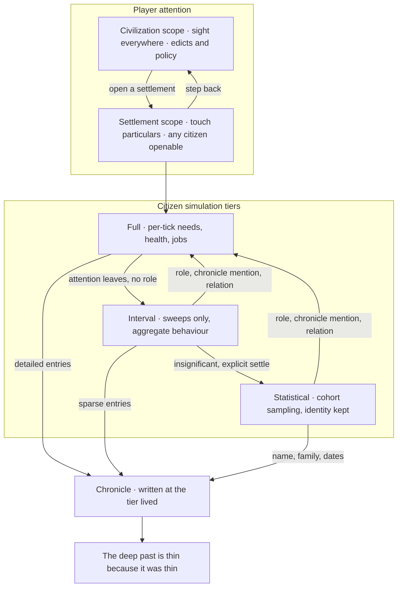

### 11.5 What this section deliberately does not decide

- **Tier budgets.** How many citizens each tier can afford comes from
  measurement, not guesswork. What is now measured (§11.3): the Full tier is
  affordable in the low hundreds once injury and illness are normal rather than
  exceptional (`docs/perf/baseline.md`), and demography's own growth — 4.5% a
  year, doubling every ~16 years — crosses that from a 20-40 person founding
  band somewhere around year 40; Interval and Statistical sustain roughly two
  to three orders of magnitude more (projected ~385,000 and ~2.3M respectively
  at 15x) precisely because they are cheap rather than absent. Still not
  decided: the exact population curve a real campaign needs across an era, and
  what fraction of citizens a director would realistically keep Full/Interval
  at once — those need the director itself (§11.1) to measure against.
- **Whether Interval and Statistical are two tiers or samples of a
  continuum — still open, but narrower than before.** Promotion is settled: any
  of the four significance triggers promotes straight to Full from either
  coarser tier, so there is no continuum on the way up. What remains genuinely
  undecided is the way down: this pass built the mechanism for Interval to
  settle to Statistical (`Pawn_TierTracker.DemoteToStatistical`, gated on
  "insignificant and already Interval") but deliberately left _when_ to call it
  unspecified — that is a director/game-loop policy (which citizens, on what
  cadence, under what pressure), not something this module should invent
  without the director to measure it against. Until the director exists,
  Interval is the resting tier for every insignificant citizen; nothing demotes
  itself to Statistical without an explicit call.
- How the abstract clock and the director interact — a skipped century still
  needs incidents, and they cannot all fire at the seam.

## 12. Presentation & Host

- `SimWorld.Core` is `netstandard2.1` with no engine reference and an asmdef
  marked `noEngineReferences`; Unity consumes it as a local package.
- The host renders and issues commands; it holds no simulation state — a
  `Game` (§4) is the one object that does, and the host's whole seam into
  the simulation is: `Game.NewGame(...)` to start one;
  `game.TickManager.TickManagerUpdate(deltaSeconds)` once a frame to
  advance it (or `DoSingleTick()` directly, off the render loop, for a
  headless run); `Scribe.SaveToString(game, "game")` /
  `Scribe.Load<Game>(xml, "game", defs)` to save and load the whole thing
  as one document; and `game.AutosaveDue` to know when to do that save —
  the core only ever hands back a string, writing it to disk (or wherever)
  is the host's own job, never the core's.
- A playable loop now exists (`Game`, §4) — the Blueprint tracker's launch
  control can drop its "no game loop yet" reason. What still sits above it
  (rendering, input, the UI a player actually clicks) is unchanged and
  remains the host's to build.

### 12a. The god view's read model

`God/View` is the seam the host binds to for the god layer, and it is
deliberately narrow in both directions.

- **Reading** is `GodViewSnapshot.Capture()`: one tick's values — the
  civilization rollup (§10), every settlement, every edict, the chronicle
  tail and the curated moments — as plain objects. Not live references.
  A live reference would be three problems at once: it is a write surface
  (anything holding an `EdictDef` can reach `EdictDef.Worker`), it tears
  (the host renders across frames while the sim ticks, so a half-read list
  shows a civilization that never existed), and it is not a contract (every
  internal rename becomes a host break, which is most of what being
  engine-free was for).
- **Writing** is `GodCommands`, which takes a `defName` and an intent and
  nothing else. The host never holds a `Def` or a manager, so it cannot
  reach a worker or mutate state by any route this class does not offer.
  Widening what a god may do means adding a method here on purpose, rather
  than a host discovering it could already do it.
- **Every refusal is explained.** `GodManager.CanActivate` answers a bare
  yes or no, which is all the simulation needs and strictly less than a UI
  does — a greyed-out control with no reason is a bug report waiting to be
  filed. `EdictOption.Availability` carries that same decision with its
  reason preserved, and `GodCommands` reuses the read model's own wording
  on a refusal so one rule set never grows two descriptions.
- **The invariant that makes it trustworthy**: `Availability == Available`
  agrees with `GodManager.CanActivate` for every edict in content, at both
  ends of the era ladder and at every slot count between. The view can
  never offer something the simulation would then refuse — which is the
  worse of the two failures, because the player already believed it worked.
- What the snapshot deliberately omits: per-citizen detail (opening every
  person to paint a civilization is what §11.3's tiering exists to prevent
  — a named citizen is a different, narrower query) and map or rendering
  data (a settlement reports only whether its interior exists yet).

## 13. Determinism & Testing

- All randomness routes through seeded streams, so tests assert exact outcomes.
- Thread-static `Rand`, `Scribe` and `Find` state keeps xUnit's parallel
  collections isolated; tests touching the global `DefDatabase` share one
  collection.
- The core content loads in CI with zero config or DefOf errors — asserted, not
  assumed.
- Every module ships save/load round-trip tests alongside behaviour tests.
- CI runs build and test, the Blueprint build (which validates `status.json`),
  markdown lint, link check and mermaid validation.

## 14. Roadmap

Per-system state, checklists and translation decisions live in
`docs/status.json` and render in the Blueprint tracker. Phase 1 ships every
system as an isolated tested module; the god layer and a playable loop follow.

## 15. Open Questions

- **Narrator name**: Scribe, Historian, or The Chronicle. Code module stays
  `Director` until chosen.
- Population ceiling: the tiering design (§11.3) fixes the shape; the actual
  per-tier budgets wait on measurement from the benchmark harness. The pathing
  half of "a pathing... pass" has landed and is measured (§7.4's path-sharing
  bullet, `docs/perf/baseline.md` §9) — path-finding cost for many pawns
  converging on a shared destination is no longer the open half of this
  question, tick-budget per tier still is.
- Endless tech beyond the authored era ladder: procedural generation shape.
- Multiplayer determinism, which would constrain RNG stream design.
- Director behaviour across an abstracted-time skip (§11.5): a skipped century
  still needs incidents, and they cannot all fire at the seam.
- Settlement generation and the opening state of a game — how a founding band
  picks a site, and what a settlement _is_ once it has an interior.
